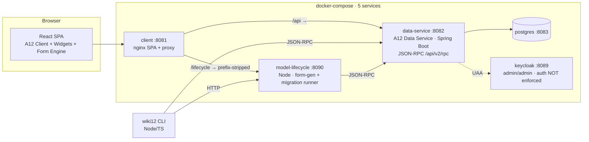
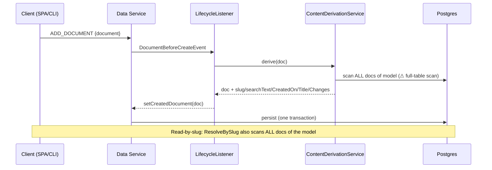

# wiki12 — Senior A12 Engineer Architecture & Code-Quality Review

> **Brief.** Reverse-engineer the architecture and data flow of an unfamiliar A12 codebase,
> then identify bad architecture decisions, duplicate logic, performance bottlenecks,
> scalability risks, and maintainability issues — always preferring **A12 standard patterns**,
> grounded in up-to-date A12 sources. Deliver a clean architecture breakdown, critical problem
> areas, refactoring strategies, and improved production-grade code sketches.
> **Constraint: do not change functionality — only upgrade quality, scalability, maintainability.**
> This document is therefore a findings + strategy report with code *sketches*; it edits no source.

## How this review was produced

Eleven parallel audits, each reading the real code (not the docs' description of it) and
grounding every A12 claim in the in-repo mirror `docs/a12/` (104 pages + Widgets Showcase) or
upstream: **server (Java Data Service), web client, CLI + model-lifecycle, shared model tooling +
ADRs, infra/build/deploy, security, test coverage, an authoritative A12-canonical-patterns
baseline, an A12-Widgets conformance pass, an A12-Form-Engine pass, and the "should we use the
standard A12 client" question.** The highest-severity findings were then re-verified by hand
(grep/read) before landing here — those are marked ✔ **verified**.

Confidence tags: **[code]** read directly · **[mirror]** confirmed in `docs/a12/` ·
**[upstream]** geta12.com/github/discourse · **[unverified]** needs a running stack.

---

## 1. Clean architecture breakdown

### 1.1 What wiki12 *is*

A wiki built on **A12** (mgm technology partners), a model-driven platform: declarative JSON
**models** in → generic runtime engines interpret → app out. One underlying mechanism — a
**content item** `{ type, slug, id, fields }` — expressed as two vocabularies (**Pages** = the
built-in `page` type; **Entities** = user-defined `person`/`film`/`location`). **Three clients
over one contract**: the React web client (on the A12 Client framework), the `wiki12` CLI, and
the A12 Data Service.

### 1.2 Topology



### 1.3 The two boundaries (the "one contract")

| Concern | Boundary | Operations |
|---|---|---|
| **Content** (search / CRUD / resolve) | Data Service JSON-RPC | `ADD_/GET_/QUERY/MODIFY_/DELETE_DOCUMENT` + custom `@RemoteOperation`s **`ResolveBySlug`** (try-ID-then-slug) and **`UnifiedSearch`** (fan-out over content models) |
| **Models / forms / migrations** | model-lifecycle HTTP | form-model generation (delegates to `src/dm-to-fm`), TS migration runner + version gate |

Slug / search / envelope derivation lives **only** in the Data Service: a
`@CommonDataServicesEventListener` (`WikiContentLifecycleListener`) fires on
`DocumentBefore{Create,Update}Event`, delegates to `ContentDerivationService`, which derives the
read-only `slug`, a `searchText` blob, and the **standard content envelope** (`CreatedOn`,
`Title`, append-only `Changes`) inside the write transaction. **This is textbook-canonical A12**
— confirmed against `docs/a12/data_services/dataservices-documentation-src.md:5407` (correct
before-write events, mutations persist, `DocumentV2` immutable → reassign). ✔

### 1.4 Complete write/read data flow



### 1.5 How wiki12 maps to A12 canonical patterns (the good news first)

| Area | A12 canonical pattern [mirror] | wiki12 | Verdict |
|---|---|---|---|
| Lifecycle derivation | `@CommonDataServicesEventListener` on `Before*` events, reassign immutable doc | `WikiContentLifecycleListener` | ✅ canonical |
| Custom ops | `@RemoteOperation` + `rpc` + `@JsonRpcParam`, whitelisted, `RpcException` | `ResolveBySlug`, `UnifiedSearch` | ✅ canonical shape (but see §2.3 impl) |
| Unified multi-model search | **none native** — must fan out per DM | custom `UnifiedSearch` | ✅ legitimate gap-fill |
| Cross-document uniqueness / slug / DB unique index | **none native** (open Discourse topic) | hand-rolled slug + (intended) advisory lock | ✅ hand-roll justified — but see §2.2 |
| App data-migration runner | **none native** (A12 migrates model *format*, not app data) | `Migration` items + TS runner | ✅ legitimate gap-fill |
| Form binding | `FormEngineViews.FormEngine` + `PlatformSingleDocumentDataLoader` — **do not hand-roll** | migrated back to it (ADR-0007) | ✅ now canonical |
| Auto form generation | native generator exists but **unsupported for projects** | `src/dm-to-fm` reimplementation | ✅ defensible |
| Widgets | semantic props + `createTheme` tokens, never hand-set colors | mostly good | ⚠ see §3.7 |

**The architecture is fundamentally sound and A12-idiomatic.** The problems below are almost all
*implementation* debt — unsafe concurrency, non-scaling query patterns, contract drift, and doc
rot — not a wrong overall design.

---

## 2. Critical problem areas (ranked)

### CRIT-1 — Unauthenticated stack + committed super-user signing key + browser-reachable RCE `[code]` ✔

The baseline is deliberately unauthenticated for dev, and honest about it — but the exposure is
worse than "login optional", and one item is dangerous **today**, not just pre-prod:

- **Committed JWT signing secret** — `server/config/application-wiki12.properties:38`
  `mgmtp.a12.uaa.authentication.jwt.secret=G7JTTZjLrdyykwn8+…` is a real HMAC key in a
  git-tracked file. Anyone with repo access can forge valid `UAABearer` super-user tokens — so
  the moment auth is switched on, it is already bypassable, and the key is burned across all of
  git history. ✔ verified (tracked, cleartext).
- **Authentication is required, but trivially bypassed** — *corrected against the running stack
  (§8):* a token **is** required (a no-token `POST /api/v2/rpc` returns **401**, not 200 — so the
  earlier "unauthenticated CRUD" framing was wrong). But committed `admin/admin` logs in and, with
  `grant-super-user-privileges.enabled=true` (`:34`) + `roleBased.enabled=false` (`:49`) +
  `security-on-startup.enabled=false` (`:41`), **any** authenticated principal is a super-user. So
  the practical exposure is the same: anyone can log in with the committed creds, or forge a token
  with the committed secret above, and get unrestricted access. ✔ verified live.
- **Browser-reachable arbitrary code execution** — the model-lifecycle service has **no auth on
  any route** (`model-lifecycle/src/app.ts`), including `PUT /migrations/:id` (store TS) and
  `POST /migrate` (transpile + execute it). nginx proxies `/lifecycle/*` straight through with no
  credentials (`client/nginx.conf.template:45`). The sandbox (CRIT-1b) is the *only* thing between
  that and full RCE.
- **CORS `*`** on the auth surface (`:46`); **`admin/admin`** committed in
  `server/config/auth/users.yaml:6-7`; **all five ports published** on `0.0.0.0`.

**CRIT-1b — the sandbox can silently degrade to a non-sandbox.** `model-lifecycle/src/migrate/sandbox.ts`
prefers `isolated-vm` (real isolate, 64 MB cap, timeout) but it's an *optional* dependency; if the
native addon fails to load, it **silently** falls back to `node:vm`, which its own comment
(`:12-15`) correctly calls "NOT a security boundary." The fallback is meaningfully hardened
(`codeGeneration.strings:false` blocks the classic `constructor.constructor` escape) but has no
memory cap and no guaranteed isolation. Nobody is told which backend ran the untrusted code.

> **Fix priority:** rotate + externalize the JWT secret now; authenticate the Data Service and
> model-lifecycle before any shared deployment; make `isolated-vm` mandatory + fail-closed; scope
> CORS; stop publishing internal ports. *XSS and SQL-injection surfaces were audited and are
> **clean*** — no `dangerouslySetInnerHTML` anywhere, Milkdown holds a CommonMark AST with no HTML
> passthrough, and all queries use structured JSON-RPC params, not string interpolation. ✔

### CRIT-2 — The slug-uniqueness invariant is documented as guaranteed but implemented by nothing `[code]` ✔

ADR-0001, CLAUDE.md, `server/README.md`, and the class Javadoc all describe slug uniqueness as
guaranteed by a Postgres **advisory lock** in a `SlugDerivationService`. In reality:

- There is **no advisory lock anywhere in `server/src`** (grep confirms). ✔
- There is **no DB unique-index backstop** (deliberately omitted, `docker/postgres/init/01-init.sql`).
- The real class is `ContentDerivationService`; `uniqueSlug()` (`:237`) does read-then-decide over
  a full in-memory scan, and its own comment (`:234`) admits *"no advisory lock, so two concurrent
  creates of the same name could still collide."* ✔
- `build.gradle:78` still pulls `spring-boot-starter-jdbc` "for the advisory lock" that doesn't exist. ✔
- `existingSlugs()` **fails open** (`:267-269`): any scan exception is logged and treated as "no
  collision" → it will mint a **duplicate slug** exactly when the DB is unhealthy.

So the invariant ADR-0001 made a hard GO decision on is currently backed by neither of its two
sanctioned mechanisms. **This is reproduced live (§8): 8 parallel creates of the same title all
received the identical slug `page:race_test` — 8 documents, 1 distinct slug — and `ResolveBySlug`
now reaches only one of them; the other seven are unreachable by slug.** Two concurrent creates of
"Till Gartner" both write `person:till_gartner`; `ResolveBySlug` returns whichever it scans first
and the other becomes unreachable.
Additional correctness gaps in the same code: sticky-suffix stability breaks for names ending in
digits (`page:section_2` re-slugified on unrelated edits), and `_N` reuse after delete lets an old
URL resolve to a new item (violates ADR-0001's "never renumber").

### CRIT-3 — All three server data paths full-table-scan instead of using the A12 QueryService `[code/mirror]`

`ResolveBySlugOperation:69-78`, `UnifiedSearchOperation:68-89`, and `ContentDerivationService.existingSlugs:250`
each do `findAllDocRefsForModel(model)` → per-ref `findByDocumentReference` → filter in Java, i.e.
**load every document of a model into memory** to find matches. Every slug resolve (every page
view/link click), every search, and every create pays O(N) round-trips; `existingSlugs` does it
*inside the write transaction*, going quadratic on bulk import (the seed/migration path).

This defeats the entire point of the model-driven query layer. The documented A12-standard pattern
(`docs/a12/overall/dev_tutorial_backend_custom_endpoint.md:416`) is to push the predicate down:
`QueryRoot` + `ExactMatchOperator` (resolve/collision) or `SimpleSearchOperator` (search — the
native Postgres full-text operator that the `searchText` blob was *built* to feed), then one batch
`findDocumentsByDocRefs`. This is the single biggest architectural error and the primary scale
blocker. See §6.1 for the fix.

### CRIT-4 — "One contract" has silently forked; tests hide it `[code]` ✔

The invariant is "two clients, one contract, so they can't diverge." In practice contract logic is
re-implemented per client and *has* diverged:

- **Client reimplements `UnifiedSearch`** — `client/src/api/search.ts:19` asserts the op "isn't in
  the stock server" and does a client-side batched-QUERY fan-out with a **hardcoded** model list
  (`:21-26`). But the op **exists** (`UnifiedSearchOperation.java`, `@RemoteOperation("UnifiedSearch")`,
  with `query/kind/type` params). ✔ So search semantics + the model registry live in the browser,
  at risk of drift from the CLI, and adding an entity type means editing client code — defeating
  model-driven design.
- **model-lifecycle runner contradicts the live Data Service contract** — `dataservice.ts` sends
  `MODIFY_DOCUMENT {document}` with **no `docRef`** (`:71`) and reads QUERY results as
  `result.result ?? result.rows` (`:51`), while the CLI + web client (validated against the running
  stack, QA-LOG B21) send `{docRef, document}` and read `entries` from a `PagedResultSet`. The
  runner would fail against the real stack; it passes only because `test/fake-dataservice.ts` was
  written to match the runner, **not** reality. Green tests, wrong in production.
- **Model-name mapping diverges** — `type→Type_DM` is implemented in cli (`model-name.ts`), client
  (`content.ts` — lowercases the tail), server (`ResolveBySlugOperation` — does not), and
  model-lifecycle, with **at least two casing rules**. A mixed-case type resolves differently per client.

### CRIT-5 — ~40% of critical logic has no automated test, and there is no CI `[code]`

- **No CI at all** — no `.github/`, no pipeline; `just test` is honor-system only.
- `just test` doesn't even run the Java **Slugifier** test or the **validator's own** unit test
  (`test_validate.py`) — two of the richest offline suites run only if a human remembers.
- **Zero integration/e2e coverage.** Nothing boots the stack. All container-only Java —
  `ContentDerivationService` (envelope derivation), the lifecycle listener, `ResolveBySlug`,
  `UnifiedSearch`, the slug-uniqueness race — is unverified by any automated test. This is exactly
  the "green suite, broken UI" hole CLAUDE.md warns about (the 1px-column form bug shipped green).
- **Over-mocking hides CRIT-4:** the model-lifecycle fake and CLI `mockRpc` return shapes the author
  expects, so contract drift stays invisible.

---

## 3. Findings by category

### 3.1 Bad architecture decisions

| # | file:line | Problem | A12-standard / cleaner direction |
|---|---|---|---|
| A1 | `ContentDerivationService.java:250` · `ResolveBySlugOperation.java:69` · `UnifiedSearchOperation.java:68` | Full-table scans + N+1 loads (CRIT-3) | `QueryService` + `ExactMatch`/`SimpleSearch` + `findDocumentsByDocRefs` |
| A2 | slug uniqueness (CRIT-2) | Documented advisory lock not implemented; no unique index; fails open | Implement `pg_advisory_xact_lock` **or** partial unique index; fail closed |
| A3 | `server/Wiki12DataServiceApplication.java` + `build.gradle` | Two boot strategies; only the `WikiExtAutoConfiguration` auto-config path is built by the Dockerfile — the `@SpringBootApplication` + `bootJar` are dead | Delete the dead main; keep one story; trim `build.gradle` to compile-classpath aid |
| A4 | `server/Dockerfile:31-53` | Server built by `javac` + `zip`-merge into the stock fat jar's `BOOT-INF/classes`, **not** the Gradle build ADR-0005 claims; remote fat jar `ADD`ed with no checksum | Build as a real module against published A12 artifacts; pin+verify the artifact SHA |
| A5 | `client/src/api/search.ts` + `content.ts:47` | Client forks `UnifiedSearch` and short-circuits `ResolveBySlug` client-side (CRIT-4) | Call the server ops; delete the fan-out + hardcoded model list |
| A6 | `model-lifecycle/src/dataservice.ts:51,71` | Runner uses wrong MODIFY/QUERY wire shapes (CRIT-4) | Align to `{docRef, document}` / `entries`; fix the fake to match reality |
| A7 | `validate.py:26` | `DEFAULT_TARGETS` points at `docs/a12/sample-models/document-models`, whose 4 copies **all differ** from canonical `models/document-models` ✔ | Point at canonical; delete the drifted mirror copies |
| A8 | `registry.ts` envelope gate vs `validate.py` | Envelope contract encoded twice in two languages with **live divergences** (TS misses repeatability + exactly-one cardinality + the date-nested-block rule) | Single source of truth (JSON rule spec) consumed by both; see §6.5 |
| A9 | `nginx.conf.template:36` + client-side token | A privileged admin token is attached by the SPA (stale design) — a service token in a public client | Terminate auth at a gateway/BFF; never ship a service token to the browser |

### 3.2 Duplicate logic (the sharpest cross-cutting problem)

The same identity/contract primitives are hand-rolled **2–4×** and have already drifted:

| Concept | Copies | Divergence |
|---|---|---|
| Model-name mapping `type↔Type_DM` | `cli/model-name.ts`, `client/content.ts:91`, `server/ResolveBySlugOperation.java:114`, `model-lifecycle` | ≥2 casing rules ✔ |
| Slug grammar / namespace default / slugify | `cli/resolve.ts`, `server/Slugifier.java`, `model-lifecycle/migrate/slug.ts`, `client/routing.ts` | runner's is a knowing approximation; rule can drift from `Slugifier` |
| `bareId` / docRef split | `cli/entity.ts:51`, `client/content.ts:123`, `server` (×3: ContentDerivation, ResolveBySlug, UnifiedSearch), `runner.ts:85` | some null-safe, some not |
| try-ID-then-slug resolve | `cli/resolve.ts:53`, `client/content.ts:47` | CLI ignores server `found` flag; client honors it |
| JSON-RPC client | `cli/rpc.ts`, `client/api/rpc.ts`, `model-lifecycle/dataservice.ts` | near-identical, 3 copies |
| Envelope rules | `validate.py` (Python) ↔ `registry.ts` (TS) | live divergence (A8) |
| DM tree-walk | `validate.py`, `registry.ts`, `generate.ts` (×3), `generate.test.ts` (×2) | ≥6 copies |
| Server field-read helpers | `ContentDerivationService` (`readValue`, `safeFieldValueObj`), `ResolveBySlug.safeFieldValue`, `UnifiedSearch.fieldValue` | 4 near-identical "read path, swallow exception" |

**Direction:** a shared `@wiki12/contract` module (model-name, slug grammar, `bareId`, resolve, one
`RpcClient`) for cli + model-lifecycle (mirrored/generated for the browser); one `ModelNaming` util
in server; one exported `walkElements` + `annValue` in `src/dm-to-fm`; the envelope as data (§6.5).

### 3.3 Performance bottlenecks

- **P1** — server full scans on every resolve/search/create (CRIT-3). Highest impact.
- **P2** — `ContentDerivationService.carryOverChangeLog:159` re-reads and **re-writes the entire
  `Changes` history on every update** (client MODIFY omits it) → O(history) per edit, unbounded.
- **P3** — Browse (`search.ts:263`) fetches full document bodies (`projectionName:"document"`) for
  up to 100 rows × N models, then truncates to 140 chars client-side; hard `pageSize:100` with no
  paging silently hides content past 100/type.
- **P4** — Search fires a full fan-out batch on every debounced keystroke with no request
  cancellation (`SearchView.tsx` + `AppChrome.tsx`) → O(models × keystrokes) queries.
- **P5** — migration runner buffers **all** instances and migrates strictly sequentially
  (`runner.ts:84`) — a cliff for large types.
- Minor: no gzip in nginx; `[...walkElements(dm)]` materializes the tree then re-filters.

### 3.4 Scalability risks

- **S1** — Even with the (missing) advisory lock, uniqueness would serialize all slug-allocating
  writes through one Postgres instance-wide lock (throughput ceiling) and hard-couple to a **single
  Postgres primary** — no unique-index backstop means sharding/replicas ⇒ duplicate slugs. *(Infra
  audit corrected an earlier assumption: the lock, if present, works across N app replicas — it's a
  throughput + single-primary constraint, not a per-replica correctness break.)*
- **S2** — `ModelConfigRegistry` (server) and `Registry` (model-lifecycle) are **frozen/in-memory**:
  runtime-deployed models (the ADR-0003 goal) are invisible until restart; the model-lifecycle gate
  loses its version state on restart, and a version-bump race has no lock.
- **S3** — single-instance stateful services (postgres, keycloak, model-lifecycle), **no restart
  policy, no resource limits**, all ports published, containers run as root, base images unpinned.
- **S4** — `--experimental-strip-types` as the production Node entrypoint couples prod to an
  experimental flag.

### 3.5 Maintainability issues — documentation drift & dead code

**Doc drift (actively misleading):**
- `server/README.md` documents classes that don't exist (`SlugDerivationService`, `SlugAnnotations`),
  an `application.yaml`, a Gradle `bootJar` build, and a whole advisory-lock/`JdbcTemplate` mechanism
  — **none of which are in the code.** ✔
- `client/README.md` still describes `App.tsx`, `FormEngineHost.tsx`, `SimpleForm` — all retired by ADR-0007.
- `specs/changes/basic_setup/` (incl. `spike-slug-concurrency.md`) is **deleted**, yet CLAUDE.md and
  ADR-0001 cite it as the evidence base for the (unimplemented) lock. ✔ Dead provenance for the most
  safety-critical decision.
- Stale comments: `content.ts:99` ("our hand-rolled SimpleForm bypasses the engine" — SimpleForm is
  gone); `search.ts:19` / `content.ts:44` ("op isn't in the stock server" — it is); `FormScreen.tsx:13`
  (`ui` vs `uiState`).
- Memory note `a12-formengine-binding.md` says "standalone form engine won't bind values (SimpleForm
  used instead)" — now false (ADR-0007). *(Recommend updating memory — see close.)*

**Dead code:** `Wiki12DataServiceApplication.java`; `client/src/api/models.ts` (whole file, unimported);
`content.ts:readByRef`; `Ui.tsx ConfirmDialog` + the `search.ts` merge/normalize helpers (unused once
CRIT-4 is fixed); the `isExplicit`/`--force` FM-protection path (no FM carries `wiki12.formModel="explicit"`,
so `generate-forms` silently overwrites `Page_FM` despite the "keeps explicit FMs" claim); unused deps
`react-router-dom`, `react-markdown`, `remark-gfm`.

**Other:** `UnifiedSearchOperation.java:60` hardcodes `kind = "Page_DM".equals(modelId) ? "page" : "entity"`
(should be a model annotation, not a string literal); `derive()` is a 75-line method mixing four concerns;
blanket `catch (RuntimeException)` across the server converts real errors into "field absent"/"no collision";
`repeatability: 999999` magic sentinel in all four DMs; FM `modelVersion "37.4.0"` hardcoded with no provenance check.

### 3.6 Security findings (ranked) — see CRIT-1 for the criticals

| Sev | file:line | Issue | Before prod? |
|---|---|---|---|
| CRIT | `application-wiki12.properties:38` | Committed JWT signing secret ✔ | **Dangerous today** — rotate + externalize now |
| CRIT | `app.ts` + `nginx.conf.template:45` | Unauth model-lifecycle ⇒ browser-reachable RCE | Must fix |
| HIGH | `sandbox.ts:114` | Silent `node:vm` fallback for untrusted code; no mem cap | Must fix (fail closed) |
| HIGH | `application-wiki12.properties:46` | CORS `*` on auth surface | Must fix |
| MED | `users.yaml:6` · `.env.example` · compose `:-` fallbacks | `admin/admin`, weak default creds | Must fix (require secrets) |
| MED | `nginx.conf.template` | No CSP/X-Frame-Options/nosniff/HSTS | Fix (cheap) |
| MED | `client/src/lib/auth.ts:9` | JWT in `localStorage` | Longer-term (HttpOnly cookie) |
| — | XSS, SQL/query injection | **Audited clean** ✔ | — |

### 3.7 A12 Widgets / theming (client)

Widget adoption is genuinely strong (`Button`/`TextField`/`Tag`/`MessageBox`/`Card`/`PopUpMenu`/`List`
with correct semantic props; **no hardcoded *semantic* colors**). Violations cluster:

- `FormScreen.tsx:67` — **`window.confirm`** for destructive Delete → replace with A12 `ModalNotification`.
- `Ui.tsx:52-74` — hand-rolled `role="dialog"` + backdrop → `ModalNotification`/`ModalOverlay`.
- Raw `<h1/h2/h3/p>` across `SystemPage`/`SearchView`/`LoginPage` → `Typography.Headline`/`Body`.
- Raw `<a>` (`SystemPage:51`, `AppChrome:98`) → `ExternalLink`/`PseudoLink`.
- `SystemPage:67-106` raw `<ul>/<li>` expand rows → `Accordion`/`CollapsiblePanel`.
- **No `createTheme` anywhere** — every color decision leaked into inline hex (neutral grays, allowed,
  but should be theme tokens); one `createTheme` kills the whole class and unlocks dark mode.
- `FormScreen.tsx:86` injects global CSS against an A12 internal `data-role` to hide the footer — brittle;
  use the supported `formModelMap` suppression already present.

---

## 4. Your question: are there good reasons **not** to use the standard A12 client template?

**Short answer: the deviations are largely justified — stay custom/hybrid, do not adopt the template.**

Separate two things: the A12 client **framework** (`@com.mgmtp.a12.client/client-core`, the runtime)
vs. the A12 project **template** (a downloadable Gradle+Webpack monorepo scaffold). wiki12 **runs the
real framework and the real Form Engine** (ADR-0007) — it did *not* fork them. It declined the
*template* and swapped exactly one platform component. Verdict per deviation:

- **Custom single-document DataProvider — JUSTIFIED (verified limitation).** The platform provider
  adds a `locale` param to MODIFY/DELETE (which wiki12's server rejects, `-32602`) and issues a
  hardcoded `QUERY exact_match` + `LOAD_THUMBNAIL_URLS_INTERNAL` that wiki12's Data Service doesn't
  serve. wiki12 keeps the platform's form-engine recipe (empty-doc provider, `parseDates`/`formatDates`)
  and replaces only the persistence transport — good surgical scoping.
- **Framework-not-template — JUSTIFIED.** The template is a Gradle+Webpack monorepo that would
  collide head-on with ADR-0005 (Vite + per-component compose) and discard a working build; Webpack
  is even load-bearing for the template's model-version-map injection. The docs explicitly support
  adopting the composable appsetup in an existing app.
- **Custom Browse/Search/System views — REASONABLE PRODUCT CHOICE.** wiki12 doesn't install the
  Overview Engine; for a wiki this is fine. Cost: you forgo model-driven columns/filter/paging.
  Revisit only if rich tabular overviews become a requirement.
- **Custom URL routing — REASONABLE BUT FRAGILE (the weakest deviation).** The Client's deep-linking
  is not a URL router, so `routing.ts` hand-rolls path→descriptor mapping + history sync. Justified by
  the clean-slug-URL requirement, but the deviation most exposed to framework drift — keep it thin.

**Real costs to watch (be honest with the team):** the composable-appsetup APIs are `@experimental`
(client-core 16.2.1) so versions are effectively pinned; the custom provider mirrors the platform
recipe by hand and can silently drift on an A12 upgrade; you've traded away some compile-time config
validation (the `as any`/sequential-appsetup workaround). **Top 3 actions:** (1) add a stack-level
load/save/delete regression test so an A12 bump that changes `parseDates`/`filterDataByRelevance`
fails loudly; (2) keep `routing.ts` thin + `// VERIFY`-annotated to the specific deep-linking gap;
(3) treat the Overview Engine as a known future fork, not present debt.

> Related, and now resolved: the "SimpleForm because the engine won't bind values" belief was a
> **misconfiguration, not an A12 limitation** — a missing active locale made `parseValue` return
> `undefined`, dropping every typed value. The client has already migrated back to the canonical
> `FormEngineViews.FormEngine` path and wired `withLocalization`. Only stale comments/notes remain.

---

## 5. Refactoring strategy (phased — each phase independently shippable, no behavior change)

**P0 — Correctness & security (do first; these are latent production incidents):**
1. Rotate + externalize the JWT secret; require secrets (drop weak compose fallbacks); scope CORS;
   stop publishing internal ports; add security headers. *(CRIT-1)*
2. Authenticate model-lifecycle; remove browser reach to `/migrate`; make `isolated-vm` mandatory +
   fail-closed with a startup assertion. *(CRIT-1/1b)*
3. Implement the slug-uniqueness guarantee — advisory lock **or** partial unique index — and stop
   `existingSlugs` failing open; **or** update the docs/ADR to state best-effort. Pick one; don't
   leave code, docs, and a deleted spike disagreeing. *(CRIT-2, §6.2)*
4. Fix the model-lifecycle runner's MODIFY/QUERY shapes and rewrite the fake to match reality. *(CRIT-4)*

**P1 — Architecture alignment with A12 patterns:**
5. Replace all three server scans with `QueryService` + constraints. *(CRIT-3, §6.1)*
6. Restore the shared search contract — client calls server `UnifiedSearch`; delete the fan-out +
   hardcoded model list. *(CRIT-4, §6.3)*
7. Add an integration test tier + CI. *(CRIT-5, §6.6)*

**P2 — De-duplication & hygiene:**
8. Shared `@wiki12/contract` (model-name, slug, resolve, RpcClient); server `ModelNaming`; one
   `walkElements`/`annValue`; envelope as one data spec. *(§3.2, §6.5)*
9. Delete dead code; fix `validate.py` default target + drop drifted sample copies; rewrite
   `server/README.md` and `client/README.md`; reconcile the deleted-spec references; drop stale comments.

**P3 — Scale & polish:**
10. Projection-only Browse + paging; AbortController on search; stream/batch the migration runner;
    make both registries durable/refreshable; nginx gzip; A12-widget conformance (`ModalNotification`,
    `Typography`, one `createTheme`). *(§3.3, §3.4, §3.7)*

---

## 6. Improved production-grade code (sketches — functionality preserved)

### 6.1 Server: push predicates into the A12 QueryService (fixes CRIT-3, A1, S1)

```java
// One shared, indexed lookup — replaces findAllDocRefsForModel scans in
// ResolveBySlug, UnifiedSearch, and existingSlugs.
Optional<DocumentV2> findBySlug(String modelId, String slugPath, String slug) {
    QueryRoot q = QueryRoot.builder()
        .targetDocumentModel(modelId).projectionName("document")
        .constraint(ExactMatchOperator.builder().field(slugPath).value(slug).build())
        .paging(new Paging(0, 1)).build();
    List<DocumentReference> refs = queryService.query(q, null).getContent().stream()
        .map(DocumentTreeResult.class::cast).map(DocumentTreeResult::getDocRef).toList();
    return documentRepository.findDocumentsByDocRefs(refs).stream()
        .findFirst().map(DataServicesDocument::getKernelDocument);
}
// UnifiedSearch: SimpleSearchOperator.builder().fields(List.of(searchTextPath)).value(needle) + paging.
// existingSlugs: SimpleSearch/prefix constraint on the slug field for `base` and `base_*`.
```
Matches the official tutorial (`dev_tutorial_backend_custom_endpoint.md:416`). `SimpleSearchOperator`'s
exact Java builder shape is **[unverified]** offline — confirm against a running stack.

### 6.2 Server: guarantee uniqueness + fail closed (fixes CRIT-2, A2)

```java
private String uniqueSlugLocked(String modelId, String slugPath, String base, String selfId) {
    // Transaction-scoped lock keyed on (model, base); auto-released on commit.
    jdbc.queryForObject("select pg_advisory_xact_lock(hashtext(?))", (rs, i) -> null, modelId + "|" + base);
    int maxN = highestOrdinal(modelId, slugPath, base, selfId); // monotonic — never reuse a freed _N
    return maxN == 0 ? base : base + "_" + (maxN + 1);
}
// AND: on query failure, THROW — never return "no collision" (removes the fail-open at :267-269).
// Alternative backstop if the lock probe can't run: a Postgres partial unique index + retry-on-conflict.
```

### 6.3 Client: call the server op instead of forking it (fixes CRIT-4, A5)

```ts
export async function unifiedSearch(p: SearchParams): Promise<SearchHit[]> {
  const query = p.query.trim();
  if (!isSearchable(query)) return [];
  const raw = await rpc<RawHit[]>("UnifiedSearch", { query, type: p.type }); // server already merged/ranked
  return raw.map(normalizeHit);
}
// Deletes CONTENT_MODELS (hardcoded list), the fan-out, and the dead merge/normalize helpers.
```

### 6.4 model-lifecycle: match the real Data Service contract (fixes CRIT-4, A6)

```ts
async writeDocument(doc: A12Document): Promise<void> {
  const docRef = doc.__meta?.docRef;
  if (!docRef) throw new Error("writeDocument: doc has no __meta.docRef");
  await this.call("MODIFY_DOCUMENT", { docRef, document: doc });   // was { document }
}
async fetchInstances(model: string, version: number): Promise<A12Document[]> {
  const rs = await this.call<{ entries?: Row[] }>("QUERY", { query: /* … */ });
  return rs.entries ?? [];                                          // was rs.result ?? rs.rows
}
// Rewrite test/fake-dataservice.ts to emit { docRef, document } / { entries } so the test proves the contract.
```

### 6.5 One envelope contract, consumed by both gates (fixes A8, §3.2)

```jsonc
// models/envelope.contract.json — single source of truth
{ "derivedRoles": ["slug","searchText","createdOn","title"],
  "createdOn": { "cardinality": 1 },
  "changeLog": { "repeatable": true, "fields": { "datetime": 1, "summary": 1 } },
  "title": { "authoredName": "Title", "derivedRole": "title" } }
```
`validate.py` and `registry.ts assertEnvelope` both load and enforce this — the repeatability/cardinality
divergences disappear by construction. Minimum viable fix: port the missing TS rules first.

### 6.6 Integration test tier + CI (fixes CRIT-5)

```yaml
# .github/workflows/test.yml — turn the test-first rule into a gate
on: [push, pull_request]
jobs:
  offline: { steps: [ "just test", "cd server && <compile+run SlugifierTest>" ] }
  integration:   # opt-in second tier
    steps: ["docker compose up -d --wait",
            "wiki12 page create 'Till' && wiki12 page create 'Till'",  # assert 2nd slug gets _2
            "wiki12 page read till | assert Slug/Title/CreatedOn/Changes derived",
            "concurrency: N parallel same-name creates -> assert N distinct slugs"]
```

### 6.7 Fail-closed sandbox (fixes CRIT-1b)

```ts
export async function getSandbox(): Promise<Sandbox> {
  const iso = await tryIsolatedVm();
  if (iso) { log.info("sandbox backend=isolated-vm"); return iso; }
  if (process.env.WIKI12_REQUIRE_ISOLATED_VM === "1")
    throw new Error("isolated-vm unavailable; refusing to run untrusted code in node:vm");
  log.warn("sandbox FALLBACK backend=node:vm — NOT a security boundary");
  return nodeVmSandbox();
}
// Expose backend in GET /health; assert isolated-vm at startup in prod images.
```

---

## 7. Appendix — verification status & what remains open

**Re-verified by hand (✔):** advisory lock absent + `spring-boot-starter-jdbc` unused + README classes
don't exist; `UnifiedSearch` op exists while the client claims otherwise; JWT secret + auth switches +
`admin/admin` committed and git-tracked; CORS `*`; XSS surface clean; `specs/changes/basic_setup/`
deleted while still cited; all four sample-model copies differ from canonical.

**A12-canonical claims:** grounded in `docs/a12/` **[mirror]** — lifecycle-listener, `@RemoteOperation`,
QUERY/`simple_search`, no-native-unified-search, no-native-uniqueness, `FormEngineViews.FormEngine`
binding path, widget theming. A few builder-shape details (`SimpleSearchOperator` Java API, scalar
projection) are **[unverified]** offline.

**Needs a running stack to close (per CLAUDE.md's end-to-end rule):** the QueryService refactor;
whether the Form Engine falls back to DM field `label[]` when the FM omits per-control labels; the
DateType nested-config-block crash (a wiki12 empirical finding, **[unverified]** in the A12 docs).

---

## 8. Live stack verification (end-to-end, on a running stack)

The full stack was built and run (`docker compose up`, healthy) on alternate host ports
(`1808x`, to coexist with unrelated `w12-dev-*` projects) and exercised through the **real CLI and
the real web UI** — not hand-rolled RPC. Artifacts (screenshots) are in `tmp/` (gitignored).

| # | Check | Method | Result |
|---|---|---|---|
| 1 | Auth model | raw `POST /api/v2/rpc` no token; then login | **401 without token** → auth *is* enforced. `admin/admin` (committed) logs in → token → **200** with super-user access. *Corrects CRIT-1 wording; the risk stands (see §2).* |
| 2 | Envelope derivation | `wiki12 page create` → `page read` | ✅ `Slug: page:verification_demo`, `Title`, `CreatedOn` stamped, `Changes: [{ChangedOn, Summary:"created"}]` |
| 3 | Sequential collision suffix | create two same-title pages | ✅ second → `page:verification_demo_2` |
| 4 | **Slug-uniqueness race (CRIT-2)** | **8 parallel** same-title creates | ❌ **8 docs, 1 slug** — all `page:race_test`; `ResolveBySlug` reaches only one, 7 unreachable. **Data-integrity defect reproduced.** |
| 5 | `UnifiedSearch` server op | `wiki12 search Verification` | ✅ returns merged hits `[page:page] slug title snippet` — **the op is live**, contradicting the client's "op isn't in the stock server" comment (CRIT-4) |
| 6 | model-lifecycle auth | `GET :18090/migrations` and `/lifecycle/migrations` no token | ❌ **200 with no auth**, direct and via nginx — the migration surface is open (CRIT-1) |
| 7 | Web client E2E | Playwright: login → Browse → Create → Save → View | ✅ login (admin/admin), Browse grid renders; Create form via the **real Form Engine** — **Title input 1110px, Body editor 1092px, 0 collapsed controls** (1px-column regression is fixed); Save → navigates to View; **0 console errors** |
| 8 | Cross-client round-trip | doc created in the **UI**, read back via **CLI** | ✅ `Slug: page:e2e_ui_verification`, `CreatedOn`, `Changes` all derived — both clients share one contract for content |
| 9 | Browse dedup masks corruption | Browse after test #4 | ⚠ the 8 duplicate-slug `race_test` docs collapse to a **single card** — the UI visually hides the duplicate-slug corruption from #4 |

**Net:** the happy-path architecture works end-to-end through both clients (envelope derivation,
form binding, create/save/view, search). The two highest findings are **empirically confirmed on
the running stack**: the slug-uniqueness guarantee fails under concurrency (duplicate slugs,
unreachable documents), and the model-lifecycle code-execution surface is unauthenticated. The auth
finding was *refined* — authentication is enforced, but committed credentials + a committed signing
secret + super-user-for-all make the bypass trivial.

**Bottom line.** The architecture is sound and genuinely A12-idiomatic; the custom pieces
(`UnifiedSearch`, slug derivation, migration runner, custom client) are legitimate gap-fills, not
reinventions. The debt is concentrated in five places: an unsafe/absent uniqueness guarantee, an
unauthenticated + secret-leaking baseline, non-scaling scan-instead-of-query patterns, a silently
forked "one contract," and the absence of integration tests/CI to catch any of it. Fixing P0+P1
turns this from a solid prototype into a production-credible A12 application without changing a single
user-visible behavior.
