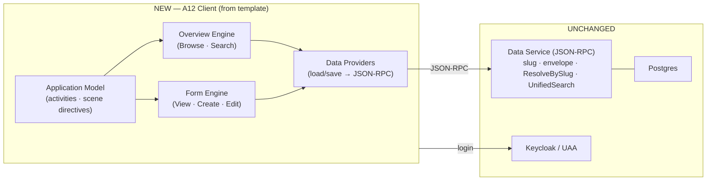

# Architecture — A12 Client rebuild

Read `proposal.md`, `domain.md`, and **`screens.md`** first. `screens.md` is the
detailed build contract; this file is the system-level wiring.

> **A12 first.** Everything here must be confirmed against the A12 docs before
> coding — Client (`docs/a12/client/client-documentation-bundle.md`), Form Engine
> (`docs/a12/form_engine/…`), Project Template (`docs/a12/project_template/…`),
> and the discourse. Carry `// VERIFY` at every contract point.

## Strategy: keep the server, replace the client

- **Server unchanged.** wiki12's Data Service (`server/`) — slug listener,
  `ResolveBySlug`, `UnifiedSearch`, envelope derivation, Postgres, Keycloak — stays
  exactly as is. The integration seam is the **JSON-RPC contract** at
  `POST /api/v2/rpc` (already exercised by the CLI), plus model serving at
  `/api/v2/models/*`.
- **Client replaced.** The current React/Vite SPA (`client/`) is rebuilt on the A12
  **Client** runtime, scaffolded from the **project template**. The template's
  sample server models are **not** used; we wire the template client to wiki12's
  Data Service.

## 1. Bootstrapping from the project template

- Retrieve the template client (project-template docs §"Getting Started",
  §"Project Content Structure"); adopt its **Composable Appsetup**, **Root Reducer**,
  **Model Loader**, **Application Frame** layout, and auth wiring.
- Strip the template's demo models/activities; keep the runtime scaffolding.
- Point model loading at wiki12's `/api/v2/models/<Model>` (DM/FM/validationCode)
  and JSON-RPC at `/api/v2/rpc` (the existing nginx proxy contract).
- Build/deploy stays per-component and VERSION-stamped (ADR-0005); the `client`
  image now builds the A12 Client app. // VERIFY template build vs wiki12 justfile.

## 2. Application Model — activities, views, regions

One Application Model declares the screenflow (`screens.md` has the per-screen
detail). The Application Frame regions:

- **header** — brand, the **global live search** view, the **New** type-dropdown
  view, user + logout.
- **sidebar** — primary nav (Browse, System) and, in master/detail, the info panel.
- **content** — the active Engine (Overview or Form).

Canonical master/detail (client docs §"From Activities to Views to Engines"):
Browse = overview Activity; opening an item creates a **dependent** detail Activity
(Form Engine in `content`, info in `sidebar`); selecting another item cancels +
recreates the dependent Activity.

## 3. Engines

- **Overview Engine** — Browse (list-all) and Search (`UnifiedSearch`) result lists,
  rendered as cards/rows. Needs an Overview/Query model per content type (or a
  cross-model overview). // VERIFY whether to author Overview Models or feed the
  engine a client-side merged result set, given wiki12's cross-type listing.
- **Form Engine** — View (read-only), Create (`__NEW__`), Edit (existing instance).
  This is the whole point: binding works because the engine runs inside an Activity
  with a data provider, per the docs' single-document data-provider recipe
  (createEmptyDocument for new; parseDates on load; filterDataByRelevance +
  formatDates on save).

## 4. Data Providers → JSON-RPC (the binding fix)

A single-document data provider (form-engine docs example) maps activity operations
to wiki12's ops:

| Activity op | JSON-RPC | Notes |
|---|---|---|
| load (new)   | — | `createEmptyDocument(dm, fm)`, id `__NEW__`, `modelId` |
| load (exist) | `GET_DOCUMENT` (+ `ResolveBySlug` for slug refs) | `parseDates` on the result |
| save (new)   | `ADD_DOCUMENT` | `filterDataByRelevance` + `formatDates` first |
| save (exist) | `MODIFY_DOCUMENT` | `{ docRef, document }` only (QA-LOG B21) |
| delete       | `DELETE_DOCUMENT` | confirm dialog |
| list         | `QUERY` (list-all per `CONTENT_MODELS`) | recency sort |
| search       | `QUERY` simple_search fan-out / `UnifiedSearch` | ≥3-char guard (existing bug fix) |

Reuse the existing request/response shapes from `client/src/api/*` as the reference
for these providers — they already match the live server (the contract is proven).

## 5. Cross-cutting

- **Markdown body.** Register the Milkdown editor in the **ClientWidgetMap** for the
  `Body` field (reuse `widgets/markdownWidgetMap`). // VERIFY ClientWidgetMap key
  vs the form-engine widgetMap used standalone.
- **Deep linking.** Client deep-linking feature binds `/view/:ref`, `/edit/:ref`,
  `/create`, `/search` to activities; slug refs resolve via `ResolveBySlug`
  (try-ID-then-slug). Keep the slug-verbatim, colon-literal URL decision
  (slug-based-urls change; `refUrl` rules still apply).
- **Slug read-only.** Slug/envelope fields are `wiki12.derived`; the FM already
  excludes them from editing (`dm-to-fm`). Surface them read-only in View.
- **Auth.** Template Keycloak/UAA; baseline does not enforce auth.
- **Search min-length + live search** behaviors (from prior fixes) carry over to the
  Overview/search view.

## 6. Retirement

Once the Client path renders + saves every type: remove `SimpleForm.tsx`,
`docModel.ts`, the bare `FormEngineHost.tsx`, and the React-Router `App.tsx`/pages
that the Application Model replaces. Keep `api/*` logic that the data providers reuse.

## Testing strategy

- **Pure units** — keep/relocate the existing pure helpers (refUrl, search
  merge/dedup/sort, envelope extractors, liveSearch, dm-to-fm) with their tests.
- **Client integration** — per client docs §"Writing Tests for the Client".
- **Browser (Playwright, CLAUDE.md rule)** — the acceptance gate: create a Person
  with the DatePicker → save succeeds (valid date); edit round-trips; markdown body;
  deep links; search. Artifacts → `tmp/`.

## Dependency & rollout

This is a large, staged change (see `plan.md`). It can land on a branch and be
verified screen-by-screen against `screens.md` before replacing the current client.
