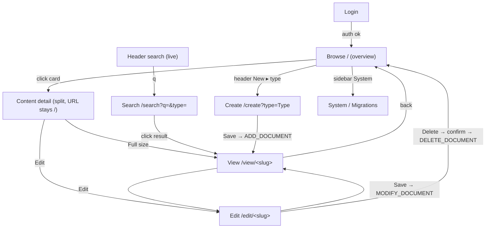

# Screens & Screenflow — wiki12 on the A12 Client

This is the **build contract**. It describes every screen wiki12 has, in enough
detail that an agent starting from the bare A12 project-template Client can build the
whole system. Content language is CONTEXT.md; Client language is `domain.md`. The
server (Data Service) is fixed — every data interaction below is an existing JSON-RPC
op.

Conventions used per screen: **Route / deep link · Activity (descriptor) · Regions &
Views · Engine/Component · Data (op) · Actions → transitions · States · Notes**.

The four content types (from `CONTENT_MODELS`): `page` (Page_DM), `person`
(Person_DM), `film` (Film_DM), `location` (Location_DM). New types appear
automatically anywhere the type list is derived from the served models.

---

## 0. Application chrome (global) — Application Frame

Present on every authenticated screen; built from the template's Application Frame.

- **header region**
  - **Brand** "wiki12" → navigates to Browse (`/`).
  - **Global search box** — a text input that **searches live as you type**
    (debounced ~250ms) by driving the Search screen / `q` param; Enter forces it.
    Single global search affordance (there is **no** separate filter box on Browse).
    A query `< 3` chars shows a "keep typing — at least 3 characters" hint and does
    **not** hit the server (`simple_search` rejects < 3 chars). Leftover text must
    **not** trap the user on Search when navigating elsewhere (see `liveSearch`).
  - **New** — a **primary button with a dropdown** (A12 `PopUpMenu` + `List`); one
    item per content type (Page, Person, Film, Location), derived from the served
    models. Selecting a type → Create screen for that type.
  - **User + Log out** — current user; logout clears the session → Login.
- **sidebar region**
  - Primary nav: **Browse**, **System**.
  - In master/detail, also hosts the **info panel** view for the selected item.
- **content region** — the active Engine (Overview or Form).

States: unauthenticated → only Login renders (no frame chrome). Authenticated → full
frame.

---

## 1. Login

- **Route:** app root when no valid token. **Activity:** none (pre-app gate) or the
  template's auth activity.
- **Component:** username/password form (A12 widgets). On submit → UAA login
  (`POST /api/user/local/login`); store the `access_token` (UAABearer) and persist
  for reload. On 401/403 → "Invalid username or password."
- **Transition:** success → Browse. A 401 on any later request → logout → Login.
- **Notes:** Keycloak seeds `admin/admin`; auth is not enforced in the baseline but
  the token is attached to API calls.

---

## 2. Browse (landing) — Overview / master

- **Route / deep link:** `/`.
- **Activity:** overview Activity (no instance). Scene directive: clear sidebar +
  content, place the Browse overview view in `content`.
- **Engine/Component:** **Overview Engine** (or a card grid view) listing **all**
  content across every type, **newest-changed first**.
- **Data:** list-all via `QUERY` per model in `CONTENT_MODELS` (omit `constraint` =
  all; per-model `CreatedOn DESC`), merged + de-duped + recency-sorted client-side
  (reuse `listAllContent`/`sortByRecency`/`dedupeCards`). Up to **100 items per
  type** (state this cap; no silent truncation).
- **Card content:** created · edited date line (`formatCardDates`), bold **Title**,
  a **type** chip, a clamped snippet (Body/Description). Cards are the listing
  vocabulary everywhere.
- **Actions → transitions:**
  - **Click a card** → opens the **Content detail** as a dependent activity in a
    split (sidebar info + content detail). The URL **stays `/`** (transient
    in-page selection). Selecting another card cancels + recreates the dependent
    activity.
  - **Full size** (in the detail) → navigates to the standalone **View** deep link
    `/view/<slug>` (bookmarkable). Close / back → `/`.
- **States:** loading; empty ("No content yet. Create a page to get started.");
  error banner.
- **Notes:** Browse is a pure list-all gallery — searching is the header's job.

---

## 3. Content detail (View) — read-only

- **Route / deep link:** `/view/:ref` (standalone) **and** the Browse split-pane
  (transient). `:ref` is the **Slug verbatim** (colon-literal, e.g.
  `/view/page:albert_einstein`) or a Technical ID; decode tolerant of legacy `%3A`.
- **Activity:** detail Activity, descriptor `{ model, instance: <docRef> }`. For a
  slug ref, resolve first (`ResolveBySlug`, try-ID-then-slug) → docRef.
- **Engine/Component:** **Form Engine in read-only mode** (same model-driven render
  as edit, non-editable) — or a dedicated detail view rendering the same fields.
- **Data:** `GET_DOCUMENT { docRef }`. Surface the **standard envelope** read-only:
  derived **Title**, **Slug**, **CreatedOn**, and the **Changes** log (newest
  first). Render the markdown **Body/Description**.
- **Actions → transitions:** **Edit** → `/edit/<ref>`. (From the Browse split-pane,
  also **Edit** and **Full size**.)
- **States:** loading; not-found ("Not found: <ref>" — expected when a hand-typed
  slug can't be resolved yet); error.
- **Notes:** the Slug shows literally in the address bar (no `%3A`). Until the server
  surfaces the real envelope `Slug`, links fall back to the docRef (graceful).

---

## 4. Create

- **Route / deep link:** `/create?type=<Type>` (e.g. `?type=Person`). Reached from
  the header **New** dropdown.
- **Activity:** form Activity, descriptor `{ model: "<Type>_DM", instance: "__NEW__" }`.
  Scene directive: Form Engine in `content` (optionally an info/slug panel in
  `sidebar`).
- **Engine/Component:** **Form Engine** with a **new** document
  (`createEmptyDocument(dm, fm)`; id `__NEW__`; `modelId`). The engine renders one
  control per editable field, **picking the widget by data type**:
  - String → text line; String w/ `lineBreaksPermitted` → **markdown editor**
    (Milkdown widget) for `Body`/`Description`;
  - **Date → DatePicker** (e.g. `BirthDate`), DateTime → DateTimePicker, Time →
    TimePicker — **this is what fixes the date-entry bug**;
  - Enumeration/Boolean → their widgets per the form-engine control table.
  Derived/system fields (`Slug`, `searchText`, envelope) are **excluded** from
  editing (the generated FM already omits them); show the **Slug read-only** as
  "(assigned on save)".
- **Data (save):** **Save** → data provider does `filterDataByRelevance` +
  `formatDates`, then `ADD_DOCUMENT { documentModelName, locale, document }`. Server
  assigns the Technical ID and derives the Slug.
- **Actions → transitions:** **Save** → navigate to the saved item's **View** (by
  docRef today; becomes the slug URL once the server returns it). **Cancel** → back.
- **States:** field-level **validation** (mandatory fields highlight; the engine
  blocks/marks invalid input — e.g. an empty required Name shows red); save error
  banner from the server (e.g. `-32002` mandatory-field / formal-check messages).
- **Notes:** values trimmed to satisfy the kernel's leading/trailing-space rule
  (engine/validation handles this; the old `trimDeep` workaround is no longer needed
  if the engine formats correctly — **VERIFY**).

---

## 5. Edit

- **Route / deep link:** `/edit/:ref` (slug or Technical ID, like View).
- **Activity:** form Activity, descriptor `{ model, instance: <docRef> }`. Resolve
  slug → docRef first.
- **Engine/Component:** **Form Engine** loaded with the existing document
  (`GET_DOCUMENT`, then `parseDates`). Same widget-by-type rendering as Create.
- **Data (save):** **Save** → `filterDataByRelevance` + `formatDates` →
  `MODIFY_DOCUMENT { docRef, document }` (**only** those two params — extra params
  are rejected, QA-LOG B21).
- **Actions → transitions:**
  - **Save** → View of the item. A Key-Field edit can re-derive the Slug; the new
    Slug surfaces on the **next read** (`MODIFY_DOCUMENT` returns void), so no
    `old → new` banner at save time (do not assert one).
  - **Delete** → the Delete action (§6).
- **States:** loading; validation; save error.
- **Notes:** Slug shown read-only (current value).

---

## 6. Delete (action + confirm)

- **Trigger:** **Delete** button on Edit (and/or the detail toolbar).
- **Component:** confirm dialog ("Delete <slug>? This cannot be undone.").
- **Data:** `DELETE_DOCUMENT { docRef }` (idempotent server-side).
- **Transition:** success → Browse (`/`). Error → banner, stay.

---

## 7. Search — Overview over UnifiedSearch

- **Route / deep link:** `/search?q=<query>&type=<type>` (shareable). Driven by the
  header global search box (live).
- **Activity:** overview Activity parameterized by `q`/`type` (from the deep link).
- **Engine/Component:** **Overview Engine** rendering the same cards as Browse.
- **Data:** `unifiedSearch({ query, type })` — client-side fan-out of
  `QUERY` `simple_search` across `CONTENT_MODELS` (or the custom `UnifiedSearch` op
  when available), merged/de-duped. **`type`** validated against the known types
  (unknown ignored = search all). **Min length 3** (else show the hint, no request).
- **Actions → transitions:** **Click a result** → `/view/<slug>` (standalone View,
  not the split-pane). Header box keeps driving `q` live.
- **States:** empty query → "Type something…"; `<3` chars → "keep typing…";
  searching; no results → "No results for '<q>'"; error.
- **Notes:** distinct from Browse — Browse is list-all (no query), Search is the
  server-side cross-model query. They are separate routes; only the header box (one
  affordance) drives Search.

---

## 8. System — Migrations & users

- **Route / deep link:** `/system`. Reached from the sidebar.
- **Component:** a plain area (not model-driven), with:
  - **Users** — outbound link to the Keycloak admin console.
  - **Migrations** — a list of `Migration` content items; each row opens a text
    editor on the migration's **TS `script` source** and PUTs it back to the
    model-lifecycle service. **TS source only** — the lifecycle service transpiles +
    sandbox-runs; the client never compiles TS.
- **Data:** model-lifecycle HTTP endpoints (not the JSON-RPC content path).
- **Notes:** lowest-priority screen; can be a thin view inside the frame.

---

## Screenflow

## Acceptance (per screen)

A screen is "done" when, on the live stack: it renders via the Application Model
(not hand-rolled routing), its data op fires with the documented shape, its
transitions work, and — for Create/Edit — the **Form Engine binds values** (typing
persists; a **Person** with a **DatePicker**-entered `BirthDate` saves successfully).
Verify in the browser (Playwright), artifacts → `tmp/`.
