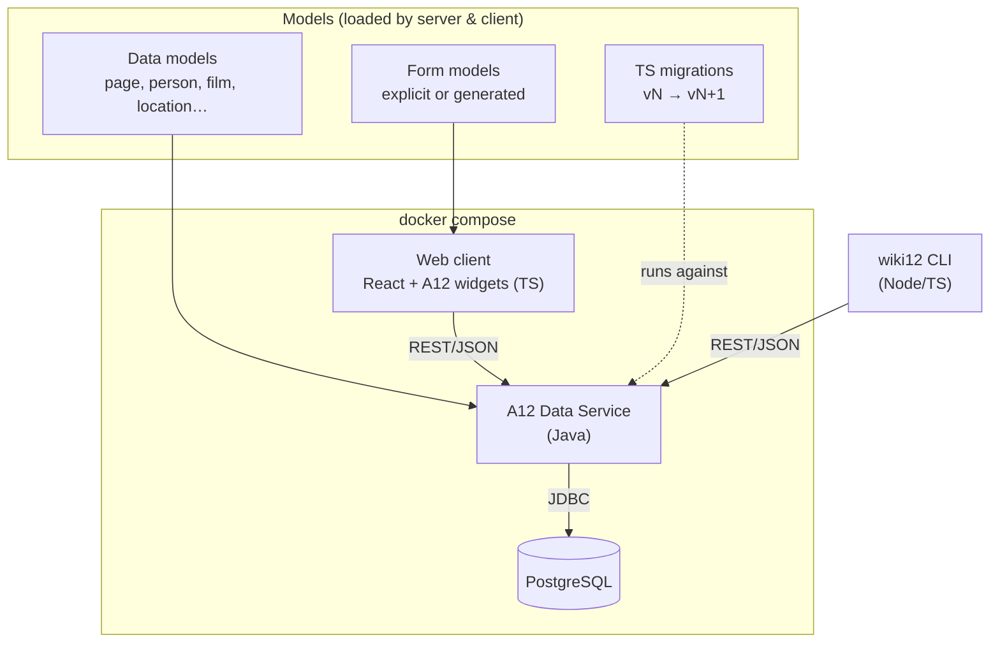
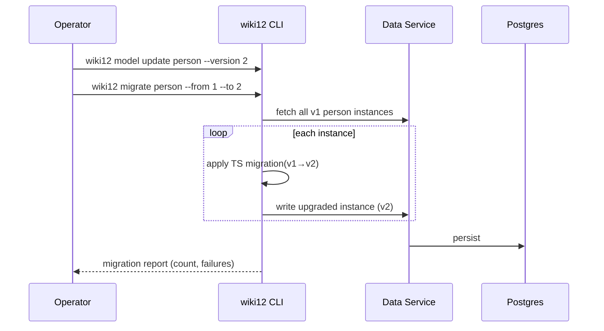
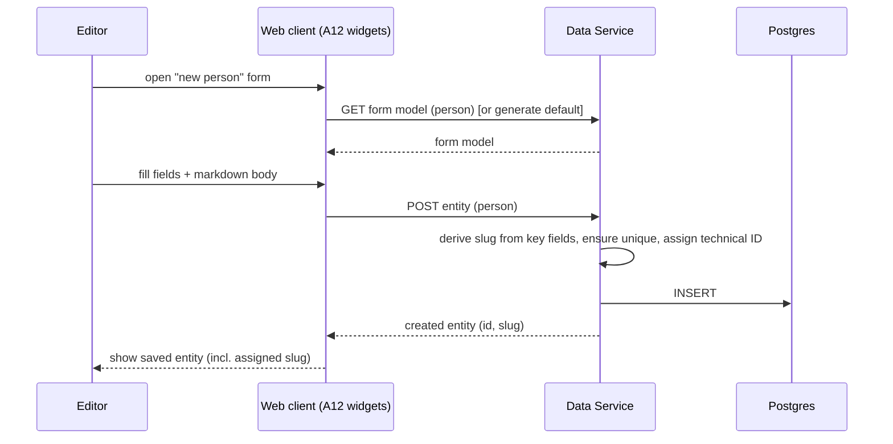
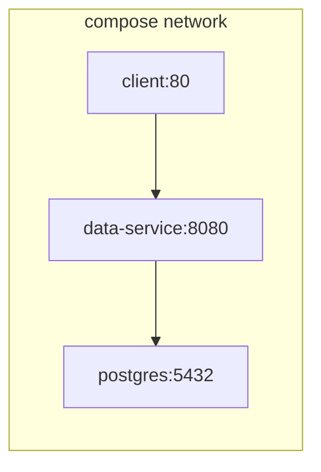

# Architecture: basic_setup

How the wiki12 baseline is built. Read `proposal.md` (what/why) and `domain.md`
(concepts) first; this document covers the technical approach.

## Technology stack

| Layer | Technology | Notes |
|---|---|---|
| Backend | **A12 Data Service** (Java) | Standard A12 server; serves model-driven CRUD over data models |
| Database | **PostgreSQL** | Persistence for content instances + model registry |
| Web client | **React + TypeScript** with **A12 widgets** | Built from scratch per the A12 widgets quick start |
| CLI | **`wiki12`** (Node/TypeScript) | CRUD + model management + migration runner; `-h` docs |
| Orchestration | **Docker Compose** | Server + Postgres + client (+ optional CLI image) |

A12 = mgm technology partners' model-driven application platform
(<https://github.com/mgm-tp>). We adopt its **data model / form model** split and
its Data Service CRUD contract rather than hand-rolling persistence.

## Component overview



## Key decisions

### 1. Model-driven everything

Pages and entities are A12 data models, not bespoke tables. The Data Service
exposes generic CRUD keyed by model + technical ID. This means adding a new
entity type (e.g. `book`) is primarily a **modeling** task, not a coding task.

- `page` data model: `title`, `slug`, `body` (markdown), `id`.
- One data model per entity type with the common fields (`type`, `slug`, `id`,
  a markdown description) plus type-specific fields.

### 2. Form models with default generation

The client renders forms from **form models**. Where a content type ships an
explicit form model, it is used; otherwise the client/server **generates a
default form model** from the data model. So every type is editable out of the
box, and custom layouts are an optional refinement.

### 3. Slugs and identity

- Technical ID is server-assigned on create.
- Slugs are **read-only and system-derived** — never user-editable. Each model
  declares its **key fields**; the Data Service computes the slug from them
  (page: `title`; entity: `type:` + the type's key fields, e.g. a person's
  first + last name → `person:till_gartner`).
- The slug is **(re)computed server-side** on create and whenever a key field
  changes, so derivation and uniqueness are enforced once at the Data Service
  boundary and both web and CLI get the same rule. Page slugs are unique; entity
  slugs are globally unique.
- **Slug-change notification**: when a write changes an item's slug, the Data
  Service reports the old → new slug in its response so clients can surface a
  clear statement to the user (web UI banner/toast, CLI message).

### 4. Search

Baseline search is a Data Service query over title/slug/body (substring /
`ILIKE` against Postgres) for both pages and entities, exposed identically to
web and CLI. Ranked/fuzzy search is deferred (see proposal out-of-scope).

### 5. Migrations in TypeScript

Data models are versioned. A model bump ships with a TypeScript migration
`vN → vN+1`. The **`wiki12` CLI hosts the migration runner** (Node already
present for the CLI), keeping the Java server free of a JS runtime:



### 6. Two clients, one contract

Both the web client and the `wiki12` CLI talk to the **same Data Service REST
API**. No business logic lives only in a client; validation (slug uniqueness,
required fields) is enforced server-side so the two stay consistent.

## CLI surface (`wiki12`)

Every command supports `-h/--help`.

```text
wiki12 page    list|create|read|update|delete|search
wiki12 entity  list|create|read|update|delete|search   --type <type>
wiki12 model   list|create|read|update                 (entity data models)
wiki12 form    list|create|read|update                 (form models)
wiki12 migrate <type> --from <v> --to <v> [--dry-run]
```

- `page` / `entity`: content CRUD + search.
- `model`: Create/Read/Update of entity data models (no delete in baseline —
  destructive model removal is out of scope).
- `form`: Create/Read/Update of form models.
- `migrate`: run a TypeScript migration; `--dry-run` reports without writing.

## Data flow: create an entity (web)



## Deployment (docker compose)



- `postgres` — volume-backed; init script provisions the schema/model registry.
- `data-service` — depends on a healthy `postgres`; loads data/form models.
- `client` — static build of the React app served (e.g. nginx), pointed at the
  Data Service.
- `wiki12` CLI — installed locally or shipped as an optional image; targets the
  Data Service URL via config/env.

## Integration points & open questions

- **A12 API specifics** (exact endpoints, model registration format) follow the
  A12 quick start; the plan starts by scaffolding from it.
- **Markdown rendering widget**: use an A12 widget if available, else a vetted
  React markdown renderer wrapped as a widget.
- **Migration registry**: how migrations are discovered (filesystem convention
  `migrations/<type>/<from>-<to>.ts`) is fixed in the plan.
