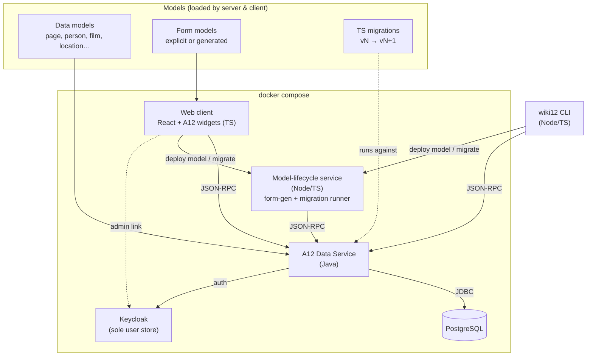
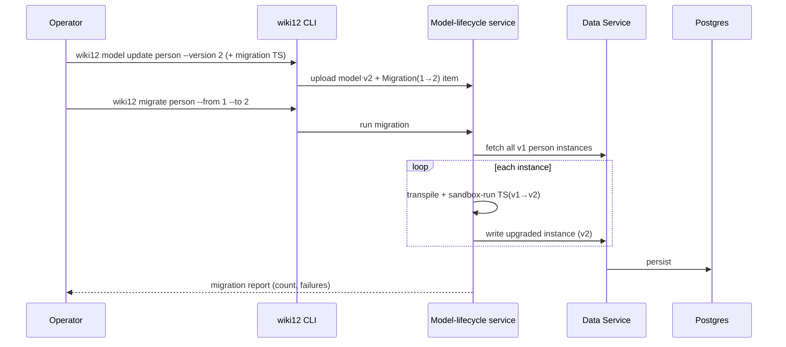
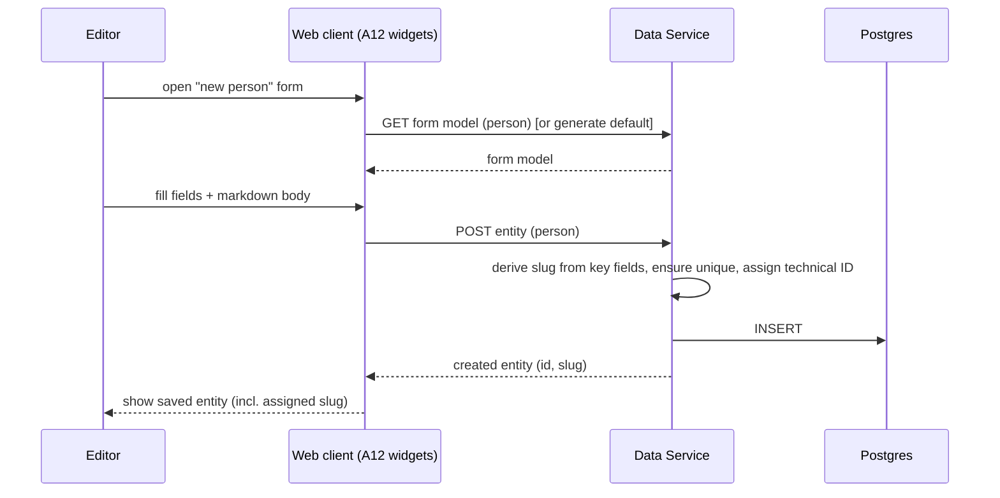
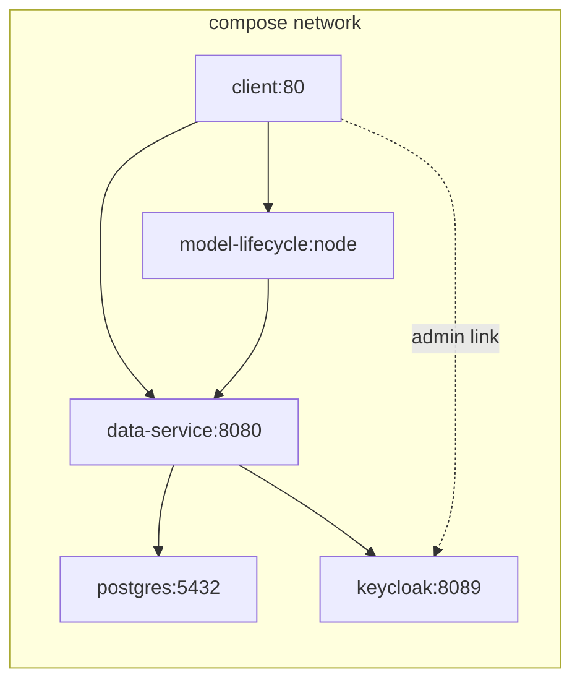

# Architecture: basic_setup

How the wiki12 baseline is built. Read `proposal.md` (what/why) and `domain.md`
(concepts) first; this document covers the technical approach.

## Technology stack

| Layer | Technology | Notes |
|---|---|---|
| Backend | **A12 Data Service** (Java) | Standard A12 server; serves model-driven CRUD over data models |
| Database | **PostgreSQL** | Persistence for content instances + model registry |
| Identity | **Keycloak** | The **sole** user store (from the Project Template); the build seeds an `admin`/`admin` user. wiki12 builds no login/RBAC in baseline — see scope note |
| Web client | **React + TypeScript** with **A12 widgets** | Built from scratch per the A12 widgets quick start |
| Model-lifecycle service | **Node/TypeScript** (in the stack) | Owns form-model generation + the TS migration runner (transpile + sandbox); triggered by model deploy |
| CLI | **`wiki12`** (Node/TypeScript) | CRUD + model management; uploads models/migrations to the server-side path; `-h` docs |
| Orchestration | **Docker Compose** | Server + Postgres + client + model-lifecycle service (+ optional CLI image) |

A12 = mgm technology partners' model-driven application platform
(<https://github.com/mgm-tp>). We adopt its **data model / form model** split and
its Data Service CRUD contract rather than hand-rolling persistence.

## Component overview



## Key decisions

### 1. One content-item mechanism, model-driven

Pages and entities are **one mechanism** — a typed content item backed by an A12
data model, not bespoke tables (see ADR-0004). The Data Service exposes generic
CRUD keyed by model + technical ID. Adding a new type (e.g. `book`) is primarily
a **modeling** task, not a coding task. `page` is the **built-in type**; entity
types are user-defined over the same path. `wiki12 page …` is sugar for
`entity --type page …`.

- `page` data model: `title`, `slug`, `body` (markdown), `id`.
- One data model per entity type with the common fields (`type`, `slug`, `id`,
  a markdown description) plus type-specific fields.

### 2. Form models with default generation

A12 has **no** form generator (only the SME GUI action — Step 0, findings §2), so
form models are **generated by our own model-lifecycle service** (`src/dm-to-fm`,
the headless equivalent of "Build Screens From Fields") on model deploy, then
stored and served — a content type with no explicit form model gets a generated
default, persisted, not ephemeral. The **client form engine** is fed three inputs
— an A12 **data model** + **form model** + **document** (fetched at runtime,
including the Java-generated `validation.js`) — and does the rendering and
client-side validation. So every type is editable out of the box, and custom
layouts are an optional refinement.

### 3. Slugs and identity

See ADR-0001 for the full model. In brief:

- Technical ID is server-assigned on create.
- Slugs are **read-only and system-derived** — never user-editable. Every slug is
  **namespaced** `<type>:<name>` (`page:albert_einstein`, `person:till_gartner`);
  each model declares its **key fields** and the `<name>` is derived from them.
  Format: lowercase `[a-z0-9_]`, `_` word separator, `:` namespace delimiter;
  `page` is the **default namespace**.
- Slugs are **globally unique**; collisions get a **sticky `_N` suffix**
  (`person:till_gartner_2`) fixed at creation. So `slug = f(key fields, creation
  order)` — stored state, not a pure function of current key fields.
- The slug is **(re)computed server-side** on create and on key-field change, so
  derivation and uniqueness are enforced once at the boundary and both web and
  CLI get the same rule. **This rests on the A12-extensibility gate (ADR-0002):**
  if the stock Data Service can't host this logic, a façade in front of it does.
- **Either ID or slug identifies an item** (resolution: try-ID-then-slug; the ID
  grammar is reserved so the two never collide; bare names default to `page:`).
- **Slug-change notification**: when a write changes a slug, the response carries
  old → new so clients surface a clear statement (web toast/banner, CLI message).
  The old slug then **404s** (aliases deferred).

### 4. Search

Baseline search is a **single unified endpoint** spanning all content (the
`page` type + every entity type), a Data Service query over title/slug/body
(substring / `ILIKE` against Postgres). It returns a **typed** result set (each
hit tagged with kind/type, id, slug, snippet) and accepts optional `kind`/`type`
filters. The web search box calls it directly; the CLI exposes it as `wiki12
search <query>`, with `page search` / `entity search --type` as filtered
conveniences over the **same** endpoint ("two clients, one contract"). Custom
query support rides the A12-extensibility gate (ADR-0002). Ranked/fuzzy search is
deferred (see proposal out-of-scope).

### 5. Migrations in TypeScript

Data models are versioned (see ADR-0003). A migration is a TS function over a
single A12 document — `(doc at vN) → (doc at vN+1)`; the runner handles
iteration, IO, dry-run, and reporting. Because models are **runtime-deployable**,
the **server-side Node model-lifecycle service hosts the migration runner** (not
the CLI), and migrations are **stored as `Migration` content items** (TS source),
not filesystem files. The service **transpiles** the TS and runs the function
**per document in a sandbox** (`isolated-vm`, no fs/net). The bump is **gated at
upload**: a model-version bump is rejected unless its matching `Migration` item is
uploaded with it; `page` is a valid migration target like any entity type. A
`--dry-run` that would change slugs reports the full old→new manifest first:



### 6. Two clients, one contract

Both the web client and the `wiki12` CLI talk to the **same Data Service**
(JSON-RPC 2.0 over `POST /api/v2/rpc`) and the **same model-lifecycle service**.
No business logic lives only in a client; per-document logic (slug derivation,
uniqueness, `searchText`) is enforced in the Data Service and model-lifecycle
tooling (form-gen, migration) is server-side, so the two clients stay consistent.

## CLI surface (`wiki12`)

Every command supports `-h/--help`.

```text
wiki12 search  <query>                                  [--kind page|entity] [--type <type>]
wiki12 page    list|create|read|update|delete|search    <id-or-slug>
wiki12 entity  list|create|read|update|delete|search    --type <type>  <id-or-slug>
wiki12 model   list|create|read|update                  <type>   (incl. page)
wiki12 form    list|create|read|update                  <type>   (incl. page)
wiki12 migrate <type> --from <v> --to <v> [--dry-run]
```

- `search`: unified search across all content; `page`/`entity` `search` are
  filtered conveniences over the same endpoint.
- `page` / `entity`: content CRUD. `page` is sugar for `entity --type page`.
  Items are addressed by either Technical ID or slug.
- `model`: Create/Read/Update of data models for any type, `page` included (no
  delete in baseline — destructive model removal is out of scope). A version bump
  uploads the model **and** its `Migration` item together (gated — ADR-0003).
- `form`: Create/Read/Update of form models (any type, `page` included); the
  model-lifecycle service generates a default when none is supplied.
- `migrate`: ask the model-lifecycle service to run a stored migration;
  `--dry-run` reports without writing (including the slug-change manifest).

## Web client surface

- **Theme.** A **compact, flat A12 theme**; colors are a later refinement (kept
  deliberately plain for the baseline).
- **Content.** Search, read (markdown render), create/edit (form engine +
  Milkdown), delete — for Pages and Entities.
- **System area.** An operator/admin section grouping non-content tooling:
  - **Users** — an outbound **link to the Keycloak admin console** (user
    maintenance lives in Keycloak; wiki12 does not manage users itself).
  - **Migrations** — a list of the `Migration` content items, each editable as
    its **TS source in a simple text editor** (baseline; a richer editor later).
    The editor uploads **TS source only** — the model-lifecycle service owns
    transpile + sandboxed execution (ADR-0003), which is exactly why a
    client-side compile must not be relied on.

## Data flow: create an entity (web)



## Deployment (docker compose)



- `postgres` — volume-backed; init script provisions the schema/model registry.
- `data-service` — depends on a healthy `postgres`; registers data/form models,
  runs the JVM codegen (`validation.js`), serves model artifacts for client fetch.
- `model-lifecycle` (Node) — form-model generation + migration runner (transpile +
  sandbox); talks to the Data Service over JSON-RPC.
- `keycloak` — the sole user store (from the template); the build seeds an
  `admin`/`admin` user. The web client's System area links out to its console.
- `client` — static build of the React app served (e.g. nginx), pointed at the
  Data Service + model-lifecycle service.
- `wiki12` CLI — installed locally or shipped as an optional image; targets the
  service URLs via config/env.

## Integration points & open questions

- **A12 server-side extensibility — RESOLVED = GO (ADR-0002, Step 0).** Slug
  derivation/resolution and substring search live **inside** the stock Data
  Service (`@RemoteOperation`, lifecycle hooks, injected `QueryService`/
  `IDocumentRepository`); the façade fallback is dropped.
- **Model-lifecycle service (Node).** A server-side Node component owns form-model
  generation and the migration runner, triggered by model deploy; models are
  **runtime-deployable** via the CLI/app (findings §4, ADR-0003).
- **Slug uniqueness — advisory lock only.** A before-write listener takes a
  transaction-scoped Postgres advisory lock; no DB unique-index backstop. **Open
  gate:** confirm custom code can inject a raw `JdbcTemplate`/`DataSource` for the
  lock (findings §1a) — must be verified before slug work in Step 2.
- **Search.** Unified search = **batched fan-out** (one `simple_search` `QUERY`
  per model in a single JSON-RPC request) + **client-side merge**; each model has
  a derived `searchText` blob field. No shared supertype (findings §3).
- **Markdown editor = Milkdown** (markdown-native), stored as plain markdown in a
  String field, wrapped as a custom form-engine widget; read-view via
  `react-markdown` (findings §5). Caveat: contenteditable focus/scroll needs
  `data-role="text-output"`.
- **Markdown rendering widget**: `react-markdown` (or Milkdown read-only).
