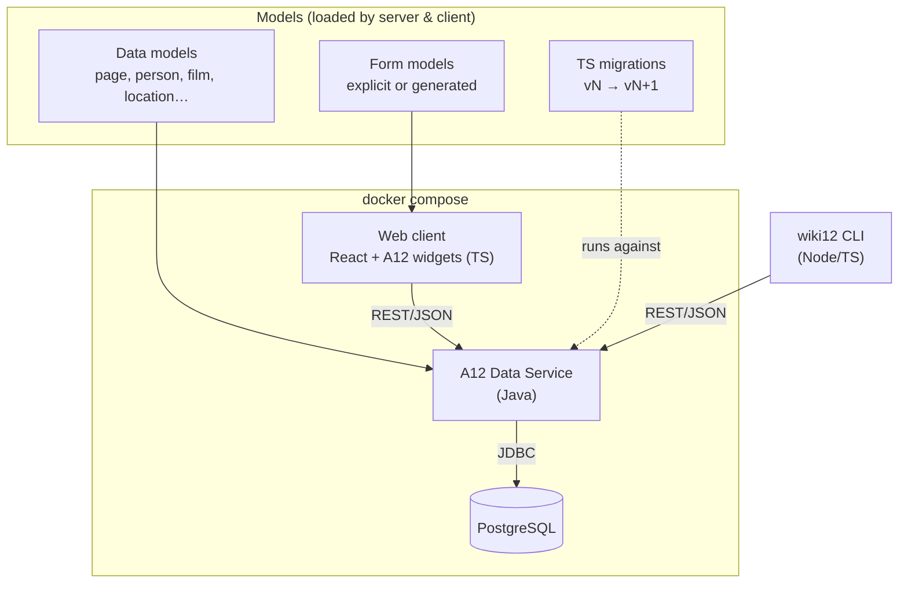
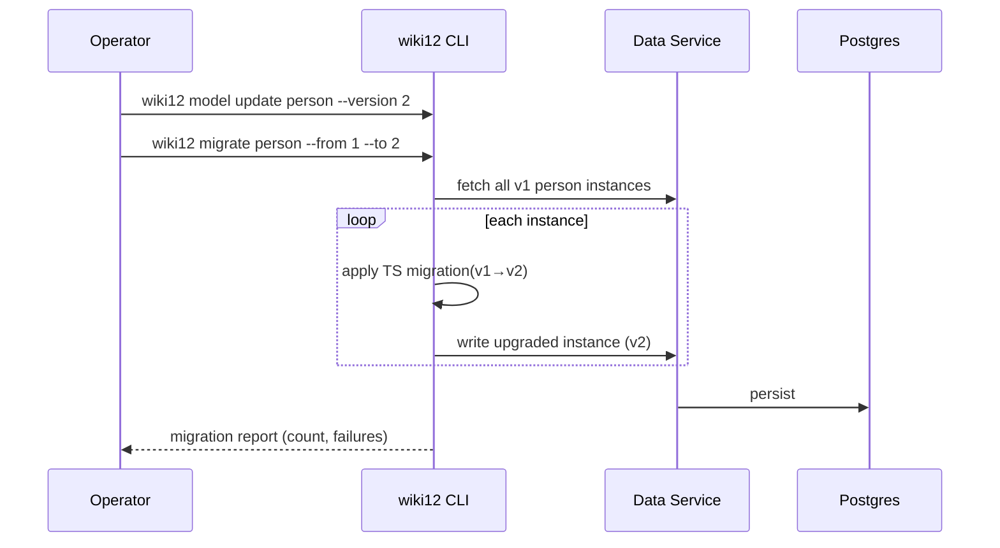
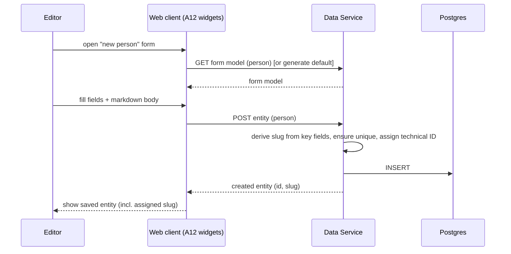
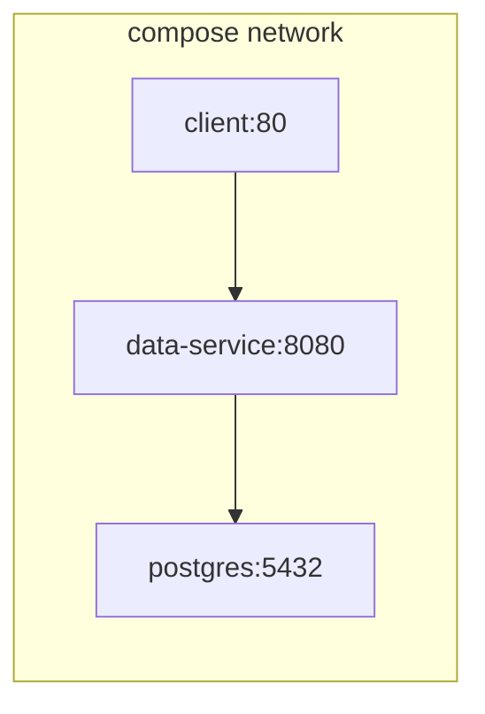

# Architecture: basic_setup

How the wiki12 baseline is built. Read `proposal.md` (what/why) and `domain.md`
(concepts) first; this document covers the technical approach.

## Technology stack

| Layer | Technology | Notes |
|---|---|---|
| Backend | **A12 Data Service** (Java) | Standard A12 server; serves model-driven CRUD over data models |
| Database | **PostgreSQL** | Persistence for content instances + model registry |
| Web client | **React + TypeScript** with **A12 widgets** | Built from scratch per the A12 widgets quick start |
| CLI | **`wiki12`** (Node/TypeScript) | CRUD + model management + migration runner; `-h` docs |
| Orchestration | **Docker Compose** | Server + Postgres + client (+ optional CLI image) |

A12 = mgm technology partners' model-driven application platform
(<https://github.com/mgm-tp>). We adopt its **data model / form model** split and
its Data Service CRUD contract rather than hand-rolling persistence.

## Component overview



## Key decisions

### 1. One content-item mechanism, model-driven

Pages and entities are **one mechanism** — a typed content item backed by an A12
data model, not bespoke tables (see ADR-0004). The Data Service exposes generic
CRUD keyed by model + technical ID. Adding a new type (e.g. `book`) is primarily
a **modeling** task, not a coding task. `page` is the **built-in type**; entity
types are user-defined over the same path. `wiki12 page …` is sugar for
`entity --type page …`.

- `page` data model: `title`, `slug`, `body` (markdown), `id`.
- One data model per entity type with the common fields (`type`, `slug`, `id`,
  a markdown description) plus type-specific fields.

### 2. Form models with default generation

Form models are **generated, stored, and managed server-side** (a content type
with no explicit form model gets a server-generated default — persisted, not
ephemeral). The **client form engine** is fed three inputs — an A12 **data
model** + **form model** + **document** — and does the rendering and client-side
validation. So every type is editable out of the box, and custom layouts are an
optional refinement. (Exact A12 mechanics are verified in Step 0.)

### 3. Slugs and identity

See ADR-0001 for the full model. In brief:

- Technical ID is server-assigned on create.
- Slugs are **read-only and system-derived** — never user-editable. Every slug is
  **namespaced** `<type>:<name>` (`page:albert_einstein`, `person:till_gartner`);
  each model declares its **key fields** and the `<name>` is derived from them.
  Format: lowercase `[a-z0-9_]`, `_` word separator, `:` namespace delimiter;
  `page` is the **default namespace**.
- Slugs are **globally unique**; collisions get a **sticky `_N` suffix**
  (`person:till_gartner_2`) fixed at creation. So `slug = f(key fields, creation
  order)` — stored state, not a pure function of current key fields.
- The slug is **(re)computed server-side** on create and on key-field change, so
  derivation and uniqueness are enforced once at the boundary and both web and
  CLI get the same rule. **This rests on the A12-extensibility gate (ADR-0002):**
  if the stock Data Service can't host this logic, a façade in front of it does.
- **Either ID or slug identifies an item** (resolution: try-ID-then-slug; the ID
  grammar is reserved so the two never collide; bare names default to `page:`).
- **Slug-change notification**: when a write changes a slug, the response carries
  old → new so clients surface a clear statement (web toast/banner, CLI message).
  The old slug then **404s** (aliases deferred).

### 4. Search

Baseline search is a **single unified endpoint** spanning all content (the
`page` type + every entity type), a Data Service query over title/slug/body
(substring / `ILIKE` against Postgres). It returns a **typed** result set (each
hit tagged with kind/type, id, slug, snippet) and accepts optional `kind`/`type`
filters. The web search box calls it directly; the CLI exposes it as `wiki12
search <query>`, with `page search` / `entity search --type` as filtered
conveniences over the **same** endpoint ("two clients, one contract"). Custom
query support rides the A12-extensibility gate (ADR-0002). Ranked/fuzzy search is
deferred (see proposal out-of-scope).

### 5. Migrations in TypeScript

Data models are versioned (see ADR-0003). A migration is a TS function over a
single A12 document — `(doc at vN) → (doc at vN+1)`; the runner handles
iteration, IO, dry-run, and reporting. The **`wiki12` CLI hosts the migration
runner** (Node already present for the CLI), keeping the Java server free of a JS
runtime. Registering a new version is **gated on the migration file existing**
(`wiki12 model update <type> --version N` refuses without
`migrations/<type>/<N-1>-<N>.ts`), and `page` is a valid migration target like
any entity type. A `--dry-run` that would change slugs reports the full old→new
manifest first:



### 6. Two clients, one contract

Both the web client and the `wiki12` CLI talk to the **same Data Service REST
API**. No business logic lives only in a client; validation (slug uniqueness,
required fields) is enforced server-side so the two stay consistent.

## CLI surface (`wiki12`)

Every command supports `-h/--help`.

```text
wiki12 search  <query>                                  [--kind page|entity] [--type <type>]
wiki12 page    list|create|read|update|delete|search    <id-or-slug>
wiki12 entity  list|create|read|update|delete|search    --type <type>  <id-or-slug>
wiki12 model   list|create|read|update                  <type>   (incl. page)
wiki12 form    list|create|read|update                  <type>   (incl. page)
wiki12 migrate <type> --from <v> --to <v> [--dry-run]
```

- `search`: unified search across all content; `page`/`entity` `search` are
  filtered conveniences over the same endpoint.
- `page` / `entity`: content CRUD. `page` is sugar for `entity --type page`.
  Items are addressed by either Technical ID or slug.
- `model`: Create/Read/Update of data models for any type, `page` included (no
  delete in baseline — destructive model removal is out of scope).
- `form`: Create/Read/Update of form models (any type, `page` included).
- `migrate`: run a TypeScript migration; `--dry-run` reports without writing
  (including the slug-change manifest).

## Data flow: create an entity (web)



## Deployment (docker compose)



- `postgres` — volume-backed; init script provisions the schema/model registry.
- `data-service` — depends on a healthy `postgres`; loads data/form models.
- `client` — static build of the React app served (e.g. nginx), pointed at the
  Data Service.
- `wiki12` CLI — installed locally or shipped as an optional image; targets the
  Data Service URL via config/env.

## Integration points & open questions

- **A12 server-side extensibility — the central gate (ADR-0002).** Slug
  derivation, slug resolution, and unified substring search all assume the stock
  Data Service can run custom server-side logic/queries. Step 0 resolves this as
  a single go/no-go; if A12 is a closed black box, a thin **façade** in front of
  it owns all three (A12 becomes pure model-driven storage).
- **Form engine.** Form models generated/stored/managed server-side; the client
  form engine renders from (data model + form model + document). The exact A12
  mechanics are verified in Step 0.
- **A12 API specifics** (exact endpoints, model registration format) follow the
  A12 quick start; the plan starts by scaffolding from it.
- **Markdown rendering widget**: use an A12 widget if available, else a vetted
  React markdown renderer wrapped as a widget.
- **Migration registry**: migrations are discovered by filesystem convention
  `migrations/<type>/<from>-<to>.ts` (fixed — ADR-0003).
