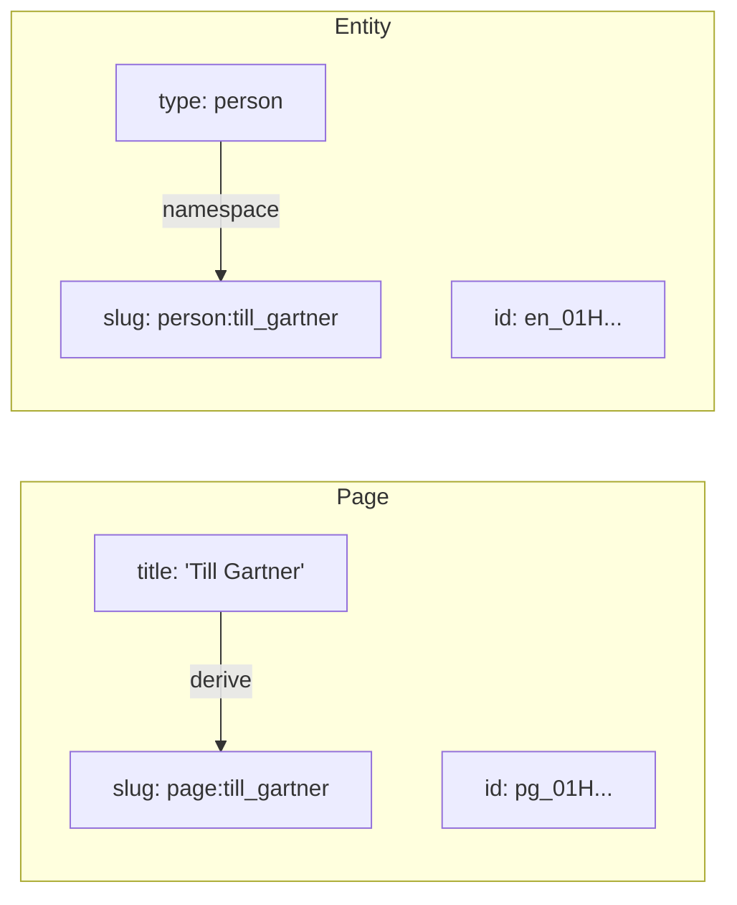
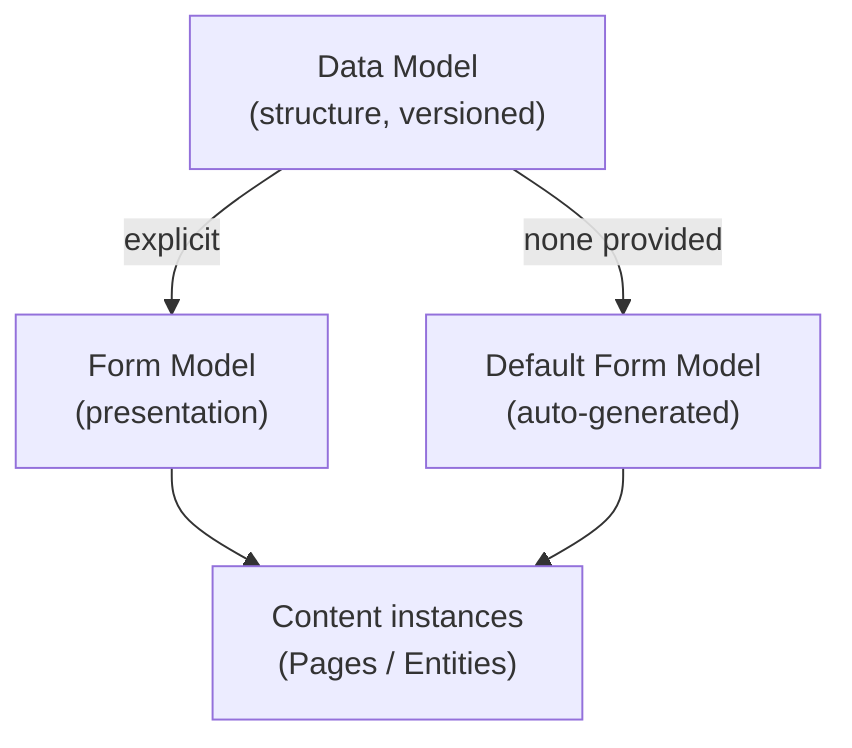
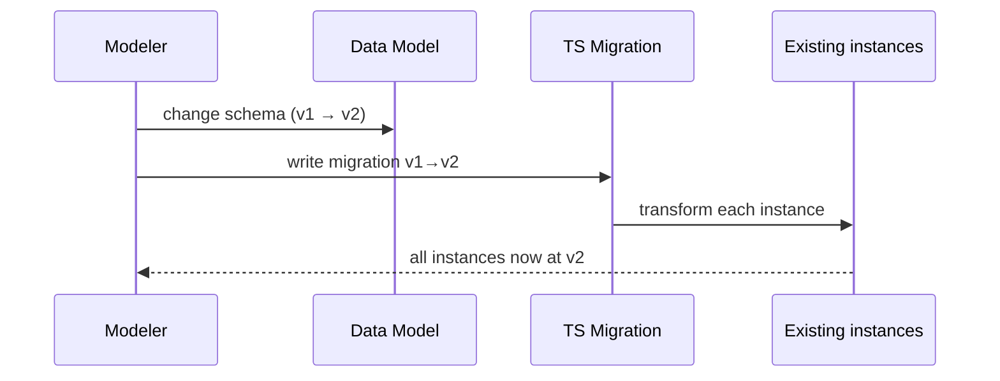
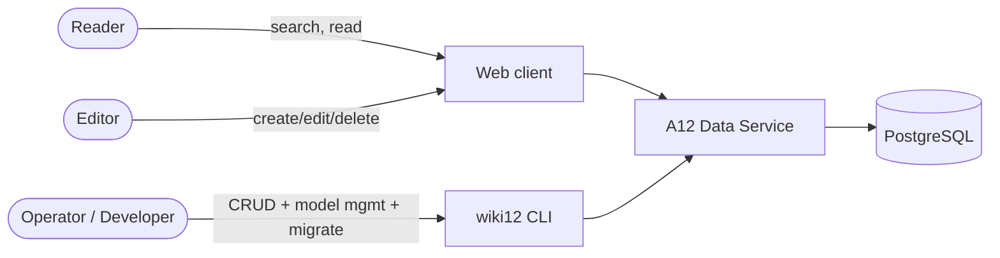

# Domain: basic_setup

This document captures the domain concepts the wiki12 system is built around. As
the first change in a greenfield project, it defines the vocabulary the rest of
the specs will reuse.

## Core concepts

### Content items

Pages and Entities are **one underlying mechanism** — a typed, versioned,
namespaced **content item** `{ type, slug, id, fields }`. "Page" and "Entity"
are vocabulary over this one mechanism, not separate implementations (see
ADR-0004).

| Concept | Identity | Key attributes | Body |
|---|---|---|---|
| **Page** | technical ID (system) + slug `page:<name>` | `title`, `slug`, `id` | markdown `body` |
| **Entity** | technical ID (system) + slug `<type>:<name>` | `type`, `slug`, `id` + type-specific fields | markdown field(s) |

- **Page** — a content item of the built-in **`page`** type. Has a `title`, a
  `slug` derived from the title (e.g. "Albert Einstein" → `page:albert_einstein`),
  a system-assigned **technical ID**, and a markdown **body**. The `page` type
  always exists and is the default slug namespace.
- **Entity** — a content item of a user-defined **type** (e.g. `person`, `film`,
  `location`), with a technical ID and a slug. Beyond the common fields, each
  type defines its own fields via its data model.

### Identifiers

- **Technical ID** — opaque, system-generated, stable, unique per item. Used for
  references and persistence; never shown as the primary human handle.
- **Slug** — the human-facing handle. It is **read-only**: the system creates
  and maintains it; users never edit it directly. Every slug is **namespaced**
  `<type>:<name>`, where the `<name>` is **derived from that type's key fields**:
  - Page: from the `title` (e.g. "Albert Einstein" → `page:albert_einstein`).
  - Entity: from the type's key fields (e.g. a person's first + last name →
    `person:till_gartner`).
  - Format: `<name>` is lowercase `[a-z0-9_]` with `_` as the word separator;
    `:` is the reserved namespace delimiter. `page` is the **default namespace**
    (a bare `<name>` resolves as `page:<name>`).
  - Slugs are **globally unique**; collisions get a **sticky numeric suffix**
    (`person:till_gartner_2`) assigned at creation and never recomputed.
- **Either identifier resolves an item.** Anywhere an item is named (CLI, API,
  link), both its Technical ID and its slug are accepted (resolution is
  try-ID-then-slug; see ADR-0001).
- **Slug changes are surfaced.** Editing a key field can change the slug; the
  system gives the user a **clear statement** of the old → new slug — in the web
  UI and the `wiki12` CLI. The old slug then **404s** (aliases/redirects are
  deferred).

### Markdown

All longer texts (page bodies, entity description fields) are authored in
**Markdown**. The web client renders markdown for reading and offers a markdown
editor for writing.

## Models (the A12 way)

Wiki12 is built on A12, where content structure is described by **models**:

- **Data Model** — defines the structure of a content item (fields, types,
  constraints). There is a data model for `Page` and one per entity `type`.
  Data models are **versioned**.
- **Form Model** — defines how a data model is presented and edited in a form
  (layout, widgets, validation). If a content type has **no explicit form
  model, a default form model is generated** from its data model. Conceptually,
  **every entity therefore has a form model** — explicit or generated.

## Model evolution & migration

When a `Page` or entity data model changes, existing instances were created
against an **older model version** and must be brought to the new one.

- A **Migration** is a **TypeScript** function over a single A12 document:
  `(doc at version N) → (doc at version N+1)`. Iteration, IO, and reporting live
  in the runner; the script only describes the per-document shape change.
- Migrations are the contract that makes model changes safe: no model bump ships
  without its migration — registering a new version is **gated on the migration
  file existing** (see ADR-0003). This applies to `page` too (it has a versioned
  data model like any entity type).

## Actors

- **Reader** — searches and reads pages/entities in the browser.
- **Editor** — creates, edits, and deletes content in the browser.
- **Operator / Developer** — uses the `wiki12` CLI for content CRUD, for
  managing data models and form models, and for running migrations.

## Glossary

- **Content item** — the single mechanism (`{ type, slug, id, fields }`) that
  both Pages and Entities are; typed, versioned, namespaced.
- **Page** — a content item of the built-in `page` type (title, markdown body).
- **Entity** — a content item of a user-defined type, with a namespaced slug.
- **Entity type** — a user-defined content type (`person`, `film`, `location`,
  …); `page` is the built-in type.
- **Technical ID** — opaque unique system identifier.
- **Slug** — read-only, system-derived handle; always namespaced `<type>:<name>`
  (derived from key fields; `page` is the default namespace); globally unique
  with a sticky `_N` suffix on collision; either ID or slug identifies an item;
  slug changes are reported and the old slug 404s.
- **Key fields** — the fields a slug is derived from (page: title; person:
  first + last name; per entity type).
- **Data model** — versioned structural definition of a content type.
- **Form model** — presentation/editing definition; auto-generated if absent.
- **Migration** — TypeScript script upgrading instances across model versions.
- **Data Service** — the standard A12 Java backend providing persistence/CRUD.