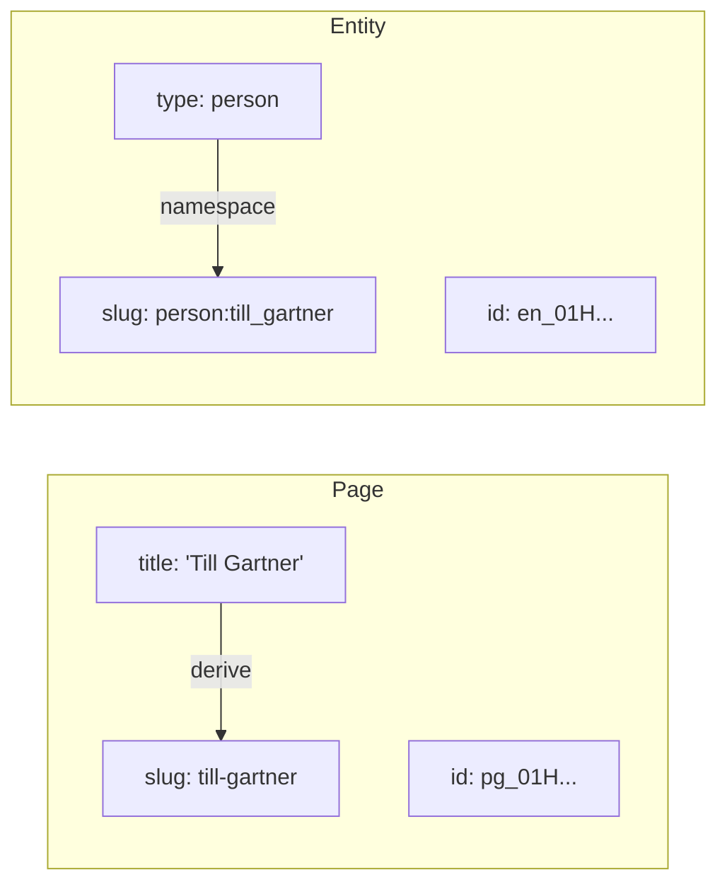
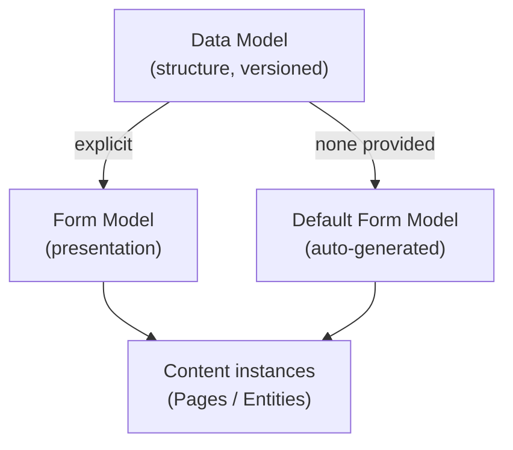
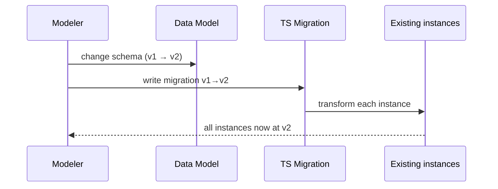

# Domain: basic_setup

This document captures the domain concepts the wiki12 system is built around. As
the first change in a greenfield project, it defines the vocabulary the rest of
the specs will reuse.

## Core concepts

### Content items

| Concept | Identity | Key attributes | Body |
|---|---|---|---|
| **Page** | technical ID (system) + slug (human) | `title`, `slug`, `id` | markdown `body` |
| **Entity** | technical ID (system) + slug (human, namespaced) | `type`, `slug`, `id` + type-specific fields | markdown field(s) |

- **Page** — the basic wiki unit. Has a `title`, a `slug` (typically derived
  from the title, e.g. "Till Gartner" → `till-gartner`), a system-assigned
  **technical ID**, and a markdown **body**.
- **Entity** — a typed content item. Every entity has a **type** (e.g. `person`,
  `film`, `location`), a technical ID, and a **slug**. Beyond the common fields,
  each type defines its own fields via its data model.

### Identifiers

- **Technical ID** — opaque, system-generated, stable, unique per item. Used for
  references and persistence; never shown as the primary human handle.
- **Slug** — the human-facing handle. It is **read-only**: the system creates
  and maintains it; users never edit it directly. A slug is **derived from the
  item's key fields**:
  - Page slug: derived from the `title`, URL-friendly (e.g. `till-gartner`).
  - Entity slug: **namespaced** as `<type>:<name>`, where the `<name>` part is
    derived from that type's key fields (e.g. a person's first + last name →
    `person:till_gartner`). Entity slugs are **globally unique**.
- **Slug changes are surfaced.** Because the slug tracks the key fields, editing
  a key field can change the slug. Whenever that happens, the system gives the
  user a **clear statement** that the slug changed — both in the web UI and in
  the `wiki12` CLI.

### Markdown

All longer texts (page bodies, entity description fields) are authored in
**Markdown**. The web client renders markdown for reading and offers a markdown
editor for writing.

## Models (the A12 way)

Wiki12 is built on A12, where content structure is described by **models**:

- **Data Model** — defines the structure of a content item (fields, types,
  constraints). There is a data model for `Page` and one per entity `type`.
  Data models are **versioned**.
- **Form Model** — defines how a data model is presented and edited in a form
  (layout, widgets, validation). If a content type has **no explicit form
  model, a default form model is generated** from its data model. Conceptually,
  **every entity therefore has a form model** — explicit or generated.

## Model evolution & migration

When a `Page` or entity data model changes, existing instances were created
against an **older model version** and must be brought to the new one.

- A **Migration** is a **TypeScript** script that transforms instances from
  data-model version *N* to version *N+1*.
- Migrations are the contract that makes model changes safe: no model bump ships
  without its migration.

## Actors

- **Reader** — searches and reads pages/entities in the browser.
- **Editor** — creates, edits, and deletes content in the browser.
- **Operator / Developer** — uses the `wiki12` CLI for content CRUD, for
  managing data models and form models, and for running migrations.

## Glossary

- **Page** — basic wiki content item (title, slug, id, markdown body).
- **Entity** — typed content item with a namespaced unique slug.
- **Entity type** — category of entity (`person`, `film`, `location`, …).
- **Technical ID** — opaque unique system identifier.
- **Slug** — read-only, system-derived handle (from key fields); namespaced
  (`type:name`) for entities; slug changes are reported to the user.
- **Key fields** — the fields a slug is derived from (page: title; person:
  first + last name; per entity type).
- **Data model** — versioned structural definition of a content type.
- **Form model** — presentation/editing definition; auto-generated if absent.
- **Migration** — TypeScript script upgrading instances across model versions.
- **Data Service** — the standard A12 Java backend providing persistence/CRUD.