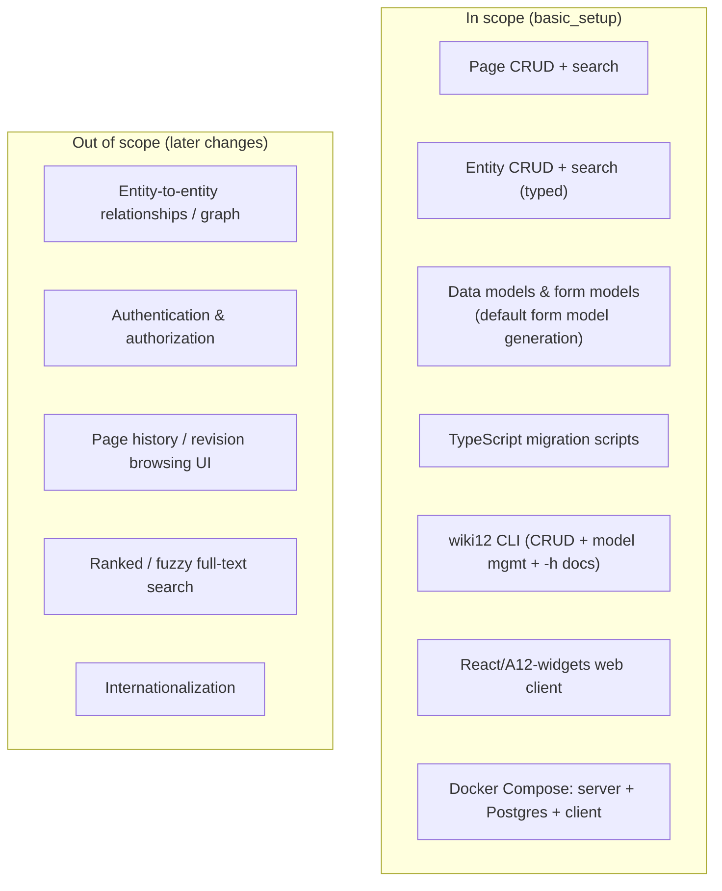

# Proposal: basic_setup

## Summary

Establish the foundational **wiki12** system: an A12-based wiki application that
manages **content items** over one mechanism — a built-in **Page** type and
user-defined typed **Entities** (person, film, location, …) — through a
React/TypeScript web client, a `wiki12` command-line interface, and the standard
A12 Data Service backend, all running under Docker Compose with a PostgreSQL
database.

This is a greenfield change. There is no existing codebase; `basic_setup`
bootstraps the entire system end to end and is the seed from which the future
`specs/system/` description will be derived.

## Motivation

We need a working, deployable baseline that proves out the full A12 stack and
the core content model before we layer on richer features (relationships
between entities, versioning UX, full-text ranking, access control, etc.).

The baseline must:

- Be runnable by a single `docker compose up`.
- Let a user **search, create, edit, and delete** Pages and Entities from the
  browser.
- Let a developer/operator do the same — plus manage **data models** and **form
  models** — from the `wiki12` CLI.
- Define a disciplined story for **model evolution**: when an entity or page
  data model changes, a TypeScript migration script transforms existing
  instances from the old version to the new one.

## Scope

### In scope

- **Content model**: one **content item** mechanism (`{ type, slug, id,
  fields }`). Every item has a namespaced slug `<type>:<name>`. `Page` is the
  built-in type (`page:albert_einstein`; title, markdown body) and the default
  slug namespace; `Entity` types (`person:till_gartner`, …) are user-defined
  types over the same mechanism, with type-specific + markdown fields.
- **A12 data models** for pages and each entity type, with **form models**
  (default-generated when not explicitly provided).
- **Web client**: search, create, edit, delete for both Pages and Entities,
  built from scratch with A12 widgets per the A12 quick start, in a compact flat
  theme. Includes a **System area** (link to the Keycloak console for user
  maintenance; a Migrations list with a simple TS-source editor).
- **`wiki12` CLI**: CRUD for pages and entities; a unified `search` across all
  content (with per-kind/per-type filters); Create/Read/Update for data and form
  models (`page` is a first-class managed type like any entity type); `-h` help
  on every command. Items are addressable by either Technical ID or slug.
- **Migrations**: TypeScript scripts that migrate page/entity instances across
  data-model versions.
- **Deployment**: `docker compose` with the Java A12 Data Service, PostgreSQL,
  and the client.

### Out of scope (deferred)

- Relationships/links between entities (a wiki "graph"), **authentication &
  authorization in wiki12** (login flows, route protection, role mapping),
  revision-history UI, ranked search, and i18n. These are explicitly future
  changes that build on this baseline.
- **Note on Keycloak:** it *is* deployed (from the Project Template) as the
  **sole user store**, and the build seeds an `admin`/`admin` user. What's
  deferred is wiki12 *consuming* it for auth — the baseline only **links out** to
  the Keycloak console for user maintenance (a "System" area), it does not gate
  content behind login or roles.

## Expected outcome

After `basic_setup` is applied:

1. `docker compose up` brings up a reachable web app, a healthy Data Service,
   and a seeded PostgreSQL database.
2. A user can find a Page or Entity via search, open it, edit its markdown,
   create new ones, and delete them — from the browser.
3. `wiki12 --help` documents the CLI; `wiki12 page ...`, `wiki12 entity ...`,
   and `wiki12 model ...` perform the documented operations against the same
   backend.
4. Changing a data model and supplying a TypeScript migration upgrades existing
   instances without data loss.

## Risks & assumptions

- **A12 server-side extensibility (the central gate)**: the slug logic, slug
  resolution, and substring search all assume the stock A12 Data Service can run
  custom server-side logic/queries. **Step 0 resolved this = GO** — the stock Data
  Service is extensible, so the logic lives inside it and the façade fallback is
  dropped (see ADR-0002). One residual gate: confirming raw `JdbcTemplate`/
  `DataSource` injection for the slug advisory lock (findings §1a).
- **A12 familiarity**: the team follows the A12 widgets quick start; the data
  model / form model split and the Data Service CRUD API are taken as given by
  the platform. Form models are generated by **our own** server-side tooling (A12
  has no generator — Step 0, findings §2), stored/managed server-side, and
  rendered by a client-side form engine.
- **Typo correction**: a Page slug is derived from its **title** (the brief said
  "derived from the slug", read as a typo).
- **Migration runtime**: TypeScript migrations run in a **server-side Node
  model-lifecycle service** (not the CLI), which transpiles and sandbox-executes
  them; migrations are stored as `Migration` content items, gated at upload
  (decided at the Step 0 review gate — see ADR-0003).
