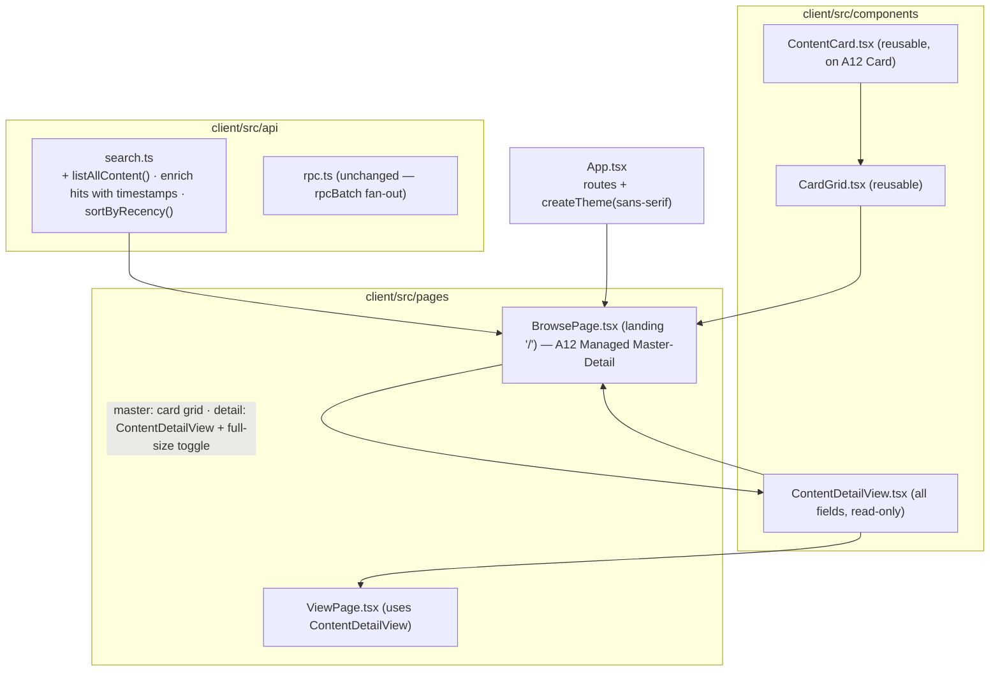

# Architecture: Content cards & the gallery

How the Content Card, the Gallery, live filter, the reduced Detail view, and the
Master-Detail Browse layout (with full-size toggle) are built. Read
[`proposal.md`](proposal.md) and [`domain.md`](domain.md) first.
Guiding constraints: **web-client only** (no server / model / lifecycle change),
**reuse before rebuild** (extend `api/search.ts`, reuse `ViewPage`'s render),
and **build genuinely reusable components** (`ContentCard`, `CardGrid`).

This change touches only `client/`. The fields the card reads (`CreatedOn`,
`Title`, `Changes`) are delivered by [`mandatory-content-fields`](../mandatory-content-fields/architecture.md);
every consumer of them here is written to **tolerate their absence** (see
*Graceful degradation*).

## A12 contract — docs-confirmed (no longer VERIFY)

Checked against the in-repo A12 mirror; these were open questions in the first
draft and are now settled, so the design below uses them directly:

| Concern | Confirmed contract | Source |
|---|---|---|
| **List all** documents of a model | `QUERY` `constraint` is **optional** — omit it to return every document; `paging.{pageSize,pageNumber}` is required | `data_services/dataservices-documentation-src.md` (QUERY → Selection / Paging) |
| **Server-side sort** | `QUERY` accepts `sort: [{ field, direction: "ASC"\|"DESC", nullHandling, ignoreCase }]` | same, → Sorting |
| **DateTimeType** value | ISO 8601 string `YYYY-MM-DDTHH:mm:ss` (e.g. `"2020-12-31T23:59:59"`) | `sme/sme-dm-ba-docs.md`, `kernel/kernel-documentation-ba-en.md` |
| **Repeatable group** in `document` projection | **JSON array of objects** (e.g. `Changes: [{ ChangedOn, Summary }, …]`) | `data_services/dataservices-documentation-src.md` (QUERY response example) |
| **Card** | A12 `Card` / `Card.Content` / `Card.ActionArea` (ActionArea adds `onClick`, `onKeyDown`, link role); flat-theme default font already `"Open Sans", sans-serif` | `widgets/data-display/card.md` |
| **Split pane + full-size** | A12 **Managed Master-Detail** — `views`, `columnCount`, `fullScreenable`, `fullscreen`, `onFullscreenToggled`, responsive `breakPoints` (sm = 767px → one view) | `widgets/layout/master-detail.md` |
| **Base font** | `createTheme({ typography: { fontFamily }, baseTheme: "flat" })` deep-merges over the default theme | `widgets/basics/theme.md` |

**Sort decision (settled by the above).** The server *can* sort, but only within
one model and only on a plain field path — it can't order by "the newest
`ChangedOn` inside the repeatable `Changes` group", and our list is a **cross-model
merge** anyway. So sorting stays a pure, client-side `sortByRecency` after the
merge (as before) — now a deliberate choice, not a gap. (We *may* additionally ask
each per-model QUERY to `sort` by `CreatedOn DESC` so a bounded page captures the
most relevant rows before the merge.)

## Component map



## 1. Read path — list-all + recency sort (`api/search.ts`)

The existing `unifiedSearch` already does a **client-side batched fan-out** (one
`QUERY` per content model via `rpcBatch`) and a pure `mergeResults`. We extend the
same module rather than adding a parallel one.

**List-all.** `unifiedSearch` returns `[]` for an empty query. Add
`listAllContent(): Promise<ContentCardData[]>` that runs the **same fan-out with a
constraint-free (match-all) QUERY** per model, so the gallery has a full set to
show before any typing.

```ts
// per model, instead of { operator: "simple_search", value: query }:
query: { targetDocumentModel: m.model, projectionName: "document",
         /* constraint omitted → all documents (docs-confirmed) */
         sort: [{ field: "CreatedOn", direction: "DESC",
                  nullHandling: "NULLS_LAST", ignoreCase: false }],
         paging: { pageSize: 100, pageNumber: 0 } }
```

Omitting `constraint` to list all documents, the `sort` shape, and `paging` are
all confirmed (see *A12 contract* above) — no VERIFY needed here anymore. The
per-model `sort` by `CreatedOn DESC` just biases the bounded page toward recent
rows; the authoritative cross-model ordering is still `sortByRecency` after merge.

**Card Data shape.** Extend the per-hit projection (`entriesToHits`) to also pull
the two envelope timestamps out of the root field bag:

```ts
export interface ContentCardData extends SearchHit {
  createdOn?: string;       // from CreatedOn (DateTimeType ISO string)
  lastChangedOn?: string;   // max(Changes[].ChangedOn) ?? createdOn
}
```

`rootFields()` already descends into the A12 group; reading `CreatedOn` and the
repeatable `Changes` group reuses it. `lastChangedOn` = the max `ChangedOn` across
the `Changes` repetitions (the change log is append-only, so the last/newest entry
is the modification time). The `DateTimeType` value is an ISO 8601 string and the
`Changes` group is a JSON array — both docs-confirmed (*A12 contract* above), so
the extraction (`Date.parse` the ISO string; `Math.max` over `Changes.map(c =>
c.ChangedOn)`) needs no live-stack VERIFY.

**Sort.** Hits come from several models, so the authoritative ordering happens
**after** the merge, client-side. Add a pure, unit-tested `sortByRecency(items)` →
`lastChangedOn` desc, with a stable fallback (missing timestamp sorts last, then by
title/slug). This stands even though the server `sort` exists (see *Sort decision*
above) because it can't express max-over-a-repeatable-group across models.

**Live filter.** Two viable strategies; we pick **fetch-once + filter-in-memory**
for the baseline and document the cap:

- `listAllContent()` runs **once** on mount (bounded `pageSize: 100`/model).
- Each keystroke filters the in-memory set with the **same substring match** the
  server's `simple_search` approximates (case-insensitive over title + snippet),
  debounced (~150 ms) only to avoid re-render churn — no per-keystroke round-trip.
- *(Alternative, noted not chosen:)* re-run `unifiedSearch(query)` server-side per
  keystroke. Rejected for the baseline: a network round-trip per keystroke for a
  small corpus, when the full set is already in hand. If the corpus outgrows one
  page, switch the live filter to debounced server search — the `unifiedSearch`
  path already exists for it.

> **Cap (logged, per CLAUDE.md "no silent caps"):** the gallery shows up to
> `pageSize` items **per model**; beyond that, items are not listed and the
> in-memory filter can't find them. The UI states the bound; cross-model paging is
> out of scope (proposal.md).

## 2. `ContentCard` — the reusable playing-card component

`client/src/components/ContentCard.tsx`. Props are the **Card Data** plus an
`onOpen` (so the click target is decided by the caller — gallery, future surfaces):

```ts
function ContentCard(props: { item: ContentCardData; onOpen: (item: ContentCardData) => void }): ReactElement
```

Layout (top → bottom), all **sans-serif**:

```
┌───────────────────────────┐   playing-card look:
│ 2026-06-01 · 2026-06-12   │   · rounded corners, 1px border + soft shadow
│                           │   · portrait-ish min-height, padded
│  Albert Einstein          │   · created · last change: ~0.72rem, grey (#888)
│  page                     │   · title: bold, ~1.05rem
│                           │   · type: chip (reuse <Chip tone="type">)
│  Theoretical physicist    │   · preview: clamped to N lines (-webkit-line-clamp)
│  who developed the …      │   · whole card is the click/keyboard target
└───────────────────────────┘
```

- **Built on the A12 `Card` widget** (clean-within-A12): the four slots live
  inside `Card` → `Card.ActionArea` → `Card.Content`. `Card.ActionArea` provides
  the whole-surface click (`onClick`), keyboard (`onKeyDown`) and link role for
  free — so `onOpen` wires to its `onClick`/`onKeyDown` rather than us
  re-implementing button semantics on a `div`.
  > **VERIFY (import path):** the exact package path for `Card`
  > (`@com.mgmtp.a12.widgets/widgets-core/lib/data-display/card`, by analogy with
  > the `layout/application-frame` import already in `App.tsx`) — confirm against
  > the installed package.
- Dates formatted from the ISO `createdOn`/`lastChangedOn` (e.g. `YYYY-MM-DD`); a
  pure `formatCardDate` helper, unit-tested. The whole top line is **omitted** if
  both timestamps are absent (degradation).
- The **type** slot reuses the existing `<Chip tone="type">` from `components/Ui.tsx`.
- **Playing-card look** is layered via the card's `style`/`className` and the
  `theme.card` tokens (`childMargin`, `content.fontFamily`, the `actionArea`
  hover/focus borders): rounded corners, soft shadow, portrait-ish min-height
  (A12 Card height range is 60–300px), padded. Content preview clamped with the
  A12 `lines-ellipsis`/`css-ellipsis` util (or `-webkit-line-clamp`).

**Reusability is the contract:** `ContentCard` depends only on `ContentCardData`
+ `onOpen` — never on the gallery, the router, or a fetch. Any future listing
hands it data and an open handler.

## 3. `CardGrid` — responsive layout

`client/src/components/CardGrid.tsx`. A thin layout wrapper: CSS grid with
`grid-template-columns: repeat(auto-fill, minmax(16rem, 1fr))` and a gap, so cards
flow into as many columns as the width allows and wrap into rows. Props:
`{ children }` (the cards) — it owns **only** layout, not data. Used by the
gallery now and any future card list.

## 4. `ContentDetailView` — all fields, read-only (the "reduced view")

`client/src/components/ContentDetailView.tsx`. Where the card shows four slots,
the detail view renders the **whole** item read-only. It is a generalisation of
today's `ViewPage`, which only renders the markdown `Body`.

```ts
function ContentDetailView(props: { item: ContentItem }): ReactElement
```

- Iterates the item's fields (`rootFields()` — already extracted/used in
  `content.ts`/`search.ts`/`ViewPage`) and renders each as a read-only
  **label → value** row. Field **labels/order/types** come from the item's **Data
  Model** metadata (reuse `lib/modelFields.ts` / `lib/docModel.ts`), so the view
  is type-agnostic and works for any Page or Entity.
- **Markdown fields** (the searchable `Body`/`Description`) render via the existing
  `ReactMarkdown`+`remarkGfm` path lifted from `ViewPage`; scalar fields render as
  text; the `Changes` group renders as a small reverse-chronological list (it is a
  JSON array — *A12 contract*).
- **Read-only by construction** — it renders values, never the Form Engine, so
  there is no write path to leak. (Alternative considered: drive the A12 Form
  Engine in a read-only/display mode with the generated FM. Rejected for now: it
  adds a VERIFY on the engine's read-only flag and pulls in form wiring for a pure
  display; a field-list renderer is simpler and reuses `modelFields`. Revisit if
  we want exact form-layout parity.)
- `ViewPage` is refactored to **fetch by ref and delegate to `ContentDetailView`**
  — so the standalone `/view/:ref` route and the Browse detail pane render
  identically from one component.

## 5. `BrowsePage` — the Master-Detail landing view

`client/src/pages/BrowsePage.tsx`, mounted at `/` (replacing `SearchPage` as home).
It is the A12 **Managed Master-Detail** widget with two views: the **master** = the
search field + `CardGrid`; the **detail** = `ContentDetailView` for the selected
item. Master-Detail gives the responsive split and the full-size toggle natively.

```mermaid
sequenceDiagram
    participant U as Reader
    participant B as BrowsePage (Master-Detail)
    participant S as search.ts
    participant DS as Data Service
    U->>B: open "/"
    B->>S: listAllContent()
    S->>DS: rpcBatch([QUERY per model, constraint omitted])
    DS-->>S: entries per model
    S-->>B: ContentCardData[] sorted by lastChangedOn desc
    B-->>U: master pane = CardGrid (newest first); no detail yet
    U->>B: type in filter (each keystroke)
    B->>B: debounced in-memory substring filter → master re-renders
    U->>B: click a card
    B->>B: set selected = item → detail pane shows ContentDetailView
    Note over B,U: wide screen → master+detail side by side (reduced)<br/>narrow screen → detail only (one view at a time)
    U->>B: click the detail's full-size control
    B->>B: onFullscreenToggled → detail at full viewport
```

- Holds `query` + fetched `ContentCardData[]` + `selected: ContentCardData | null`.
  The master view renders `<CardGrid>` of `<ContentCard onOpen={setSelected}/>`;
  the detail view renders `<ContentDetailView>` (fetching the full document by
  `selected` ref). Loading/empty/error reuse `Banner`.
- **Responsiveness is the widget's job.** Managed Master-Detail with
  `columnCount: 2` shows both panes above its `sm` breakpoint (767px) and **one
  view at a time** below it — so on a narrow screen the detail naturally opens
  full-width (the old "full-screen read" requirement, for free).
- **Full size** = the widget's `fullScreenable` detail + `onFullscreenToggled`
  control — the "field to bring it full size". No bespoke full-screen route.

  > **VERIFY (A12 Master-Detail):** confirm `fullScreenable`/`onFullscreenToggled`
  > expand the *detail* to the whole viewport (hiding the master) as intended, the
  > `columnCount`/`breakPoints` responsive behavior, and the exact import path
  > (`@com.mgmtp.a12.widgets/widgets-core/lib/layout/master-detail`). Examples in
  > `docs/a12/widgets/layout/master-detail.md`.

**Routing.** `BrowsePage` at `/`. The current `SearchPage` is **retired** as the
landing (its unified-search logic stays in `api/search.ts`; the live filter *is*
the search, made incremental). The standalone `/view/:ref` route stays (deep links
to a single item) and now renders `ContentDetailView` inside the shell. A12
Master-Detail manages selection in component state; deep-linking a *selected* item
in the split layout is out of scope (the `/view/:ref` route covers shareable
single-item links).

## 6. Sans-serif everywhere

Two facts from the docs make this small:

1. The A12 **flat theme is already sans-serif** — its component defaults are
   `"Open Sans", sans-serif` (e.g. `theme.card.content.fontFamily`,
   `theme.masterDetailLayout.title.fontFamily`). So widget-rendered text needs no
   change to *be* sans-serif.
2. The supported override is `createTheme(...)`, which deep-merges over the
   default theme (`widgets/basics/theme.md`).

So:

- Build the app theme with `createTheme({ typography: { fontFamily: SANS },
  baseTheme: "flat" })` (from `@com.mgmtp.a12.widgets/widgets-core/lib/theme/create-theme`)
  and pass it to the existing `ThemeProvider` in `App.tsx`, replacing the bare
  `flatTheme` import. `SANS` = a system sans stack
  (`-apple-system, Segoe UI, Roboto, Helvetica, Arial, sans-serif`).
- Belt-and-braces for our **own** inline-styled components (`Ui.tsx`, cards, detail
  view): a `font-family: inherit`/`SANS` rule via a styled-components global layered
  after A12's `GlobalStyles`, so nothing falls back to the browser serif default.

> **VERIFY (A12 Widgets):** the exact `typography.fontFamily` token path on the
> theme (the docs name "Font Family" under `.typography` but don't show the full
> object). If `createTheme` doesn't cascade to every widget, the layered
> `GlobalStyles` rule is the safe fallback (and the flat default is already
> sans-serif regardless).

## What's reused vs. new

| Reused | New |
|---|---|
| `rpc.ts` `rpcBatch` fan-out | `listAllContent()`, `sortByRecency()`, `ContentCardData` |
| `search.ts` merge/normalize core | `ContentCard.tsx`, `CardGrid.tsx`, `ContentDetailView.tsx`, `BrowsePage.tsx` |
| `Chip` (`Ui.tsx`) for the type slot | `createTheme(sans-serif)` in `App.tsx`; sans-serif global |
| A12 `Card` + `Card.ActionArea` (click/a11y) | — |
| A12 Managed **Master-Detail** (split + full-size + responsive) | — |
| `ViewPage` markdown render; `lib/modelFields`/`docModel` (field labels) | `ViewPage` refactored to delegate to `ContentDetailView` |

## Testing strategy (test-first)

Pure logic is unit-tested (Vitest, no live stack — consistent with
`search.test.ts`):

- `sortByRecency` — recency desc, missing-timestamp fallback, stable order.
- `lastChangedOn` extraction — max over the `Changes` group; falls back to
  `CreatedOn`, then `undefined`.
- the in-memory live filter predicate — case-insensitive substring over
  title+snippet; empty query = all.
- `formatCardDate` — ISO → display; empty/absent input.
- `ContentCard` render — date line omitted when timestamps absent (degradation);
  `onOpen` fires on click/Enter (via `Card.ActionArea`).
- `ContentDetailView` render — all fields shown read-only; markdown field rendered
  as markdown; `Changes` array rendered reverse-chronologically; absent envelope
  fields simply not shown.

Then the browser verification per CLAUDE.md: `npm run dev`, open the app, and on a
**wide** viewport screenshot master+detail (reduced) and the **full-size** toggled
state; on a **narrow** viewport screenshot the single-view detail. Save artifacts
under `tmp/`.

## Graceful degradation (parallel-development contract)

Every read of an envelope field is optional-chained with a fallback, so the
gallery works **before** `mandatory-content-fields` lands and improves
automatically after:

| Field absent | Behavior |
|---|---|
| `CreatedOn` & all `ChangedOn` | card omits the top date line; item sorts last |
| `Title` (entity) | fall back to `Name`/`FirstName+LastName`/slug (today's heuristic) |
| `Changes` log | `lastChangedOn` falls back to `createdOn`, else undefined |

## VERIFY summary (extends the client `// VERIFY` set)

The first-draft VERIFY items (list-all, DateTimeType format, repeatable-group JSON,
font override approach) are **resolved by the docs** (see *A12 contract*). What
remains are import-path / widget-behavior confirmations against the installed
packages + a live stack:

1. **A12 `Card`** import path + that `Card.ActionArea` gives the whole-surface
   click/keyboard/link role we wire `onOpen` to (§2).
2. **A12 Managed Master-Detail** — `fullScreenable`/`onFullscreenToggled` expand
   the detail to full viewport, `columnCount`/`breakPoints` responsive behavior,
   and import path (§5).
3. **`typography.fontFamily`** token path on the theme for `createTheme` (§6) —
   layered `GlobalStyles` is the safe fallback.
