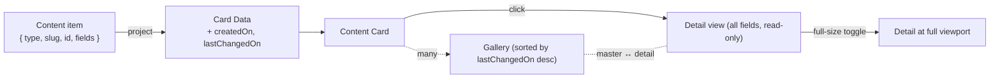
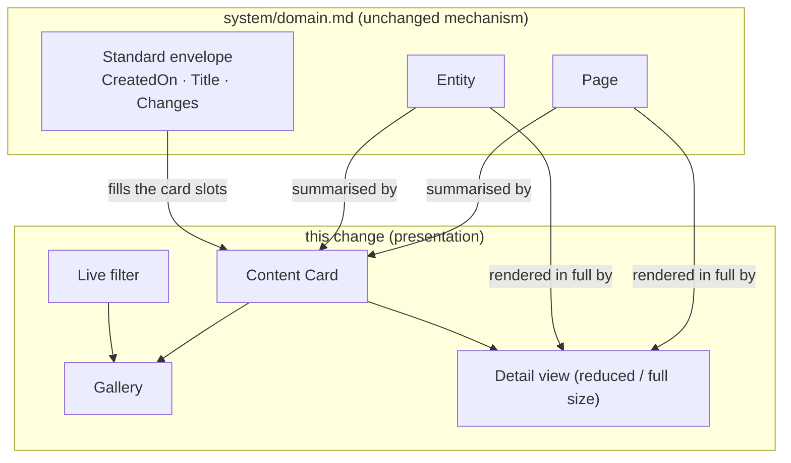

# Domain: Content cards & the gallery

What this change adds to the shared vocabulary. It introduces **no new content
mechanism** — Pages and Entities stay exactly what [`system/domain.md`](../../system/domain.md)
defines. It adds **presentation** terms (how a Content item is *summarised* and
*browsed*) and one derived read-model concept. Keep these terms exact.

## New terms

### Content Card

A uniform, type-agnostic **visual summary of a single Content item** — the same
component for a Page or any Entity Type. It is the reader-facing counterpart of
the "one mechanism, two vocabularies" model (ADR-0004): one card shape, every
type. A Content Card surfaces exactly four things, in this order:

| Slot | From the Content item | Meaning |
|---|---|---|
| **Created · Last change** | `CreatedOn`, latest `Changes[].ChangedOn` | when it came into being / was last touched |
| **Title** | `Title` (Key-Field-derived or authored) | the human handle |
| **Type** | `type` | which vocabulary/model it is (`page`, `person`, …) |
| **Content preview** | beginning of the markdown body/description | what it's about |

The Created/Last-change/Title fields are exactly the **standard envelope** defined
by the [`mandatory-content-fields`](../mandatory-content-fields/domain.md) change;
the Content Card is the first surface that consumes the whole envelope at once.

### Gallery (the "All pages" view)

The landing **browse surface**: every Content item shown as Content Cards in a
responsive grid, **ordered by last modification (newest first)** by default. The
Gallery is *type-blind* — a Page and a `person` Entity sit side by side, ranked
only by recency. It is **browse-first** (you see everything before you search),
the inverse of the baseline's search-first row list.

### Live filter

Filtering the Gallery **as the reader types** — the visible set narrows on every
keystroke, with no explicit "search" action. An empty filter means "show all"
(the default recency-sorted set). This refines the existing **Search** capability
(unified, substring over `searchText`) into an **incremental** interaction; it is
the same matching, applied continuously.

### Detail view (the "reduced view")

A **read-only rendering of a single Content item showing all of its fields** —
the counterpart to the Content Card's summary. Where the card shows four slots,
the Detail view shows the *whole* item (every field, read-only; markdown fields
rendered as markdown). It is the existing **Read** capability
(`system/functional.md`), generalised from "render the markdown body" to "render
the full field set", and presented in the Master-Detail right pane.

### Browse (Master-Detail) & Full size

**Browse** is the landing interaction: the Gallery (master) and the Detail view
(detail) side by side, following A12's **Master-Detail** pattern. On a **wide
screen** both panes show — pick a card on the left, read it on the right
("reduced", because it shares the width with the gallery). On a **narrow screen**
only one pane fits, so selecting a card shows the Detail view on its own (the
gallery steps aside).

**Full size** is the reader's action of **expanding the Detail view to occupy the
whole viewport** (hiding the gallery), via a control on the detail pane — A12
Master-Detail's native fullscreen toggle. It replaces the earlier notion of a
separate "full-screen read mode": full size is a *state of the Browse layout*, and
on a narrow screen the detail is effectively full-size already.

## Card data (derived read-model)

The Gallery needs a small projection per item — distinct from the full document a
Read fetches. We name it **Card Data**: `{ kind, type, id, slug, title, snippet,
createdOn?, lastChangedOn? }`. It extends the existing **Search hit**
(`kind/type/id/slug/title/snippet`) with the two envelope timestamps that ordering
and the date line need. `lastChangedOn` is the **most recent** `Changes[].ChangedOn`
(falling back to `CreatedOn`, then to nothing). The `?` marks the graceful-degradation
contract: cards render without the date line when the envelope is absent.

## Actors

No new actors. The **Reader** (searches and reads in the browser, per
`system/domain.md`) gains the browse-first Gallery and the split-pane Detail view
with full-size reading; the Editor/Operator are unaffected by this change.

## Relationship to existing terms

- **Content Card** is presentation over a **Content item** — not a new kind of
  content.
- **Gallery** / **Live filter** are a refinement of **Search** + **Read**, not new
  capabilities at the contract level (same Data Service ops).
- **Detail view** (reduced and full size) is a presentation of the existing
  **Read**, generalised to render all fields.
