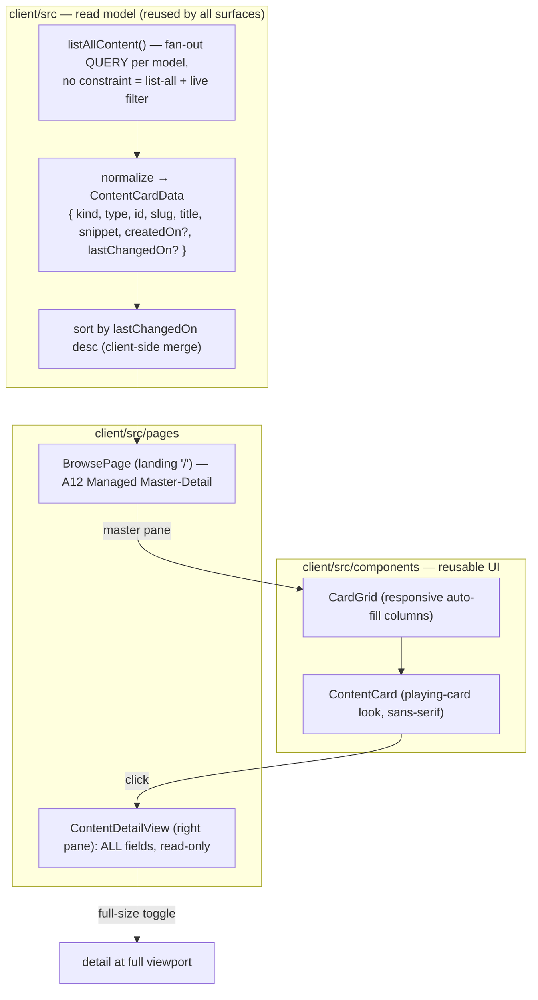

# Proposal: Content cards & the "All pages" gallery

## What

Three tied-together, reusable pieces of web-client UI over the existing one
content mechanism (Pages + every Entity Type):

1. **A reusable `ContentCard`** — a visual, playing-card-styled component that
   represents **any** Content item (Page or Entity, any type) identically. It
   shows, top to bottom:

   | Slot | Source field | Style |
   |---|---|---|
   | created · last change | `CreatedOn` + latest `Changes[].ChangedOn` | small, grey, very top |
   | **title** | `Title` (derived/authored) | **bold** |
   | type | the content `type` / model (e.g. `page`, `person`) | label/chip |
   | content preview | beginning of the markdown body/description | plain, clamped |

   All type faces in the card (and the wider client) are **sans-serif**. The card
   is used **everywhere a content item is summarised** — and clicking a card,
   anywhere it appears, opens that item in **read mode** (in the detail pane on a
   wide screen, full-width on a narrow one — see #3).

2. **An "All pages" gallery** as the landing view — on opening the app you see
   **every** Content item (built-in `page` and every model-based Entity alike),
   rendered as `ContentCard`s in a **responsive multi-column grid**, **sorted by
   last modification, most-recent first**. A single search field filters the grid
   **live, on every keystroke** (no submit button); clearing it returns to the
   full, recency-sorted list.

3. **A split-pane reduced detail view.** Clicking a card on a **wide screen**
   keeps the gallery on the left and opens a **reduced, read-only view of the
   item on the right** — showing **all** of its fields (not just the body
   preview), read-only. That right pane carries a control to **expand it to full
   size** (occupying the whole viewport). On a **narrow screen** there is no room
   for two panes, so the detail opens **full-width on its own** (the gallery
   steps aside) — the "full-screen read" behavior for small viewports. This is
   the A12 **Master-Detail** pattern (master list ↔ detail, responsive, with a
   native full-size toggle), so we adopt the widget rather than hand-roll it.

## Why

The baseline web client lists content as plain text rows behind a submit-button
search (`SearchPage`), and you can only *find* content you can already name — there
is no "what's here / what changed recently" landing. The
[`mandatory-content-fields`](../mandatory-content-fields/proposal.md) change gives
every item a uniform envelope (`CreatedOn`, `Title`, `Changes`), which for the
first time makes a **generic, type-agnostic** summary card and a **recency-sorted
overview** writable *once* across all types. This change spends that envelope on
the reader's primary surface:

- a **browse-first** landing (see everything, newest first) instead of search-first;
- **instant** filtering (results track typing, no round-trip-to-submit);
- a **single visual vocabulary** (the card) reused across the gallery and any
  future listing, so Pages and Entities look and behave the same — the UI
  expression of ADR-0004's "one mechanism, two vocabularies".

## Dependency & sequencing

This change **consumes** the envelope fields from `mandatory-content-fields`
(`CreatedOn`, `Title`, the `Changes` log). It is sequenced **after** it, but is
designed to **degrade gracefully** so the two can be built in parallel and merged
in either order:

- If `CreatedOn` / `Changes` are absent on an item, the card omits the date line
  (or shows nothing in that slot) rather than breaking; sort falls back to slug
  order.
- `Title` already exists on `Page`; for entities it arrives with the envelope.
  Until then the card falls back to the same title heuristic the current search
  uses (`Title ?? Name ?? FirstName+LastName ?? slug`).

## Scope

**In scope**
- A reusable **`ContentCard`** component (playing-card styling, the four slots
  above, sans-serif), built on the **A12 `Card` widget** (`Card.ActionArea` for
  click/keyboard/link role), and a reusable **`CardGrid`** (responsive columns/rows).
- A **list-all + live-filter** read path (extend `api/search.ts`): fan-out a
  constraint-free `QUERY` per content model, normalize to a card-data shape that
  **includes `createdOn` and `lastChangedOn`**, merge + **sort by last
  modification desc** client-side. Debounced live filtering on keystroke.
- A **`ContentDetailView`** component: renders **all** of an item's fields
  read-only (markdown fields rendered as markdown), driven by the document + its
  Data Model field metadata.
- A **`BrowsePage`** as the landing route (`/`) built on the **A12 Managed
  Master-Detail** widget: master pane = live search field + `CardGrid`; detail
  pane = `ContentDetailView`; native **full-size toggle** on the detail; responsive
  (single view on narrow screens). Replaces the submit-button `SearchPage` as home.
- **Sans-serif** type across the client (`createTheme` typography override + a
  global stack for our own non-widget components).
- Update `specs/system/functional.md` and the client `README.md` to reflect the
  new browse + split-pane detail + full-size behavior.

**Out of scope**
- Server / Data Model / lifecycle changes — this is **web-client only**. (The
  fields it reads are delivered by `mandatory-content-fields`.)
- Ranked/fuzzy search, faceting, or cross-model paginated infinite scroll — the
  gallery fetches a bounded page per model and merges (a documented cap).
- CLI changes — the CLI keeps its text output.
- Editing from the card / detail (create + edit stay on their existing routes;
  the detail view is read-only).

## Expected outcome

Opening wiki12 lands on a grid of cards — every Page and Entity, newest-changed
first. Each card looks like a playing card: a faint grey "created · changed" line
on top, a bold title, the type, and a few lines of the content. Typing in the
search box re-filters the grid on every keystroke; clearing it restores the full
recency-sorted set. On a wide screen, clicking a card opens a reduced, read-only
view of all its fields in the right pane, with a control to expand it to full
size; on a narrow screen that read view takes the whole width. Everything is
sans-serif, and the card, grid, and detail view are components reused, not
re-implemented, wherever content is listed.

## A12 questions resolved (docs-checked)

Checked against the in-repo A12 mirror (`docs/a12/`) so the design rests on the
real contract, not guesses:

| Question | Answer | Source |
|---|---|---|
| List **all** documents of a model | `QUERY` `constraint` is **optional** — omit it | `data_services/dataservices-documentation-src.md` |
| `DateTimeType` wire format | ISO 8601 `YYYY-MM-DDTHH:mm:ss` | `sme/sme-dm-ba-docs.md`, kernel docs |
| Repeatable group (`Changes`) JSON | **array of objects** `[{ChangedOn, Summary}, …]` | `data_services/dataservices-documentation-src.md` |
| Sans-serif base font | `createTheme({ typography: { fontFamily }, baseTheme: "flat" })`; flat-theme defaults are **already** `"Open Sans", sans-serif` | `widgets/basics/theme.md` |
| Split pane + full-size toggle | A12 **Managed Master-Detail** widget (`columnCount`, `fullScreenable`, `onFullscreenToggled`, responsive `breakPoints`) | `widgets/layout/master-detail.md` |
| Clickable card | A12 **`Card`** widget + `Card.ActionArea` (`onClick`/`onKeyDown`/link role) | `widgets/data-display/card.md` |
