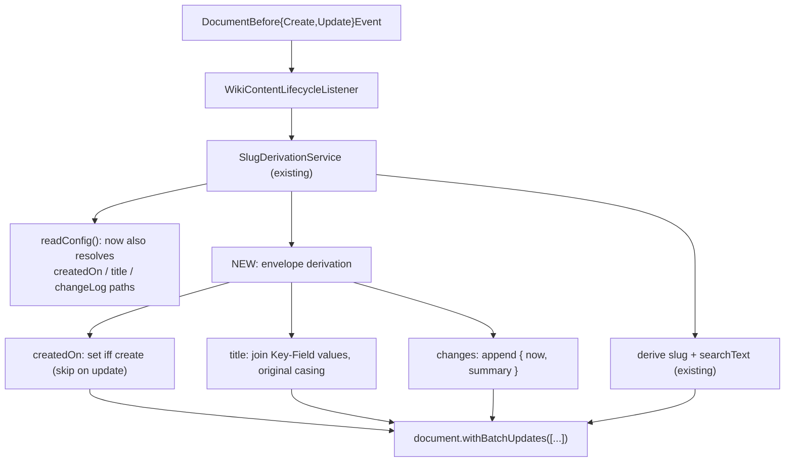
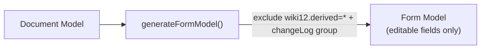
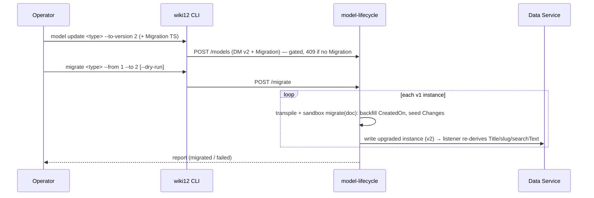

# Architecture: mandatory content fields

How the standard envelope (`CreatedOn`, `Title`, `Changes`) is realised. Read
[`proposal.md`](proposal.md) and [`domain.md`](domain.md) first. The guiding
constraint: **stay clean within A12 and the existing wiki12 logic** — reuse the
derived-field mechanism (`slug`/`searchText`) rather than inventing a parallel
one, and express every field with native A12 model constructs.

## Design principle

The three fields are added as **derived fields**, maintained by the **existing**
`@CommonDataServicesEventListener` inside the write transaction (ADR-0001). The
listener already reads `wiki12.*` field annotations off the Document Model to
decide what to derive; we add three more derivation targets, marked with three
more annotation values. **No new service, no new boundary, no new transaction.**

## A12-native field shapes

| Field | A12 construct | DM fragment |
|---|---|---|
| CreatedOn | `DateTimeType` (ISO/UTC, no extra config — `sme-dm-ba-docs §Date Time Fields`) | `{ "fieldType": { "type": "DateTimeType" } }` + `wiki12.derived="createdOn"` |
| Title (derived) | `StringType` | `{ "fieldType": { "type": "StringType" } }` + `wiki12.derived="title"` |
| Changes | **repeatable `Group`** (`repeatability` > 1) containing two fields | group with `wiki12.derived="changeLog"`; child `ChangedOn` (`DateTimeType`, `wiki12.changeField="datetime"`) + `Summary` (`StringType`, `wiki12.changeField="summary"`) |

`DateTimeType`, `StringType`, and group repeatability are all already accepted by
the model validator (`src/model_tools/validate.py` `KNOWN_FIELD_TYPES`) and are
standard A12 — confirmed against `docs/a12/sme/sme-dm-ba-docs.md`. The Changes
group is the first use of A12 group repeatability in wiki12.

## New annotations

Add to the wiki12 annotation contract (`server/.../slug/SlugAnnotations.java` —
the existing constants holder; consider renaming it to `WikiAnnotations`, see
*Tradeoffs*). All are field/group-level on the Document Model:

| Annotation | On | Value | Meaning |
|---|---|---|---|
| `wiki12.derived` | field | `createdOn` | stamp once at create, never on update |
| `wiki12.derived` | field | `title` | derive from Key Fields (human label) |
| `wiki12.derived` | group | `changeLog` | the repeatable Change-log group |
| `wiki12.changeField` | field | `datetime` \| `summary` | role of a field inside a Change Entry |

`wiki12.derived` already exists with values `slug`/`searchText`; we extend its
vocabulary. `wiki12.changeField` is new.

## Server: extend the derivation, don't fork it

- **`ModelDerivationConfig`** (in `SlugDerivationService`) gains
  `createdOnPath`, `titlePath`, and the change-log paths
  (`changeLogGroupPath`, `changeDatetimePath`, `changeSummaryPath`), resolved in
  the same `readConfig()` annotation walk that already finds slug/searchText.
- **CreatedOn** — on `deriveForCreate`, append
  `UpdateAction.putFieldValue(createdOnPath, now)`. On `deriveForUpdate`, **do
  nothing** (immutable). `now` must come from the same clock A12 uses; prefer the
  event/transaction timestamp if A12 exposes one, else server `Instant.now()`
  truncated to the model's `timeZone` (UTC). *(VERIFY — see below.)*
- **Title** — derive from the same Key-Field values `readFieldValues(...)`
  already collects for the slug, but joined **human-readable** (original casing,
  single space, no slugification): `Till` + `Gartner` → `Till Gartner`. Only when
  the model declares a `wiki12.derived="title"` field. Re-derived every write
  (cheap, idempotent), like the slug name part.
- **Changes** — append one Change Entry to the repeatable group:
  - create → `Summary = "created"`.
  - update → `Summary = "updated: <field labels>"`, computed by diffing the
    `updated` vs `persisted` document over the **editable** (non-derived) fields.
    A12 exposes both documents on `DocumentBeforeUpdateEvent`
    (`getUpdatedDocument()` / `getPersistedDocument()`), already used for the
    slug rename diff — reuse that.
  - `ChangedOn = now`.
  - Appending a repetition to a repeatable group is the one genuinely new A12 API
    here. *(VERIFY — `UpdateAction` for adding a group repetition; the existing
    code only uses `putFieldValue` on scalar paths.)*

The pure, A12-free parts (humanizing Title from values, formatting a summary
string from a set of changed field labels) go in **`Slugifier`** (or a sibling
pure class) so they stay **unit-testable offline**, matching how `deriveName` /
`searchText` are already factored. The A12-bound parts (reading the now-clock,
appending a group repetition) stay in `SlugDerivationService`.

## Forms: exclude all derived fields from editing

`src/dm-to-fm/generate.ts` currently excludes only fields annotated
`wiki12.derived="searchText"`. Generalise: exclude **every** field annotated
`wiki12.derived="<anything>"`, and skip the `wiki12.derived="changeLog"` group
entirely. This also (correctly) removes `slug` from generated edit forms.

Crucially, only **derived** fields are excluded. A model may carry an
**authored** title that the user writes — `Page`'s `Title` Key Field is exactly
such a case — and because it is not annotated `wiki12.derived`, it stays editable
in the generated form. Only derived envelope fields are removed; read-only
*display* of those is the client's job (View screen), not the edit form's.

## Enforcing the envelope on every model

The envelope is only useful if **every** content model carries it — including new
Entity Types added later. We enforce this in **two wiki12-owned layers**, with the
A12-native model hook held in reserve:

1. **Authoring / CI — the offline validator (primary, cheapest).**
   `src/model_tools/validate.py` (`just validate-models`) already enforces the
   per-content-DM conventions (must have a `wiki12.keyField`, a `wiki12.derived="slug"`
   field, a searchable markdown field). Extend it to also require the envelope:
   a `wiki12.derived="createdOn"` field, a `wiki12.derived="changeLog"` group with
   `changeField="datetime"`/`"summary"` children, and a `Title` (authored Key
   Field **or** `wiki12.derived="title"`). This fails the build before anything is
   uploaded and rides the existing `just test` gate.

2. **Upload — the model-lifecycle gate (runtime backstop).** `POST /models`
   (`model-lifecycle/src/registry.ts`) already rejects ungated version bumps with
   a `409 GateError` (ADR-0003). Add the same envelope check there, reusing the
   `GateError`/409 path, so a model can't be deployed at runtime even if it
   skipped CI.

3. **A12-native hook — `IModelRepository` (reserve, only if a bypass exists).**
   To the direct question "does A12 offer a model-upload hook?": **yes** —
   `IModelRepository` lets a project implement custom behaviour for model **CRUD**;
   `ModelService` selects an implementation via its `supports()` method, and its
   `save`/`update` methods are where a model could be validated/rejected or
   augmented on persist (`dataservices-documentation-src.md §IModelRepository`).
   It is the model-level analogue of the document-level
   `@CommonDataServicesEventListener` we already use. We **do not** adopt it now:
   it is heavy (you own model persistence + repository ordering; the default repo
   is explicitly not for extension), and in wiki12 every model reaches the Data
   Service **through** the model-lifecycle gate, so layers 1–2 already cover it.
   The one path that bypasses model-lifecycle is A12's startup classpath/file
   import (`mgmtp.a12.dataservices.initialization.import.models.path`); wiki12 does
   not deploy models that way, but if it ever does, `IModelRepository` (or running
   the validator at image-build time) becomes the enforcement point.

**Check vs. inject.** We *check* (reject models missing the envelope) rather than
silently *inject* it, so Document Models stay explicit and self-describing —
consistent with wiki12 hand-authoring DMs and validating them. (Auto-injecting the
envelope via a generator, the way Form Models are generated, is a viable
alternative if author burden ever becomes a problem; not adopted now.)

## Versioning & migration (ADR-0003 gate)

The baseline DMs carry **no** `wiki12.version` annotation (grep confirms none
exist). This change therefore both **establishes** the content-schema version
axis and performs its first bump:

1. Stamp the current shape as `wiki12.version = "1"` (header annotation) — the
   pre-envelope baseline.
2. Add the envelope fields and bump to `wiki12.version = "2"`.
3. Per ADR-0003 a higher version is rejected (409) unless a matching
   **Migration** ships with it. Provide one TS Migration per content type (or one
   shared `migrate(doc)` that is type-agnostic) that:
   - sets `CreatedOn` to a backfill instant (the migration run time, since the
     true creation time is unknown for legacy rows — documented as a known
     approximation);
   - seeds a single Change Entry `{ now, "migrated to v2" }`;
   - leaves Title to be (re-)derived on next write, or computes it inline from the
     instance's Key Fields.

## Clients (read-only surfacing)

- **Web client** — View screen (`ViewPage`) shows `CreatedOn` (formatted),
  `Title`, and the `Changes` log (reverse-chronological). Edit screen shows none
  of them (already excluded from the generated FM). No new write path.
- **CLI** — `wiki12 page/entity get` output includes the three fields; the change
  summary is auto, so **no new flag** on create/edit (consistent with the
  auto-appended decision).

## Tradeoffs & decisions

- **Reuse the listener vs. a new audit component.** Reuse. The envelope is the
  same lifecycle role as slug/searchText; a separate component would duplicate
  the annotation walk and need its own slice of the write transaction. Keeping it
  the derivation in the existing service is the clean-within-A12 choice. Because
  it now derives the whole envelope rather than just the slug, it is **renamed
  `SlugDerivationService` → `ContentDerivationService`** (and the annotation
  holder `SlugAnnotations` → `WikiAnnotations`) as part of this change — a pure
  rename, carried as its own commit (plan.md step 8).
- **Title is derived only where needed.** Page authors its Title as a Key Field
  (a page title is source, not derivable), so Page keeps an editable `Title`;
  other types get a derived one. Uniform **contract** (every model has a `Title`
  field), mechanism differs per type. The listener derives Title only for models
  that declare `wiki12.derived="title"` — authored titles are left untouched.
- **Auto summary vs. user note.** Auto (confirmed). The update summary is a
  field-name diff, not a semantic description — cheap, always present, never
  skipped. A richer user-authored note is a clean future extension (add a
  `wiki12.changeField="note"` and a write-path input) without reworking this.
- **Changes is a repeatable Group.** It is the A12-native representation of "a
  list of structured entries", queryable and renderable by the form/overview
  engines, and keeps us inside A12 rather than smuggling JSON through a string.
  Cost: first use of group repetition + a new `UpdateAction` shape (flagged
  VERIFY).
- **CreatedOn immutability.** CreatedOn is written by the **server** at create
  time and is never part of any client write payload (it is a derived field,
  excluded from edit forms), so a client can never set or overwrite it. On update
  the server leaves the persisted value untouched.

## VERIFY (A12-boundary assumptions to confirm against a live stack)

These extend the existing `// VERIFY` set in `server/`:

1. **Write clock** — whether `DocumentBefore*Event` / the kernel exposes a
   canonical transaction timestamp, or the listener should use `Instant.now()`.
2. **Append a repeatable-group repetition** — the `UpdateAction` (or document
   builder) API to add one repetition `{ ChangedOn, Summary }` to a repeatable
   group; the current code only does scalar `putFieldValue`.
3. **DateTimeType wire format** — the exact ISO string A12 expects/returns for
   `DateTimeType` in the JSON-RPC `document` payload (so the client formats and
   the migration backfills the right shape).
4. **Group-level annotation read** — reading `wiki12.derived="changeLog"` off a
   *Group* (existing code reads annotations off *fields* via `IField`); confirm
   the `IGroup`/model-walk accessor.
