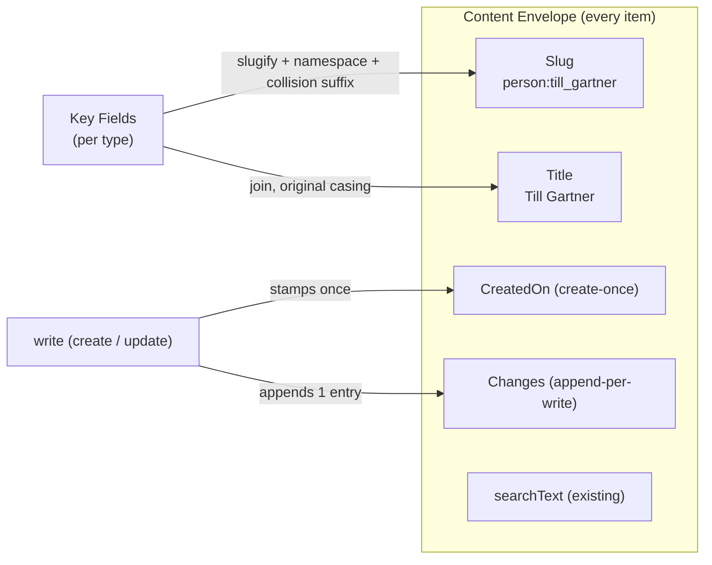
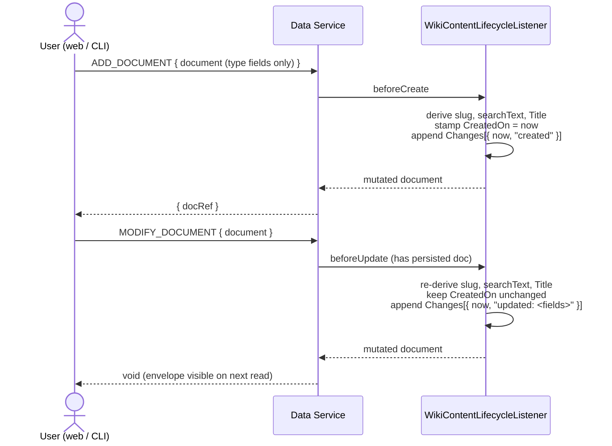

# Domain: the standard content envelope

This change introduces a small but load-bearing domain concept: a **standard
envelope** of fields that every Content item carries regardless of type. It
extends the language in [`CONTEXT.md`](../../../CONTEXT.md) — use these terms
exactly; the additions slot under the existing **Content** and **Identity**
sections.

## New / refined concepts

**Content Envelope** *(new)*
The set of standard, system-maintained fields **every** Content item carries in
addition to its type-specific fields: **CreatedOn**, **Title**, and **Changes**
— alongside the already-existing **Slug** and **searchText**. The envelope is the
type-independent surface of a Content item: the part generic code (search rows,
listings, audit) can rely on without knowing whether it holds a Page or an
Entity. Members of the envelope are never user-authored; the Data Service
maintains them.
*Avoid_: metadata, header, system fields (when you mean specifically this set).

**CreatedOn** *(new)*
The instant a Content item was first persisted (`DateTimeType`, ISO/UTC). Stamped
**once** by the Data Service at create and **never** changed on update —
immutable audit. Read-only; not part of any write payload.
*Avoid_: timestamp, created date, dateCreated.

**Title** *(new — a derived display handle)*
The uniform human label of a Content item, exposed as a `Title` field on every
content type. It is the *display* counterpart to the **Slug** (which is the
machine handle): where Slug is `person:till_gartner`, Title is `Till Gartner`.
Derived from the item's **Key Fields** (joined in Key-Field order, original
casing, space-separated). For the `page` type the Title *is* an authored Key
Field (a page's title cannot be derived — it is the source); for types whose Key
Fields are not themselves a single title (e.g. `person` → `FirstName` +
`LastName`), Title is a **derived, read-only** field. Either way every type
exposes a `Title`.
*Avoid_: name, label, heading, displayName.

**Changes** *(new)* / **Change Entry** *(new)*
The append-only **change log** of a Content item: an ordered list of **Change
Entries**, each a `{ ChangedOn: DateTimeType, Summary: StringType }` pair. The
Data Service appends exactly one entry per successful write: on create, an entry
with summary `created`; on update, an entry whose summary names the fields that
changed. Users never write entries directly (auto-appended design). Realised as a
native A12 **repeatable Group**.
*Avoid_: history, audit log, revisions, versions (it is not full versioning — only
a summary trail).

**Key Fields** *(refined)*
Already defined in `CONTEXT.md` as the fields a Slug is derived from. This change
gives Key Fields a **second consumer**: the derived **Title**. Slug and Title are
now both functions of the Key Fields — Slug as a slugified machine handle, Title
as a human display label. Editing a Key Field can therefore change **both** the
Slug and the Title.

## Relationships

## The standard fields vs. the existing derived fields

The envelope is **not** a new kind of thing — it is more of what `slug` and
`searchText` already are. All five share the same lifecycle role:

| Field | Type | When written | Source |
|---|---|---|---|
| `slug` | StringType | create + re-derived on update | Key Fields (slugified, +suffix) |
| `searchText` | StringType (multiline) | every write | searchable fields concatenated |
| **CreatedOn** | DateTimeType | **create only** | the write clock |
| **Title** | StringType | every write (derived) or authored (Page) | Key Fields (joined, human) |
| **Changes** | repeatable Group | append one entry every write | the write clock + field diff |

The one genuinely new shape is the **repeatable Group** for `Changes` — the first
place wiki12 uses A12 group repeatability. Everything else reuses the
single-derived-field mechanism already in place.

## Actors & processes

The user is **never** an actor on the envelope fields — there is no input event
for CreatedOn, Title, or a Change Entry. They are derived state, owned by the
Data Service, consistent with ADR-0001 ("derivation lives only in the Data
Service").
