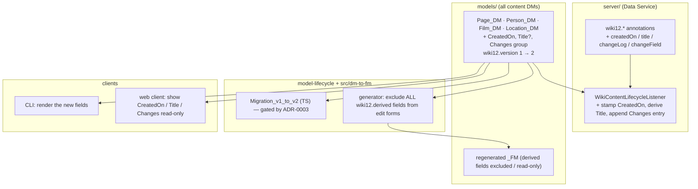

# Proposal: Mandatory content fields (CreatedOn, Title, Changes)

## What

Every Content item — every Page and every Entity, of every type — must carry
three **standard, system-maintained** fields in addition to its type-specific
fields:

| Field | Type | Maintained by | Semantics |
|---|---|---|---|
| **CreatedOn** | `DateTimeType` | system, stamped once at create | the item's creation instant; immutable |
| **Title** | `StringType` | system-derived display label | a uniform human handle for the item, derived from its Key Fields |
| **Changes** | repeatable `Group` of `{ ChangedOn: DateTimeType, Summary: StringType }` | system, one entry appended per write | an append-only change log |

All three are **read-only / system-derived**, in the same spirit as the existing
`slug` and `searchText` fields: the user never authors them, and they are
maintained by the Data Service lifecycle listener inside the write transaction
(ADR-0001). This keeps the change **clean within A12** — no new mechanism, just
two more derived aspects on the path that already derives `slug`/`searchText`,
expressed entirely with native A12 model constructs (`DateTimeType`, a repeatable
`Group`, field-level `wiki12.*` annotations).

## Why

The baseline gives each content type only its bespoke fields plus the derived
`slug`/`searchText`. There is **no uniform audit surface**: you cannot ask "when
was this created?" or "what changed and when?" against an arbitrary item, and
there is no single field every type exposes as a display label (Pages have
`Title`; Person has `FirstName`/`LastName`; Film/Location have their own). That
makes generic UI (search result rows, listings, "recently created") and generic
audit impossible to write once across types.

These three fields establish a **common envelope** every Content item shares,
regardless of type — the natural complement to the "one content mechanism, two
vocabularies" model (ADR-0004): one envelope, every type.

## Scope

**In scope**
- Add the three fields to **all four** content Data Models (`Page`, `Person`,
  `Film`, `Location`) and establish the `wiki12.version` axis at `1`, bumping the
  changed models to `2`.
- New `wiki12.*` annotations to mark the derived fields and the change-log group.
- Extend the lifecycle listener / derivation service to stamp `CreatedOn` (create
  only), derive `Title` from Key Fields, and append one `Changes` entry per write
  — all inside the existing write transaction.
- Generalize the DM→FM generator to keep **every** derived field out of the
  editable form (today only `searchText` is excluded).
- A gated TS **Migration** (v1→v2) that backfills existing instances.
- **Enforce** the envelope on every content model (so new/changed Entity Types
  can't omit it): a check in the offline validator (CI) and in the
  model-lifecycle upload gate (runtime).
- Surface the three fields read-only in the web client and CLI.
- Update `CONTEXT.md`, `README.md`, and the relevant ADR(s).

**Out of scope**
- User-authored change summaries / commit-message UX (the chosen design is
  **auto-appended** entries; a richer manual note is a possible later change).
- `UpdatedOn` / `UpdatedBy` / author identity — `CreatedOn` only for now; authorship
  waits until auth is actually enforced (it is not, in the baseline).
- Changing slug derivation or the identity model (ADR-0001 stays as-is).

## Expected outcome

Every item returned by `GET_DOCUMENT` / `QUERY` / `UnifiedSearch` carries a
`CreatedOn`, a `Title`, and a `Changes` log. Creating an item stamps `CreatedOn`
and writes a first `Changes` entry (`"created"`); each subsequent edit appends an
entry summarising which fields changed. None of the three is editable by users;
all are populated by the Data Service. Existing seeded content is migrated
forward so no item is left without the envelope.

## Open decisions (resolved)

- **CreatedOn** → system-derived, set once at create, read-only. *(confirmed)*
- **Changes** → auto-appended by the server (datetime + auto-generated summary),
  no user input required. *(confirmed)*
- **Title** → a derived display label computed from Key Fields, not a redundant
  editable field. Page already authors a `Title` Key Field and keeps it; types
  whose Key Fields are not a single title (Person, …) gain a derived `Title`.
  *(confirmed — see architecture.md for the per-type detail)*
