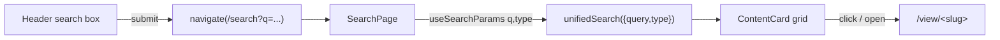
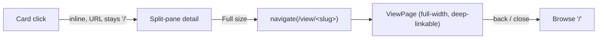

# Architecture — Slug-based URLs

Read `proposal.md` and `domain.md` first. All changes are in `client/`. No server
code, no new dependencies (react-router-dom v7 and `unifiedSearch` already exist).

## Current state (what's already there)

- `client/src/App.tsx` — `BrowserRouter` + routes: `/`, `/view/:ref`,
  `/edit/:ref`, `/create`, `/system`. Header (`ApplicationHeader`) has brand +
  user; no search box. nginx has SPA fallback (`try_files … /index.html`).
- `client/src/api/content.ts` — `resolveRef` (try docRef locally, else
  `ResolveBySlug`), `readByRef`, `getDocument`. **`getDocument` returns
  `slug: dref`** — the docRef stands in for the real Slug.
- `client/src/api/search.ts` — `unifiedSearch({query,type?,kind?})` (cross-model
  `simple_search` QUERY fan-out, returns `SearchHit[]`); `listAllContent`
  (gallery); cards built by `entriesToHits`, which sets **`id: e.docRef`,
  `slug: e.docRef`**.
- `client/src/pages/{ViewPage,EditPage,BrowsePage}.tsx` — build links with
  **`encodeURIComponent(item.slug || item.id)`** (ViewPage:34, EditPage:76).

So: the routing skeleton is correct; the **Slug just isn't real yet on the
client**, and links percent-encode the ref.

## Key decisions

### 1. The URL segment is the raw Slug (colon-literal)

`encodeURIComponent("page:albert_einstein")` → `page%3Aalbert_einstein`
(verified) — wrong. The Slug charset is `[a-z0-9_]` + one `:`, all URL-safe in a
non-leading path segment. So **build links by raw interpolation** of the Slug:

```ts
// client/src/lib/refUrl.ts  (new, pure, unit-tested)

/** Is this ref a Slug ("<type>:<name>") vs a docRef ("<Model>_DM/<uuid>")? */
export function isSlug(ref: string): boolean {
  return /^[a-z][a-z0-9_]*:[a-z0-9_]+$/.test(ref);
}

/** Path segment for a /view|/edit deep link.
 *  Slug -> raw (colon-literal, pretty). docRef/other -> encodeURIComponent
 *  (its '/' would otherwise split the route). */
export function refSegment(ref: string): string {
  return isSlug(ref) ? ref : encodeURIComponent(ref);
}

/** Inverse for the route param. encodeURIComponent is a no-op on a clean Slug,
 *  and decodeURIComponent restores a legacy %3A / %2F ref — so decode is safe
 *  for both. */
export function refFromParam(param: string): string {
  return decodeURIComponent(param);
}
```

Why a helper and not inline: three call sites build the link and one decodes it;
centralizing the slug-vs-docRef rule keeps them consistent and gives a pure unit
test target (the project's test-first convention).

> Why not switch routes to `/view/:type/:name`? That would *split* the Slug and
> force reassembly to the colon form everywhere, and break the "URL is the Slug
> verbatim" decision. A single `:ref` segment carrying the whole Slug is simpler
> and matches the existing route shape.

### 2. Surface the real Slug on read

`getDocument` must read the envelope `Slug` field out of the document instead of
substituting `docRef`. The envelope (`Slug`, `Title`, `CreatedOn`, `Changes`)
nests under the document's root group (same `rootFields` shape `search.ts` uses):

```ts
// content.ts getDocument — replace `slug: dref`
const slug = readSlugField(result.document) || dref; // fall back to docRef
return { type, id, slug, document: result.document };
```

`entriesToHits` (search.ts) likewise should set `slug` from the hit's `Slug`
field when present, keeping `id: e.docRef`, and **navigate by `slug || id`**.
Cards already key on `slug || type/id`, so this is consistent.

This is the single point where "real slugs" turn on. Before the server surfaces
`Slug`, `readSlugField` returns empty and we fall back to the docRef — links stay
ID-based and working (graceful degradation, proposal §Risks).

### 3. `/search?q=&type=` over the existing `unifiedSearch`

New `SearchPage` reads `q` and `type` from `useSearchParams`, calls
`unifiedSearch({query:q, type})`, renders results with the existing `ContentCard`
/ `CardGrid`. A header search box (in `App.tsx`'s `ApplicationHeader`) navigates
to `/search?q=<encoded>` on submit. `/` (Browse) is unchanged.



`type` is validated against `CONTENT_MODELS` types (page/person/film/location);
an unknown `type` is ignored (search all). Empty `q` → empty results with a
"type something to search" hint (mirror `unifiedSearch`'s empty-query guard).

### 4. Browse: inline detail is transient; Full size is the deep link

The Browse landing's detail panel (`BrowsePage.tsx` `DetailPanel`) has a
`fullSize` toggle ("Full size" / "Split view"). Decision:

- **Inline / split-pane** detail → URL stays `/` (transient in-page selection,
  not a navigation; nothing to bookmark).
- **Full size** → `navigate("/view/" + refSegment(slug || id))`. The standalone
  `ViewPage` already renders the *same* `ContentDetailView` full-width, so "Full
  size" simply **is** the deep-linkable view. Browser back / closing returns to
  `/`.

This drops the local `fullSize` boolean for the open case: the toggle becomes a
route change rather than component state. The split-pane path keeps its current
local-state behavior.



## Sequence: deep link by slug

```mermaid
sequenceDiagram
  participant U as User
  participant R as Router (/view/:ref)
  participant V as ViewPage
  participant C as content.ts
  participant S as Data Service
  U->>R: GET /view/page:albert_einstein
  R->>V: ref = "page:albert_einstein"
  V->>C: readByRef(refFromParam(ref))
  C->>S: ResolveBySlug {idOrSlug:"page:albert_einstein"}
  S-->>C: {type,id,slug,found}
  C->>S: GET_DOCUMENT {docRef}
  S-->>C: document (envelope incl. Slug)
  C-->>V: ContentItem {slug:"page:albert_einstein", ...}
  V-->>U: render; Edit -> /edit/page:albert_einstein
```

## Touch points

| File | Change |
|---|---|
| `client/src/lib/refUrl.ts` | **new** — `isSlug` / `refSegment` / `refFromParam` (pure) |
| `client/src/lib/refUrl.test.ts` | **new** — unit tests (colon kept, docRef encoded, round-trip) |
| `client/src/api/content.ts` | `getDocument` reads real `Slug` from envelope (fallback docRef) |
| `client/src/api/search.ts` | `entriesToHits` sets `slug` from `Slug` field; cards prefer slug |
| `client/src/pages/ViewPage.tsx` | build Edit link via `refSegment`; decode via `refFromParam` |
| `client/src/pages/EditPage.tsx` | post-save navigate via `refSegment`; decode via `refFromParam` |
| `client/src/pages/SearchPage.tsx` | **new** — `/search?q=&type=` results |
| `client/src/pages/BrowsePage.tsx` | inline detail keeps URL `/`; **Full size** navigates to `/view/<slug>` (deep link) |
| `client/src/App.tsx` | add `/search` route; header search box |

## Testing strategy

- **Pure unit (Vitest)** — `refUrl.test.ts`: `refSegment("page:albert_einstein")`
  stays literal; `refSegment("Page_DM/uuid")` percent-encodes the slash;
  `refFromParam(refSegment(x)) === x` for both; `isSlug` boundaries (rejects
  docRef, accepts numeric-suffix slug `person:till_gartner_5`).
- **Pure unit** — `readSlugField` extracts `Slug` from the envelope; returns ""
  when absent (drives the fallback).
- **Browser (Playwright, per CLAUDE.md global rule)** — start dev server, verify:
  `/view/page:<slug>` renders with the literal colon in the address bar;
  `/search?q=` shows cards; clicking a card opens `/view/<slug>`; an old
  Technical-ID link still resolves. Artifacts → `tmp/`.

## Dependency & rollout

The slug-based URLs are only *fully* realized once the server surfaces the `Slug`
envelope field on reads and `ResolveBySlug` is live (ongoing work, ADR-0001 /
mandatory-content-fields). This change is **independently shippable**: with the
fallback, it behaves exactly as today (ID links) until the server side lands, at
which point URLs become slug-based with **no further client change**. Grep for
`VERIFY` markers touching `ResolveBySlug` / `GET_DOCUMENT` before wiring.
