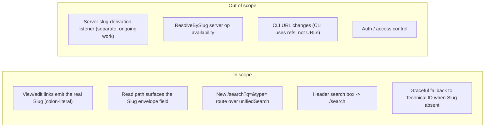

# Proposal — Slug-based URLs

## What

Make the web client's URLs **address content by its Slug**, and add a
**shareable search URL**.

- **View** a deep link: `/view/page:albert_einstein`, `/view/person:till_gartner_5`
- **Edit** a deep link: `/edit/page:albert_einstein`, `/edit/person:till_gartner_5`
- **Search**: `/search?q=einstein` (optionally `&type=person`)

The URL path segment **is the Slug verbatim** — colon delimiter and all
(`<type>:<name>`, per CONTEXT.md). No alternate encoding, no `_`-for-`:`
substitution: what you see in the address bar is the Slug you'd type into the
CLI.

## Why

The Slug is wiki12's "read-only, system-maintained human handle" (CONTEXT.md).
It's the natural thing to put in a URL: stable enough to bookmark, readable, and
already the cross-client identifier. Two gaps today:

1. **View/edit URLs don't actually carry the Slug.** The routes
   `/view/:ref` and `/edit/:ref` already exist (react-router v7), and `:ref`
   already accepts an id-or-slug. But the client never surfaces the *real* Slug:
   reads return the `docRef` (`<Model>_DM/<uuid>`) as a stand-in
   (`client/src/api/content.ts:66`), and gallery cards navigate by `docRef`
   (`client/src/api/search.ts:71`) — both carrying the comment *"real slugs need
   the extension listener"*. So in practice the address bar shows
   `/view/Page_DM%2F<uuid>`, not `/view/page:albert_einstein`. This change closes
   that gap on the client side and makes the Slug the canonical link.

2. **Search isn't deep-linkable.** The Browse landing (`/`) has an in-memory
   filter box over the already-loaded gallery (`filterCards`), but no URL — you
   can't bookmark or share "everything matching einstein". A real cross-model
   search (`unifiedSearch`) exists in `api/search.ts` but nothing routes to it.

## Scope

**In scope (client):**
- Build view/edit deep links from the **Slug** (raw, colon-literal), falling back
  to the Technical ID when no Slug is available yet.
- Surface the real `Slug` from a document read (read the envelope `Slug` field
  instead of substituting the `docRef`).
- Add a `/search?q=…&type=…` route that renders `unifiedSearch` results as the
  same content cards the gallery uses.
- Add a search input (application header) that navigates to `/search`.
- Keep `/view/:ref` and `/edit/:ref` resolving **either** a Slug **or** a
  Technical ID (try-ID-then-slug is preserved — old/ID links keep working).

**Out of scope:**
- The **server-side** Slug derivation (the `WikiContentLifecycleListener`) and the
  `ResolveBySlug` / envelope contract. This is the *"implementation work still
  ongoing"* the request acknowledges. This change is written to **degrade
  gracefully**: until the server surfaces real Slugs, links fall back to
  Technical IDs and everything keeps working; the moment the Slug is present in
  reads/search, the URLs become slug-based with no further client change.
- CLI changes — the CLI addresses items by ref, not URL.
- Authentication/authorization.

## Expected outcome

- `/view/page:albert_einstein` and `/edit/person:till_gartner_5` work as
  bookmarkable deep links, with the Slug shown literally in the address bar.
- `/search?q=einstein` (and `&type=person`) is a shareable search.
- Editing a Key Field that changes the Slug navigates to the **new** slug URL and
  surfaces the `old → new` change (the existing slug-change banner).
- A deep link by Technical ID still resolves (no broken old links).

## Risks / notes

- **Colon in the path.** `:` is a legal `pchar` in a non-leading path segment
  (RFC 3986), so `/view/page:albert_einstein` is valid and browsers keep it
  literal. **`encodeURIComponent` must not be used** on the slug — it turns `:`
  into `%3A` (verified), producing ugly `/view/page%3Aalbert_einstein`. The Slug
  character set (`[a-z0-9_]` + one `:`) is URL-safe by construction, so the link
  is built by raw interpolation. (Decode stays tolerant of legacy `%3A`.)
- **Dependency on server work.** Real slug URLs only appear once reads/search
  carry the real `Slug`. The fallback keeps the feature shippable before then.
- **Two distinct interactions on different URLs:** `/` Browse = list-all gallery
  + in-memory filter (quick narrowing); `/search` = server-side cross-model
  search (shareable). They are intentionally separate; this change does not merge
  them.
