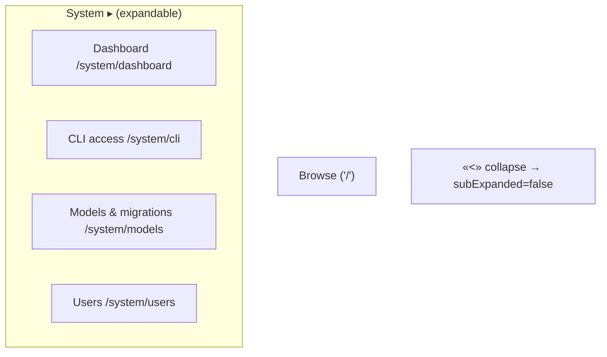
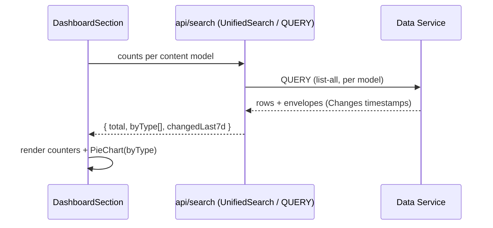
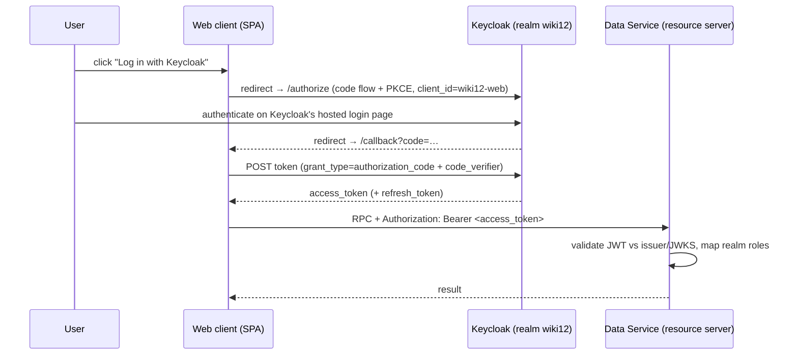
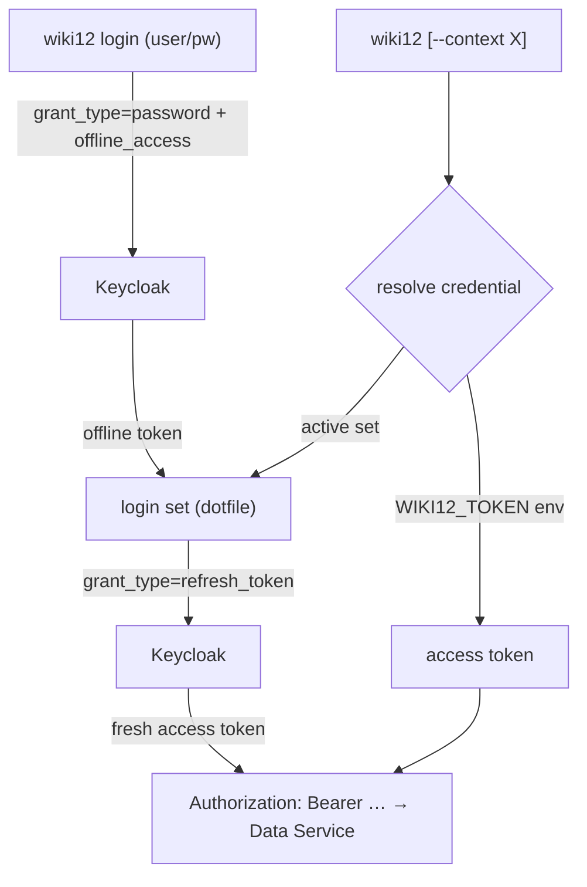
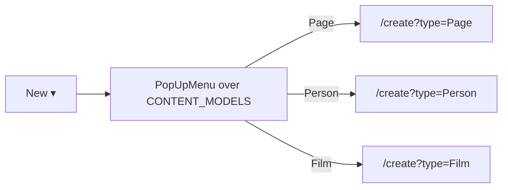

# Architecture — System area redesign

How the six bundled changes are built. Read [`proposal.md`](proposal.md) for
what/why and [`domain.md`](domain.md) for terms. A12-boundary assumptions carry
`// VERIFY` markers and are listed at the end.

All web work uses **A12 Widgets** (CLAUDE.md mandate). Relevant widgets confirmed
present in `client/node_modules/@com.mgmtp.a12.widgets/widgets-core/lib`:
`menu`, `pop-up-menu`, `dropdown`, `accordion`, `tree`, `layout/application-frame`,
`chart/pie-chart` (a Recharts wrapper), `button`, `icon`.

## 1. Navigation shell — two-level menu + collapse

**File:** `client/src/App.tsx` (`Sidebar`, `Shell`).

- **Sub-menus.** Replace the flat `FlyoutMenu` items with a two-level structure.
  `FlyoutMenu`/`menu` support nested items; System expands to **Dashboard**,
  **CLI access**, **Models & migrations**, **Users**. Browse stays top-level.
  The active route highlights via `useLocation()`.
- **Collapse with `<`.** `ApplicationFrame` already exposes `subExpanded`,
  `subExpandedState: "minimized" | "maximized"`, and `onExpansionChange`. Lift
  `subExpanded` into `Shell` state (default `true`) and render a `<` icon
  `Button` in `subToolbar` (or the sub header) that flips it; a matching control
  re-expands. (The built-in `useToggleButton` only shows on ≤767px screens, so we
  drive `subExpanded` ourselves for the desktop `<` affordance.)
- **Remove `New page`.** Delete that `Sidebar` item entirely (moves to Browse). -> Already done within another story by now.



## 2. System sub-routes

**Files:** `client/src/App.tsx` (routes), `client/src/pages/SystemPage.tsx` →
split into sub-views.

Today `/system` renders one `SystemPage`. Introduce nested routes and a small
layout:

```
/system            → redirect to /system/dashboard
/system/dashboard  → <DashboardSection/>
/system/cli        → <CliAccessSection/>
/system/models     → <ModelsAndMigrationsSection/>   (today's Migrations + model list)
/system/users      → <UsersSection/>                 (today's Keycloak link, unchanged)
```

Keep each section a focused component; `SystemPage` becomes a thin router/outlet.
This is additive — the existing Migrations editor and Users link move verbatim
into their sections.

## 3. Dashboard

**File:** new `client/src/pages/system/DashboardSection.tsx`; data helpers in
`client/src/api/search.ts` / a small `dashboard.ts`.

Three metrics, all **derived** from existing content (no new persisted state):

| Metric | Source |
|---|---|
| **Total cards** | Sum of per-model counts. `listAllContent()` already fans out across `CONTENT_MODELS`; add a count-only path (or reuse the returned arrays' lengths). |
| **Changed last 7 days** | Each item's envelope `Changes` log has timestamps; count items whose newest change ≥ now−7d. Computed client-side from the same fetched cards (cards already sort by recency). |
| **Entities by type (pie)** | Group Entity counts by `type` from `CONTENT_MODELS` (`kind === "entity"`). Render with A12 `PieChart`. |



- **Pie chart:** use `chart/pie-chart` (`PieChart`, Recharts wrapper). Feed
  `data: [{ name: type, value: count }]`. Colors come from the theme/Recharts
  defaults — **do not** hand-set semantic colors (CLAUDE.md); a categorical
  palette for type slices is neutral/decorative, not semantic state.
- **Counters:** the `counter/` or `status/` widget, or plain `typography` +
  `card`. Prefer an A12 widget over hand-rolled markup.
- **Pages slice:** show Pages as a separate counter (not in the *entities*-by-type
  pie) since the pie is specified as **entities** by type. State this in the UI.

> **Efficiency note (no silent caps):** Browse already caps at 100 items/type.
> If the dashboard needs *true* totals it must use a count query, not list length.
> See VERIFY-2 for whether the Data Service `QUERY` returns a total count.

## 4. Keycloak/OIDC login (web + CLI) + login sets

This is the **foundational, highest-risk** part and should land first (own commit
+ **ADR-0006**). It re-wires the shared auth contract from A12 UAA **LOCAL** to
**OAuth2/OIDC with Keycloak**, then layers the CLI login-set UX on top.

### 4a. Data Service → OAuth2 resource server

**File:** `server/config/application-wiki12.properties` (+ the
`SPRING_PROFILES_ACTIVE` profile list in `docker-compose.yml`).

Replace the LOCAL block (`authentication.types=LOCAL`,
`backend.grant-super-user-privileges.enabled=true`) with OAuth2 resource-server
config that trusts the Keycloak `wiki12` realm. Per the A12 UAA docs
(`docs/a12/uaa/uaa-documentation-src.md` §OAuth2):

```properties
mgmtp.a12.uaa.authentication.types=OAUTH2
mgmtp.a12.uaa.authentication.oauth2.resourceserver.tenants[0].jwt.issuer-uri=http://keycloak:8080/realms/wiki12
mgmtp.a12.uaa.authentication.oauth2.resourceserver.tenants[0].jwt.jwk-set-uri=http://keycloak:8080/realms/wiki12/protocol/openid-connect/certs
mgmtp.a12.uaa.authentication.oauth2.resourceserver.tenants[0].jwt.jws-algorithms=RS256
mgmtp.a12.uaa.authentication.oauth2.resourceserver.tenants[0].jwt.audiences=wiki12-web
# Map Keycloak realm roles (wiki12-admin/editor) into the Data Service principal:
mgmtp.a12.uaa.authentication.principal.oauth2Config.role-mapping-from-token.field-name=realm_access.roles
```

Keep `dataservices.authorization.roleBased.enabled=false` for now (authentication
on Keycloak; op-level *gating* stays a follow-up — see proposal out-of-scope).
The HS256 `jwt.secret` / `expiration-seconds` / LOCAL-user lines are removed.

> **Issuer-URI mismatch is the classic OIDC footgun:** the `iss` claim Keycloak
> stamps (browser-facing `http://localhost:8089/...`) must match what the Data
> Service validates (in-network `http://keycloak:8080/...`). Resolve with
> Keycloak's `KC_HOSTNAME`/frontend-URL or an accepted-issuers list — VERIFY-5.

### 4b. Web client → log in **on Keycloak** (redirect / Authorization-Code + PKCE)

**File:** `client/src/lib/auth.ts` (+ `LoginPage.tsx`, a new `/callback` route,
the API layer that attaches the header).

The web client logs in **via Keycloak's own hosted login page** — the standard
OIDC redirect flow, not an in-app credential form. The in-app username/password
`LoginPage` is replaced by a **"Log in with Keycloak"** kickoff that redirects to
Keycloak; after authentication Keycloak redirects back to a `/callback` route that
completes the code-for-token exchange. This is what A12's public-client
self-configuration is built for (`…client-selfconfiguration.oidc.public-client.*`:
`client-id=wiki12-web`, `realm-name=wiki12`, `idp-base.url`, `login-redirect-
relative.url=callback`, `silent-redirect-relative.url`, `logout-redirect-relative.url`)
and gives SSO, MFA, password reset and account management for free. ROPC is
**not** used for the web (it's discouraged in OAuth 2.1) — only the CLI uses it.

Implementation choice (VERIFY-1): drive the flow with the **A12 UAA frontend
client library** if it's consumable from our custom React SPA, otherwise a
standard OIDC client (e.g. `oidc-client-ts`) pointed at the realm. Either way:
Authorization Code **+ PKCE** against `wiki12-web` (a public client). The API
layer switches `Authorization: UAABearer …` → `Authorization: Bearer …`; tokens
are kept in memory with silent renew via the refresh token; logout hits Keycloak's
end-session endpoint. `nginx` must serve the SPA `/callback` route.



### 4c. CLI → Keycloak offline token + login sets

**Files:** `cli/src/` — new `commands/login.ts`, `commands/context.ts`, `auth.ts`
(token exchange), `config.ts` (dotfile); wire into `index.ts`, `help.ts`; `rpc.ts`
reads the active set + attaches `Bearer`.

- **`wiki12 login [--name <set>] [--url <dataServiceUrl>] [--issuer <url>]`** —
  prompt for username/password (or flags/stdin), do a Keycloak **direct access
  grant** with `scope=openid offline_access` against
  `…/realms/wiki12/protocol/openid-connect/token`, and store the returned
  **offline (refresh) token** in the login set. Set a concrete `Accept-Language`
  on requests (undici defaults to `*`, a known CLI gotcha in `rpc.ts`).
- **Per-call token exchange.** Before RPCs, exchange the stored offline token for
  a fresh `access_token` (`grant_type=refresh_token`), cache it in-process until
  it nears expiry. The offline token is the durable, **revocable** credential
  (revoke in Keycloak → CLI access dies) — the win LOCAL mode can't give.
- **Config dotfile** `~/.config/wiki12/config.json` (or `$WIKI12_CONFIG`),
  chmod 600: `{ active, sets: { <name>: { dataServiceUrl, issuerUrl, clientId, offlineToken } } }`.
- **`wiki12 context list|use <name>|remove <name>`** — manage login sets.
- **Resolution order** in `rpc.ts`: `--context <name>` → env
  `WIKI12_TOKEN`/`WIKI12_DATA_SERVICE_URL` (ambient access token, kept for
  back-compat/CI) → active set's offline token (→ exchange) → unauthenticated.
  Env stays the highest-priority override so existing scripts don't break.



### 4d. CLI access section (web)

**File:** new `client/src/pages/system/CliAccessSection.tsx`. Documentation-only:
show the `wiki12 login` command, the issuer/realm/client values, and an
offline-token / revocation note (point at the Keycloak console for revoke). No
token is minted in the browser — the CLI gets its own offline token via login.

### 4e. Realm config

**File:** `docker/keycloak/wiki12-realm.json` (already has realm `wiki12`, roles
`wiki12-admin`/`wiki12-editor`, user `admin`, public client `wiki12-web` with
standard + direct-access-grant flows). Additions as needed:
- Ensure the realm/client grants the **`offline_access`** scope to clients
  (default optional scope in Keycloak — confirm it's assignable to `wiki12-web`).
- Confirm `wiki12-web` `webOrigins`/`redirectUris` cover the dev hosts.
- Decide whether the CLI uses `wiki12-web` (public + ROPC) or a dedicated CLI
  client — VERIFY-1.

This is **TDD-friendly**: login-set resolution, config read/write, and token-URL
construction are pure functions tested with `node --test`; the HTTP token
exchange reuses the injectable transport pattern already in `rpc.ts`.

## 5. Browse — "New ▾"

**File:** `client/src/pages/BrowsePage.tsx`.

Add a **New ▾** button beside the "Content" heading using `pop-up-menu` (or
`dropdown`). Items = `CONTENT_MODELS` (`page` + each entity `type`), each routing
to the existing create route `\`/create?type=<Model>\``. The create form already
keys off `?type=` (App route `/create` → `EditPage`), so this is purely a new
launcher — no new create plumbing.



## 6. Models & migrations section

**File:** `client/src/pages/system/ModelsAndMigrationsSection.tsx` (absorbs
today's Migrations UI).

- **Migrations:** move the existing list + TS-source editor verbatim.
- **Models (read-first):** list Data Models via the model-lifecycle / CLI
  contract used by `wiki12 model list`. Render names + content-schema version
  (`wiki12.version`) read-only. Create/edit stays CLI for this change (scope).

## Key decisions & tradeoffs

- **Derive dashboard metrics; add no field/type.** Preserves ADR-0004
  (one content mechanism) and the envelope (mandatory-content-fields). The only
  cost is computing counts/last-week client-side — acceptable at wiki12's scale,
  with a count-query upgrade path (VERIFY-2).
- **Auth on Keycloak/OIDC, not LOCAL UAA.** A real long-lived, *revocable* CLI
  credential only exists once Keycloak issues tokens the Data Service validates —
  LOCAL mode has only a global `jwt.expiration-seconds`. The CLI's durable
  credential is a Keycloak **offline token**; web + CLI share the same Keycloak
  contract (one boundary, two clients — CLAUDE.md). Captured in **ADR-0006**.
- **Web logs in on Keycloak (redirect / Auth-Code + PKCE), not via an in-app
  form.** The standards-correct, A12-blessed flow; the in-app login form is
  replaced by a "Log in with Keycloak" redirect + `/callback`. ROPC is reserved
  for the CLI (no browser). The implementation library (A12 UAA frontend lib vs a
  standard OIDC client) is VERIFY-1.
- **Control `subExpanded` ourselves** for the desktop `<` collapse, since the
  built-in toggle button is mobile-only.
- **Pie chart via A12 `PieChart`** (Recharts wrapper) — note its types are marked
  `@deprecated since 38.1.1` ("use Recharts directly"). Prefer the A12 wrapper
  for theme consistency; if it's removed in our installed version, fall back to
  the bundled `recharts` directly (still an A12-blessed dep). See VERIFY-3.

## Integration points / files touched

| Area | Files |
|---|---|
| **Auth (backend)** | `server/config/application-wiki12.properties`, `docker-compose.yml` (profiles), `docker/keycloak/wiki12-realm.json` |
| **Auth (web)** | `client/src/lib/auth.ts`, `client/src/pages/LoginPage.tsx`, API header attach |
| **ADR** | new `docs/adr/0006-keycloak-oidc-auth.md` |
| Nav + routes + collapse | `client/src/App.tsx` |
| System sub-views | `client/src/pages/SystemPage.tsx`, new `client/src/pages/system/*` |
| Dashboard data | `client/src/api/search.ts` (+ small `dashboard.ts`) |
| New ▾ | `client/src/pages/BrowsePage.tsx` |
| CLI auth | `cli/src/commands/{login,context}.ts`, `cli/src/{auth,config,index,help,rpc}.ts` |
| Seed/tests | `seed/` runner + any test that hits the Data Service now needs a token |
| Docs | `client/README.md`, `cli/README.md`, `specs/system/functional.md` |

## VERIFY (A12 / live-stack assumptions — confirm before relying on them)

- **VERIFY-1 — web redirect library + CLI client choice.** Confirm whether the
  web Authorization-Code+PKCE flow is best driven by the **A12 UAA frontend client
  library** (consumable from our custom React SPA?) or a standard OIDC client
  (`oidc-client-ts`) against `wiki12-web`; and whether the CLI reuses `wiki12-web`
  (public + ROPC + `offline_access`) or needs a dedicated CLI client. *Confirm
  against UAA docs §OAuth2 + a running Keycloak.*
- **VERIFY-5 — issuer-URI / token scheme.** Confirm the Keycloak `iss` claim
  matches what the Data Service validates across browser-vs-network hostnames
  (`localhost:8089` vs `keycloak:8080`), and that the resource server expects the
  standard `Authorization: Bearer` scheme (not A12 `UAABearer`). *Confirm against
  a running stack.*
- **VERIFY-6 — role mapping.** Confirm `realm_access.roles` (or the right claim
  path) maps Keycloak `wiki12-admin`/`wiki12-editor` into the A12 principal via
  `principal.oauth2Config.role-mapping-from-token.field-name`.
- **VERIFY-2 — count query.** Can the Data Service `QUERY` return a **total count**
  without fetching rows (for accurate dashboard totals beyond the 100/type cap)?
  *Check A12 Data Service QUERY op (see memory: a12-dataservice-query-widgets).*
- **VERIFY-3 — PieChart longevity.** The installed `chart/pie-chart` API is marked
  `@deprecated`. Confirm it renders in our `widgets-core` version; else use the
  bundled `recharts` directly.
