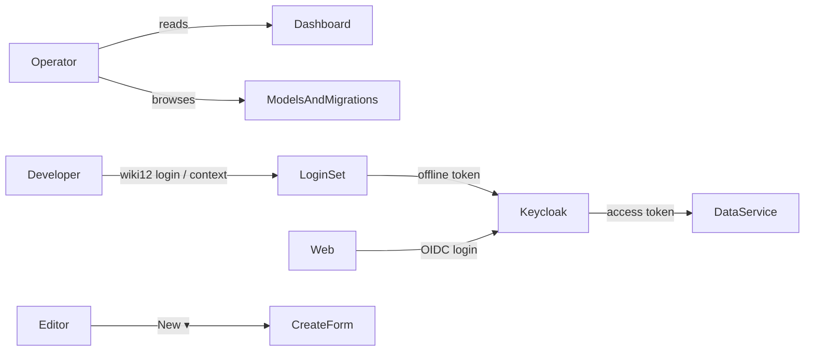
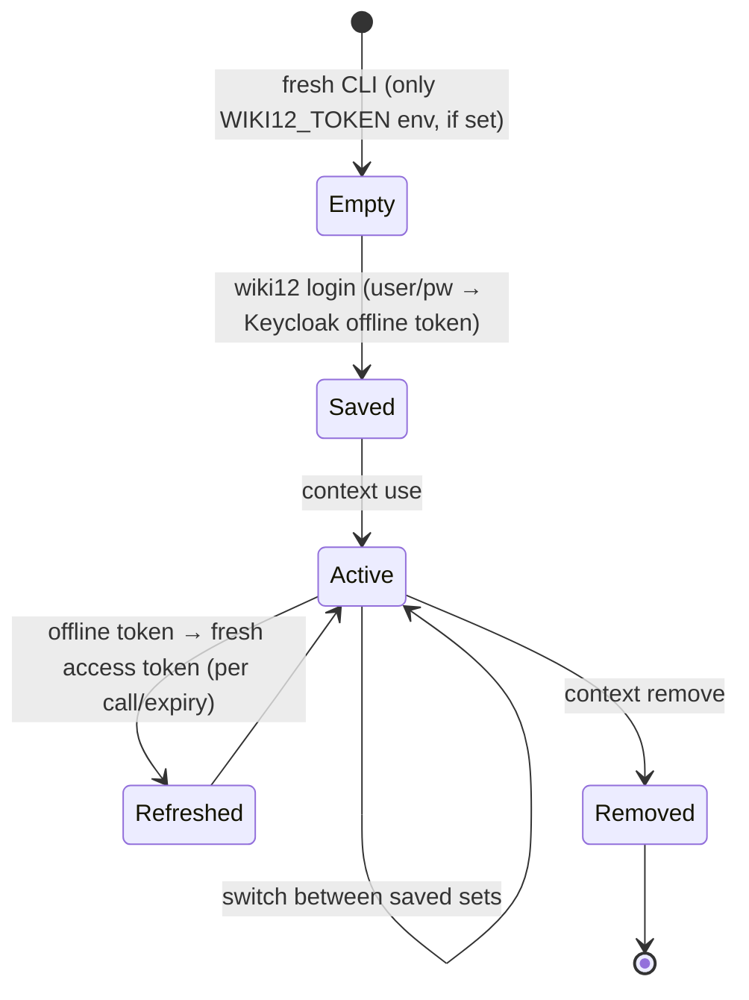

# Domain — System area redesign

New and refined domain concepts introduced by this change. These extend the
canonical language in [`CONTEXT.md`](../../../CONTEXT.md) and
[`specs/system/domain.md`](../../system/domain.md). Use these terms exactly.

## New terms

| Term | Definition |
|---|---|
| **System area** | The operator workspace under `/system`. Was a single page; now a parent with **sub-sections**: Dashboard, CLI access, Models & migrations, Users. |
| **Dashboard** | The System landing sub-section. Shows content **metrics** derived from existing content: total card count, count changed in the last 7 days, and the **entities-by-type** distribution. Read-only; no new persisted state. |
| **Entities-by-type distribution** | A breakdown of Entity content counts grouped by Entity Type (`person`, `film`, `location`, …), rendered as a pie chart. Pages may be shown as one more slice or excluded — see architecture. Derived live from a per-type count query. |
| **Last-week changes** | Count of content items whose newest `Changes` log entry (the standard envelope's append-only change log) falls within the trailing 7 days. Reuses the existing envelope — no new field. |
| **Keycloak realm** | The `wiki12` Keycloak realm (`docker/keycloak/wiki12-realm.json`): the identity authority. Holds users, the realm roles `wiki12-admin`/`wiki12-editor`, and OIDC clients. Pre-seeded; this change activates it. |
| **OIDC client** | A Keycloak client app definition. `wiki12-web` (public, standard + direct-access-grant flows) authenticates the web client and the CLI. |
| **Resource server** | The Data Service in its new role: an OAuth2 resource server that **validates** Keycloak-issued JWTs (issuer + JWKS) instead of issuing its own LOCAL token. |
| **Access token** | Short-lived Keycloak JWT sent as `Authorization: Bearer <jwt>` to the Data Service on each call. |
| **Offline token** | A long-lived Keycloak **refresh** token obtained with the `offline_access` scope; survives SSO-session expiry and is **revocable**. The durable CLI credential — stored in a login set and exchanged for fresh access tokens. |
| **Authorization Code + PKCE** | The standard OIDC **redirect** flow: the web client sends the user to Keycloak's hosted login page and exchanges the returned code for tokens at `/callback`. The **web** login flow. |
| **Direct access grant** | Keycloak's Resource-Owner-Password-Credentials flow (enabled on `wiki12-web`): exchange username+password directly for tokens, no browser redirect. The **CLI** login flow (the CLI has no browser); not used by the web. |
| **Login set** *(CLI)* | A named, saved CLI connection profile — `{ name, dataServiceUrl, issuerUrl, clientId, offlineToken }` — analogous to a kubectl context. The CLI keeps several and switches between them; one is **active** at a time. |
| **Active login set** | The login set the CLI currently uses for requests. Selected by `wiki12 context use <name>` (name TBD in architecture) or `--context <name>`. |
| **`wiki12 login`** | New CLI command: prompts/accepts username + password, performs a Keycloak direct-access-grant with `offline_access`, and stores the resulting **offline token** in a login set. |
| **New ▾** | The type-aware create affordance on Browse: a button whose dropdown lists every content type and routes to that type's create form. Replaces the menu's hard-coded **New page**. |
| **Collapsed menu** | A navigation state where the side menu is hidden/narrowed via the `<` control to reclaim content width; re-expandable. |

## Refined terms

| Term | Before | After |
|---|---|---|
| **Migrations (System section)** | A standalone System section listing/editing `Migration` TS source. | Folded into **Models & migrations** — the same Migration editor plus a read-only **Data Model** list (web parity with CLI `model`/`form`). |
| **Side navigation** | Flat `FlyoutMenu`: Browse / New page / System; always expanded. | Two-level (System expands to its sub-sections); collapsible; **no** top-level New page. |
| **Authentication** | A12 UAA **LOCAL** mode: backend grants super-user to every request; web posts user/pw to `/api/user/local/login` for a self-issued HS256 JWT (`UAABearer`); Keycloak unused. | **Keycloak/OIDC**: Data Service validates Keycloak JWTs (`Bearer`); **web logs in on Keycloak's hosted page** (Auth-Code + PKCE redirect), **CLI** via direct access grant; realm roles map into the Data Service. |

## Actors

- **Operator** — uses the web System area: reads the Dashboard, browses Models &
  migrations, follows CLI-access guidance. (Same human may be Editor/Developer.)
- **Developer** — uses the CLI; manages login sets, runs `wiki12 login` against
  Keycloak.
- **Editor** — creates content via **New ▾** on Browse.
- **Keycloak** — the identity authority issuing access/offline tokens that the
  Data Service (resource server) validates.

## Login-set lifecycle (CLI)

The pre-existing `WIKI12_TOKEN`/`WIKI12_DATA_SERVICE_URL` env vars remain a valid
**ambient** login set (highest-priority override) so existing scripts keep
working — login sets are additive, not a replacement. (A `WIKI12_TOKEN` is now a
Keycloak access token rather than a LOCAL one.)

## Relationship to existing domain

- **No new content type and no new envelope field.** Dashboard metrics are
  *derived* from existing content (counts per content model + the `Changes`
  envelope log). This keeps the "one content mechanism" model (ADR-0004) intact.
- **Auth moves from LOCAL UAA to Keycloak/OIDC** — a change to the *shared
  contract* both clients use ("two clients, one contract"). The token scheme
  changes from `UAABearer` to standard `Bearer`. Captured in **ADR-0006**.
- **Offline token** is a real Keycloak credential (long-lived, revocable), not a
  wiki12 invention — the CLI exchanges it for short-lived access tokens.
- **Login sets** are pure CLI-local config (a dotfile), not server state.
