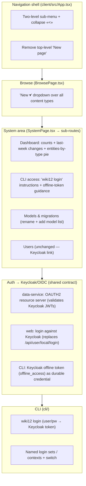

# Proposal — System area redesign

## What

Reshape the **navigation shell** and the **System area** into a proper admin
workspace, and give the **CLI** a first-class authentication story.

Six bundled changes:

1. **Proper sub-menus** — the left navigation grows a real two-level structure.
   System is no longer a single flat page; it expands into named sub-sections
   (Dashboard, CLI access, Models & migrations, Users).
2. **Dashboard** — a System landing view showing at-a-glance metrics: total
   number of content cards, content changed in the last week, and a **pie chart
   of entities by type**.
3. **Proper Keycloak/OIDC login + CLI login sets** — replace the baseline's A12
   UAA **LOCAL** auth (super-user-grants-all, `/api/user/local/login`) with real
   **Keycloak/OIDC**: the Data Service becomes an OAuth2 **resource server** that
   validates Keycloak-issued JWTs, the web client logs in against Keycloak, and
   the **CLI** authenticates against Keycloak too — using an **offline token**
   (`offline_access`) as the long-lived, revocable CLI credential. Multiple named
   connection profiles ("login sets") can be saved and switched (`wiki12 login` /
   `wiki12 context`). This is the proper home for a long-lived token — A12 LOCAL
   mode has no per-token/API-token concept, only a global JWT lifetime.
4. **"Models & migrations"** — rename and widen today's *Migrations*-only
   section into a combined **Models & migrations** section that also lists Data
   Models (web parity with the CLI `model`/`form` surface; read-first).
5. **Collapsible menu** — a `<` control collapses the side navigation to reclaim
   width; a matching control re-expands it. (Today `subExpanded` is hard-wired
   `true`.)
6. **"New" on Browse, not in the menu** — drop the top-level **New page** menu
   item. Browse (`/`) gets a **New ▾** button whose dropdown lists every content
   type (Page + each Entity Type) and routes to the create form for that type.

## Why

- The current sidebar is three flat links (`Browse`, `New page`, `System`) and
  System is a single scroll of two sections. As wiki12 grows admin surfaces
  (dashboard, CLI access, model management) a flat list doesn't scale — we need
  grouping and the ability to reclaim horizontal space.
- **`New page` is wrong in two ways** in the menu: it hard-codes the `page`
  type even though wiki12 is multi-type (Person, Film, Location, …), and a
  global "create" action belongs next to the content it creates (Browse), not in
  the chrome. A type-aware **New ▾** dropdown fixes both.
- The CLI today can only authenticate via a pre-obtained `WIKI12_TOKEN` env var
  (`cli/src/rpc.ts`). There is no supported way to *get* that token, and no way
  to juggle more than one environment. A `wiki12 login` flow with saved profiles
  closes that gap.
- **Auth must move to Keycloak for a real long-lived token.** The baseline runs
  A12 UAA in **LOCAL** mode (`authentication.types=LOCAL`,
  super-user-grants-all) — Keycloak is wired as a *user store only* and its
  tokens are never validated. LOCAL mode has no API-/long-lived-token concept
  (only a single global `jwt.expiration-seconds`), so a durable CLI credential
  requires switching to **OAuth2/OIDC with Keycloak**, where offline tokens and
  per-client/role policies are first-class and revocable. The realm
  (`docker/keycloak/wiki12-realm.json`) is already pre-seeded "for the future
  auth change" (realm `wiki12`, roles `wiki12-admin`/`wiki12-editor`, public
  `wiki12-web` client with direct access grants) — this change activates it.
- A **dashboard** turns the System area from a settings page into an actual
  operator landing surface, surfacing the health/shape of the content set.

## Scope

### In scope

- **Auth → Keycloak/OIDC** (shared contract): switch the Data Service from UAA
  LOCAL to **OAuth2 resource-server** mode validating Keycloak JWTs; the **web
  client logs in on Keycloak's hosted page** via the OIDC redirect /
  Authorization-Code + PKCE flow (the in-app login form becomes a "Log in with
  Keycloak" redirect + `/callback`); the **CLI** uses the direct-access-grant +
  `offline_access` flow (no browser). Add the realm config the CLI needs. Captured
  in a new **ADR-0006**.
- Web: collapsible two-level navigation; System sub-routes
  (`/system`, `/system/dashboard`, `/system/cli`, `/system/models`,
  `/system/users`); Dashboard metrics + pie chart; **CLI access** section with
  `wiki12 login` + offline-token guidance; Models list (read) alongside the
  existing Migrations editor; **New ▾** on Browse.
- CLI: `wiki12 login` (username/password → Keycloak **offline token**), named
  **login sets** (saved connection profiles: server/issuer URL + offline token,
  à la kubectl contexts) and a way to list/switch/remove them.

### Out of scope

- **Fine-grained authorization** beyond mapping the realm roles
  (`wiki12-admin`/`wiki12-editor`) into the Data Service. Turning on role-based
  *gating* of specific ops (currently `roleBased.enabled=false`) is a follow-up;
  this change gets authentication onto Keycloak but keeps the permissive baseline
  unless trivially additive.
- Embedded user management (Users stays a link to Keycloak).
- Model **create/edit** from the web (the new Models section is **read-first**;
  authoring stays in the CLI for this change unless trivially additive).
- Charting-library selection beyond what A12 Widgets offers — see
  `architecture.md` for the pie-chart approach (and the open VERIFY).

## Expected outcome

- Operators land on a **Dashboard** under System with live content metrics.
- The side menu nests System's sub-sections and can be collapsed with `<`.
- Creating content starts from a type-aware **New ▾** on Browse; `New page`
  disappears from the menu.
- A developer can run `wiki12 login`, save several **login sets**, switch between
  them, and get a **long-lived, revocable Keycloak offline token** — no more
  hand-managing `WIKI12_TOKEN`.
- Authentication is genuinely backed by **Keycloak/OIDC** end-to-end (web + CLI +
  Data Service), replacing the LOCAL super-user-grants-all baseline.

## Risks & coordination

- **Overlaps in-flight `slug-based-urls`.** That change is concurrently editing
  `client/src/App.tsx` and `client/src/pages/BrowsePage.tsx` (the exact files the
  navigation + **New ▾** work touches). This change should **rebase onto** the
  merged slug work, or land after it, to avoid clobbering the new routing and
  card-link helpers (`client/src/lib/refUrl.ts`). Treat slug-based-urls as a
  prerequisite for the Browse/App edits. See `plan.md`.
- **The auth switch is a shared-contract change, not a System-area-only one.**
  Moving the Data Service to OAuth2/OIDC affects *both* clients and the backend
  at once. It is the riskiest part of this change and should land as its own
  reviewable step (with **ADR-0006**) ahead of the System-area UI work. The
  `Authorization` header scheme also changes from A12's `UAABearer` to standard
  OIDC `Bearer` (`cli/src/rpc.ts`, `client/src/lib/auth.ts`) — see
  `architecture.md` VERIFY-1/5.
- **Login-less dev ergonomics regress.** Today every request is granted
  super-user; after the switch, requests must carry a valid Keycloak token. Seed
  scripts, `just seed`, and tests that hit the Data Service need a token path
  (service-account client or a seeded login). Called out in `plan.md`.
