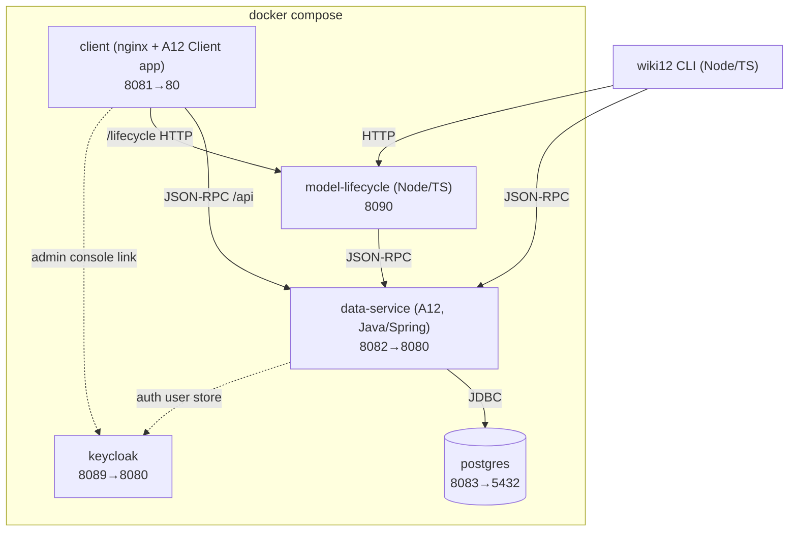
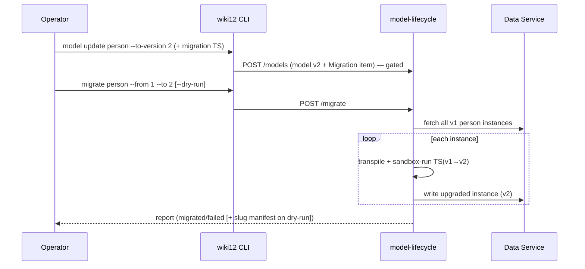
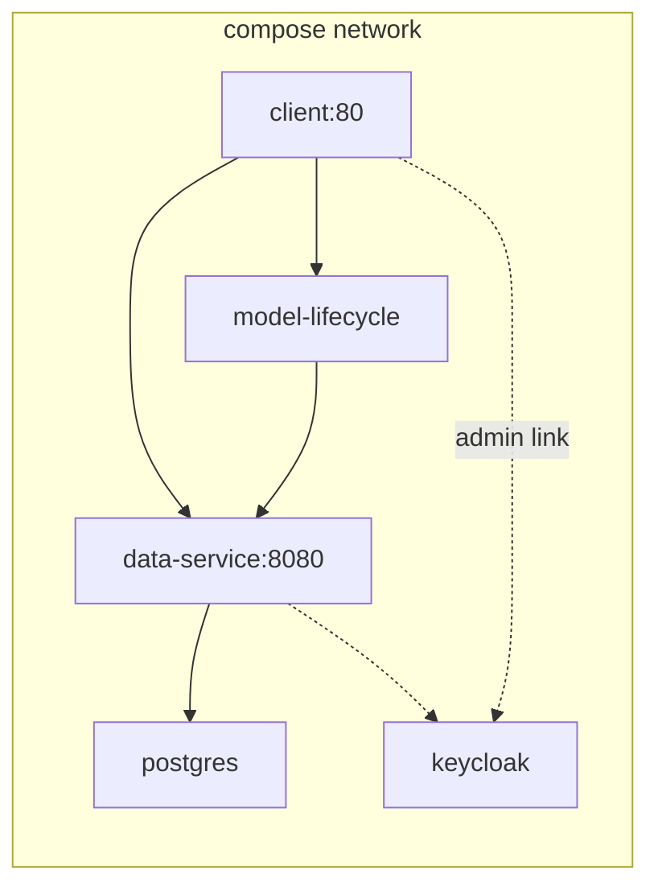

# Architecture

How wiki12 is built, in its current state. Read [`domain.md`](domain.md) for the
concepts first. Decisions are recorded in [`docs/adr/`](../../docs/adr/) (0001
slug/identity, 0002 A12 extensibility, 0003 migrations, 0004 one-content-mechanism,
0005 build/deploy, 0006 content envelope, 0007 web client on the A12 Client
framework).

## Overview

A small multi-service application orchestrated by Docker Compose. Two clients
(web + CLI) talk to the **same** two boundaries — the A12 Data Service (content)
and the model-lifecycle service (models/forms/migrations) — so they can't
diverge ("two clients, one contract").

`client` nginx proxies `/api`→data-service and `/lifecycle`→model-lifecycle
(prefix stripped).

## Technology stack

| Layer | Technology | Role |
|---|---|---|
| Backend | **A12 Data Service** (Java / Spring Boot) | Model-driven CRUD/search/validation over JSON-RPC 2.0; extended with custom ops + a lifecycle listener |
| Database | **PostgreSQL** | Content instances + model registry; slug advisory lock |
| Identity | **Keycloak** | Sole user store (seeds `admin`/`admin`); auth present, authz not enforced in baseline |
| Web client | **A12 Client framework** (React + TS; `@com.mgmtp.a12.client` + Form Engine + Widgets) | Browse/search/view/create/edit/delete declared as an Application Model; Milkdown markdown editor (ADR-0007) |
| Model-lifecycle | **Node / TypeScript** | Form-model generation + TS migration runner (transpile + sandbox) |
| CLI | **`wiki12`** (Node / TypeScript) | Content CRUD + model/form management + migrations |
| Orchestration | **Docker Compose** | 5 services; every image stamped with the single `VERSION` (ADR-0005) |

A12 artifacts are consumed from `artifacts.geta12.com`; the Data Service builds
**only** as a container. Node components (`cli`, `model-lifecycle`, `src/dm-to-fm`,
`seed`) run TypeScript directly via `node --experimental-strip-types` — no build
step. The web client is the exception (Vite + Vitest).

## Components

### Data Service (`server/`, Java)

Extends the stock A12 Data Service (ADR-0002 confirmed GO — custom logic lives
*inside* the server, no façade):

- **`WikiContentLifecycleListener`** (`@CommonDataServicesEventListener`) — derives
  the whole **read-only content envelope** inside the write transaction: `Slug`, a
  `searchText` blob, `CreatedOn` (create only), a derived `Title`, and one appended
  `Changes` entry per write. It reads field-level `wiki12.*` annotations
  (`keyField`, `derived`, `searchable`, `changeField`) off the Data Model to decide
  what to derive.
- **`ContentDerivationService`** (renamed from `SlugDerivationService` when its
  scope grew from the slug to the whole envelope) — owns the A12-bound parts:
  advisory lock, model read, collision query, the create/update field diff, and
  document mutation (including appending a repetition to the `Changes` group). The
  pure algorithm (slugify, humanize Title, format a change summary) is isolated in
  **`Slugifier`** (no A12 deps, unit-tested offline). Annotation constants live in
  **`WikiAnnotations`** (renamed from `SlugAnnotations`).
- **`ResolveBySlugOperation`** (`@RemoteOperation "ResolveBySlug"`) — try-ID-then-slug
  resolution; param `idOrSlug` (+ optional `type`).
- **`UnifiedSearchOperation`** (`@RemoteOperation "UnifiedSearch"`) — batched
  fan-out search across content models; params `{ query, kind?, type? }`.

> **As-built status:** the two custom ops are registered and scaffolded, but their
> query-row extraction is still stubbed (`extractDocRef`/`readDocRef`/`readField`
> return `null` — QA-LOG B8/B10). The web client therefore does **client-side**
> search fan-out and docRef resolution today; the CLI calls the ops directly.
> Several A12-boundary assumptions carry `// VERIFY` markers (see each component's
> README) pending live-stack confirmation.

### Model-lifecycle service (`model-lifecycle/`, Node)

HTTP service owning everything that isn't content CRUD:

- **`formgen`** — generates a default Form Model from a Data Model (shared
  generator in `src/dm-to-fm`, "Build Screens From Fields").
- **`migrate/runner`** + **`migrate/sandbox`** — transpiles a Migration's TS
  (esbuild) and runs `migrate(doc)` **per document in a sandbox** (`isolated-vm`
  preferred — a real boundary; `node:vm` is a fallback that only strips globals).
- **`registry`** — model/form/migration storage; **`dataservice`** — JSON-RPC
  client to the Data Service. Routes: `POST /models`, `GET /models[/:type]`,
  `GET|PUT /form-model[/:type]`, `POST /migrate`, `GET|PUT /migrations`.

### Web client (`client/`, A12 Client framework — ADR-0007)

Built on the **A12 Client** runtime (`@com.mgmtp.a12.client/client-core` + Form
Engine + Widgets), not a hand-rolled SPA. The UI is declared as an **Application
Model** of Activities/Views; the Form Engine runs *inside* an Activity (with a
data provider), which is what makes value binding — including the `BirthDate`
DatePicker — actually persist. This superseded the prior `SimpleForm` workaround,
whose standalone form-engine embedding never dispatched typed values into the store.

- **A12 Client wiring** (`src/a12client/`):
  - `appConfig.tsx` composes the Client (form-engine features, the custom data
    provider, localization, the platform model loader, the custom views).
  - `appModel.ts` — the **Application Model**: an Activity per screen
    (Browse/Search/System + a Form-Engine Create/View/Edit per content model).
  - `views/` — `FormScreen` (Form Engine for Create/View/Edit, read-only slice for
    View), and custom React views `BrowseView`, `SearchView`, `SystemView`.
  - `wikiSingleDocumentDataProvider.ts` — a custom **single-document data provider**
    routing load/save/delete through `api/content.ts` (`createEmptyDocument` for new,
    `parseDates` on load, `filterDataByRelevance` + `formatDates` on save → `ADD_`/
    `MODIFY_`/`DELETE_DOCUMENT`). The platform provider is incompatible (ADR-0007).
  - `routing.ts` — a thin URL↔Activity layer (the Client deep-linking feature is not
    a router): `/`, `/view/:ref`, `/edit/:ref`, `/create?type=`, `/search`, `/system`
    map to Activity descriptors; one current Activity at a time; slug refs resolve
    via `ResolveBySlug`.
  - `chrome/AppChrome.tsx` — the Application Frame chrome (brand, global live-search
    box, **New** type dropdown, sidebar nav).
- **API layer** (`src/api/`, reused unchanged across the rebuild): `rpc` (JSON-RPC +
  batch), `content` (CRUD/resolve), `search` (client-side fan-out; constraint-free
  `QUERY` per model for list-all, normalized to card data incl.
  `createdOn`/`lastChangedOn`, merged + sorted by last-change desc), `lifecycle` +
  `models`.
- **Browse/Search rendering**: custom views over the reusable content cards
  (`ContentCard`/`CardGrid`); Browse is a full-width gallery whose cards navigate to
  the standalone `/view/<slug>`.
- **Markdown**: Milkdown registered in the Client widget map for the `Body` field.
  Auth in `lib/auth` (token + 401 auto-logout). The slug-vs-docRef URL rule is the
  pure `lib/refUrl.ts`.
- **Theme**: sans-serif base font via `createTheme` typography over the flat A12
  theme; meaning is encoded with A12 widgets' semantic props, never hand-set colors.
- **Retired by this change**: the React-Router `App.tsx`/pages, `SimpleForm.tsx`,
  `docModel.ts`, and the bare `FormEngineHost.tsx`.

### CLI (`cli/`, Node)

Commands `search | page | entity | model | form | migrate`. `content` ops go to
the Data Service JSON-RPC; `model`/`form`/`migrate` go to the model-lifecycle
service over HTTP. Transports are injectable (mock-tested, 87 offline tests).

## The content contract (Data Service JSON-RPC)

`POST /api/v2/rpc`, body `{ "jsonrpc": "2.0", "id": N, "method": "<OP>", "params": {...} }`.
Shapes below are confirmed against the validated web client (run against a live
stack — QA-LOG B14/B21) and the custom-op server source:

| Purpose | Op | Params | Result |
|---|---|---|---|
| create | `ADD_DOCUMENT` | `{ documentModelName, locale, document }` | `{ docRef }` |
| read | `GET_DOCUMENT` | `{ docRef: "<Model>/<uuid>" }` | `{ document }` |
| list | `QUERY` | `{ query: { targetDocumentModel, projectionName, paging } }` | PagedResultSet |
| update | `MODIFY_DOCUMENT` | `{ docRef, document }` (no modelName/locale) | void |
| delete | `DELETE_DOCUMENT` | `{ docRef }` | void |
| resolve | `ResolveBySlug` (custom) | `{ idOrSlug, type? }` | resolved doc/ref |
| search | `UnifiedSearch` (custom) | `{ query, kind?, type? }` | `[{ kind,type,id,slug,title,snippet }]` |

`document` is the **group-keyed** payload `{ <Group>: { ...fields } }` (Group =
the capitalized type, e.g. `Page`/`Person`); string values are trimmed (the A12
kernel rejects leading/trailing whitespace). The full content envelope (`Slug`,
`searchText`, `CreatedOn`, derived `Title`, `Changes`) is derived server-side and
not part of the write payload, but is present on every read (`GET_DOCUMENT` /
`QUERY` / `UnifiedSearch`).

**Model-name mapping:** type → `<Type>_DM` (`page`→`Page_DM`); forms use `_FM`.
**docRef:** `<Model>/<uuid>`.

## Envelope derivation (Data Service only, ADR-0001)

- Technical ID assigned on create; the whole envelope (`Slug`, `searchText`,
  `CreatedOn`, `Title`, `Changes`) is derived in the write transaction by the
  lifecycle listener. `CreatedOn` is stamped once at create and never updated;
  `Title` and `Slug` are re-derived from Key Fields on each write; one `Changes`
  entry is appended per write.
- The envelope is **enforced on every content model** by the offline validator
  (`src/model_tools/validate.py`, on the `just test` gate) and the model-lifecycle
  `POST /models` upload gate (409 if a model omits it).
- Slugs are `<type>:<name>`, `page` is the default namespace, collisions get a
  sticky `_N` suffix fixed at creation.
- **No DB unique-index backstop** — uniqueness depends on a transaction-scoped
  Postgres advisory lock (`spike-slug-concurrency`).
- A Key-Field edit can re-derive the slug; today `MODIFY_DOCUMENT` returns void,
  so an old→new slug change surfaces on the next read (the listener owns
  re-derivation), not from the write response.

## Search

Unified search = **batched fan-out**: one `simple_search` `QUERY` per content
model over that model's derived `searchText` field, merged into one typed result
list. The server `UnifiedSearchOperation` is the intended home; until its row
extraction lands, the web client performs the fan-out + merge client-side
(`src/api/search.ts`). The CLI exposes `wiki12 search`, with `page search` /
`entity search --type` as filtered conveniences over the same endpoint.

## Migrations (model-lifecycle, ADR-0003)

A version bump is rejected (409) unless its matching `Migration` ships with it.
`--dry-run` reports without writing, including the old→new slug manifest.

## Build & deploy (ADR-0005)

- **Per-component build, driven by Compose** — no top-level Gradle. Every image
  is stamped with the single `VERSION` as `WIKI12_VERSION`.
- **Versioning**: `just build`/`dev`/`up` first run a deterministic PATCH bump
  (`scripts/bump-version.sh`); MAJOR/MINOR are edited in `VERSION` directly.
- **`just`** is the operator entrypoint (stack up/down, seed, validate-models,
  generate-forms, the offline `just test` gate).

## System boundaries

- **Consumed:** A12 runtime artifacts (`artifacts.geta12.com`); Keycloak as user
  store; PostgreSQL.
- **Exposed:** the Data Service JSON-RPC contract and the model-lifecycle HTTP
  routes — both consumed identically by the web client and the CLI.
