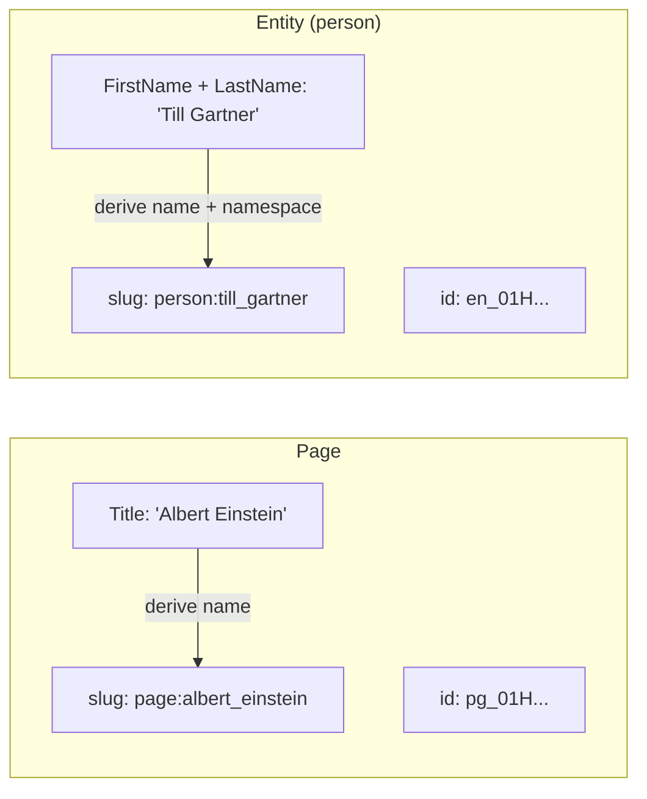
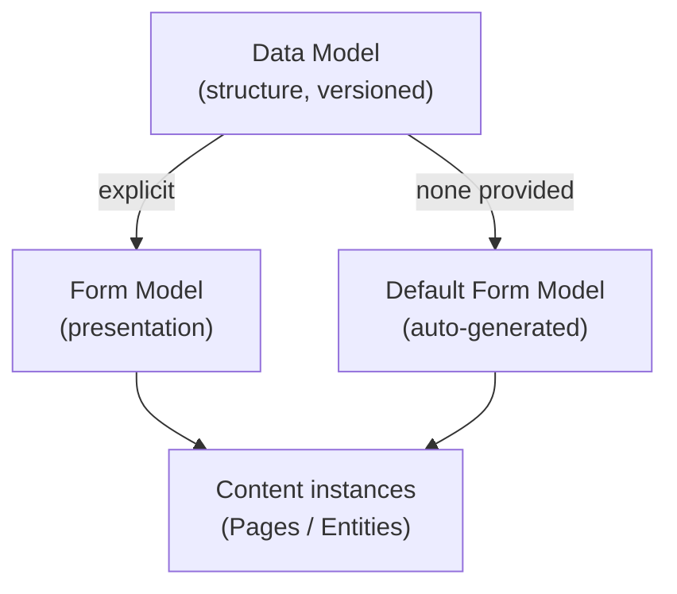
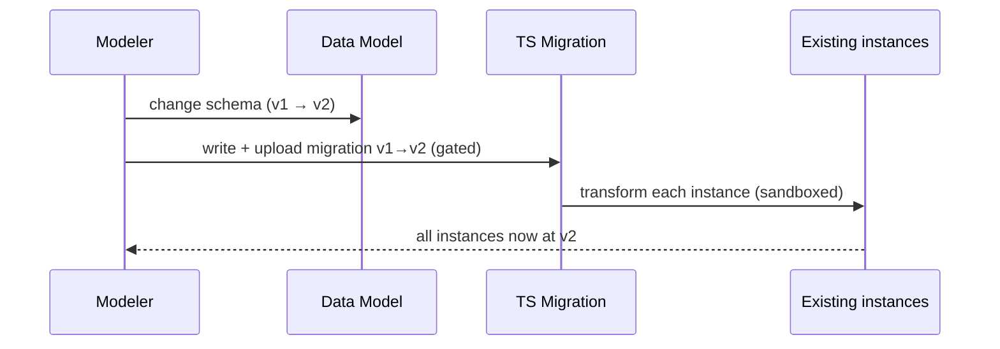
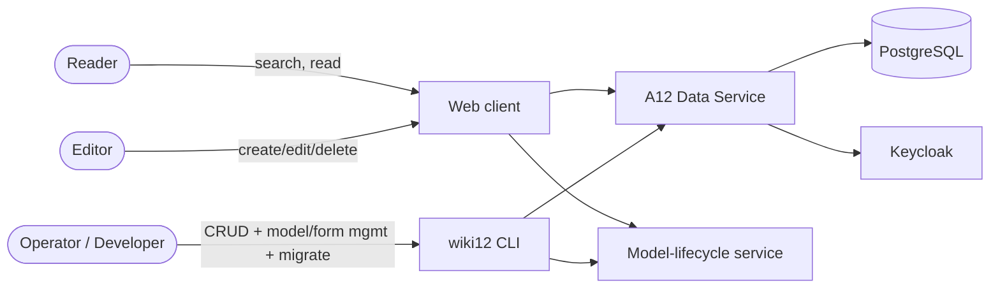

# Domain

The domain wiki12 models, in its current state. This is the shared vocabulary
the whole project uses — keep these terms exact (the canonical short form lives
in [`CONTEXT.md`](../../CONTEXT.md); this is the fuller picture).

## Purpose

wiki12 is a wiki built on **A12** (mgm technology partners' model-driven
platform). It manages two kinds of content — **Pages** and typed **Entities** —
over a single A12 Data Service, reached from a web client (on the **A12 Client
framework**, ADR-0007) and the `wiki12` CLI. Content structure is described as **models** (declarative JSON); generic
A12 engines turn those models into storage, validation, an editing form, and
querying — so adding a content type is primarily a *modeling* task, not a coding
task.

## Core concepts

### Content item

Pages and Entities are **one underlying mechanism** — a typed, versioned,
namespaced **content item** `{ type, slug, id, fields }`. "Page" and "Entity"
are vocabulary over this one mechanism, not separate implementations (ADR-0004).

| Concept | Identity | Key attributes | Body |
|---|---|---|---|
| **Page** | Technical ID + slug `page:<name>` | `Title`, `Slug`, `id` | markdown `Body` |
| **Entity** | Technical ID + slug `<type>:<name>` | `type`, `Slug`, `id` + type-specific fields | markdown field(s) |

Beyond its type-specific fields, **every** content item also carries a uniform
**Content Envelope** (see below) — `CreatedOn`, `Title`, `Changes`, plus the
already-derived `Slug` and `searchText`.

- **Page** — a content item of the built-in **`page`** type: a `Title`, a
  markdown `Body`, a Technical ID, and a derived Slug (`page:albert_einstein`).
  The `page` type **always exists** and is the default Slug namespace.
  `wiki12 page …` is sugar for `entity --type page …`.
- **Entity** — a content item of a user-defined **Entity Type** (`person`,
  `film`, `location`, …) with type-specific fields plus a markdown description.

### Entity Type

A user-defined content type, each backed by its own Data Model and supplying the
`<type>` prefix of the Slug. The baseline ships four types: the built-in `page`
plus `person`, `film`, `location`.

### Identity

Either identifier resolves an item: anywhere a Page or Entity is named (CLI
argument, API ref, link), **both its Technical ID and its Slug are accepted**
and refer to the same item (resolution is **try-ID-then-slug**, ADR-0001).

- **Technical ID** — opaque, system-generated, stable, unique. The target of all
  references and persistence; never the primary human handle.
- **Slug** — the read-only, system-maintained human handle. Always namespaced
  `<type>:<name>`, derived from the item's **Key Fields**. Format: lowercase,
  `<name>` characters `[a-z0-9_]` with `_` as the word separator
  (`Till Gartner` → `till_gartner`); `:` is the reserved namespace delimiter.
  `page` is the default namespace — a bare `<name>` resolves as `page:<name>`.
  Globally unique: collisions get a **sticky `_N` suffix** (`person:till_gartner_2`)
  fixed at creation. So `slug = f(Key Fields, creation order)` — stored state,
  not a pure recomputation. Users never edit it; a Key-Field edit that changes it
  is surfaced (web + CLI), and the old slug then **404s** (aliases deferred).
- **Key Fields** — the fields a Slug **and** the derived Title are computed from
  (Page: `Title`; person: first + last name; per Entity Type). Editing a Key
  Field can therefore change both the Slug and the Title.

### Content Envelope

The set of standard, **system-maintained** fields every content item carries
regardless of type — the type-independent surface generic code (listings, cards,
audit) can rely on without knowing whether it holds a Page or an Entity. Like
`slug`/`searchText`, none of these is user-authored; the Data Service maintains
them inside the write transaction (ADR-0001).

| Field | Type | When written | Source |
|---|---|---|---|
| **Slug** | StringType | create + re-derived on update | Key Fields (slugified, +suffix) |
| **searchText** | StringType (multiline) | every write | searchable fields concatenated |
| **CreatedOn** | DateTimeType | **create only** — immutable | the write clock |
| **Title** | StringType | every write (derived) or authored (Page) | Key Fields (joined, human-readable) |
| **Changes** | repeatable Group | append one **Change Entry** every write | the write clock + field diff |

- **CreatedOn** — the instant the item was first persisted; stamped once at
  create and never changed on update.
- **Title** — the uniform human display label, the display counterpart of the
  machine `Slug` (Slug `person:till_gartner` ↔ Title `Till Gartner`). For `page`
  the Title is an *authored* Key Field (a page's title is source, not derivable);
  for types whose Key Fields aren't a single title (e.g. `person`) it is a
  *derived*, read-only field. Either way every type exposes a `Title`.
- **Changes** — the append-only change log: an ordered list of **Change Entries**,
  each `{ ChangedOn, Summary }`. One entry is appended per successful write —
  `created` on create, `updated: <field labels>` on update. It is a summary trail,
  not full versioning. Realised as a native A12 **repeatable Group** (wiki12's
  first use of group repeatability).

The envelope is **enforced on every content model** (so a new Entity Type can't
omit it): the offline validator fails the build, and the model-lifecycle upload
gate rejects a non-conforming model at runtime (409).

### Markdown

All longer texts (Page bodies, Entity description fields) are authored in
**Markdown**. The web client renders markdown for reading and offers a markdown
editor (Milkdown) for writing.

## Models (the A12 way)

- **Data Model (DM)** — the versioned structural definition of a content type
  (fields, types, constraints). One per type (`Page_DM`, `Person_DM`, …). Carries
  field-level `wiki12.*` annotations (`keyField`; `derived` ∈ {`slug`,
  `searchText`, `createdOn`, `title`, `changeLog`}; `searchable`; `changeField` ∈
  {`datetime`, `summary`} on Change-Entry fields) that drive slug/search/envelope
  derivation. The wiki12 content-schema version is an integer in the DM header
  annotation `wiki12.version`.
- **Form Model (FM)** — the presentation/editing definition for a DM (layout,
  widgets, validation). **Auto-generated from the DM when none is supplied** (by
  wiki12's own tooling — A12 has no headless generator), so every type is always
  editable.

> **Two version axes** — don't conflate them: the A12 `header.modelVersion` (the
> model *format*, e.g. `28.4.0`) versus the wiki12 content-schema version (integer
> `1, 2, …` in `wiki12.version`, what Migrations step between).

## Model evolution & migration

When a Data Model changes, existing instances created against an older version
must be brought forward.

- A **Migration** is a **TypeScript** function over a single A12 document:
  `(doc at vN) → (doc at vN+1)`. Iteration, IO, dry-run, and reporting live in
  the runner; the script only describes the per-document shape change.
- No model-version bump ships without its Migration — registering a new version
  is **gated on the Migration existing** (ADR-0003). This applies to `page` too.
- Migrations are stored as **`Migration` content items** holding TS source — not
  filesystem files. Clients never compile TS.

## Actors

- **Reader** — searches and reads Pages/Entities in the browser.
- **Editor** — creates, edits, and deletes content in the browser.
- **Operator / Developer** — uses the `wiki12` CLI for content CRUD, data-model
  and form-model management, and running migrations.
- **User store** — users live in **Keycloak** (seeded `admin`/`admin`); wiki12
  does not manage users itself. The web client's System area links to the
  Keycloak admin console. Authentication is present (login screen, 401
  auto-logout) but **authorization is not enforced** in the baseline.

## Rules & constraints

- **One mechanism.** Every content operation (CRUD, slug, model, form, migrate)
  goes through the same path for Pages and Entities.
- **Slugs are derived and unique.** Read-only, namespaced, globally unique with a
  sticky `_N` suffix; derivation + uniqueness are enforced **only in the Data
  Service** (ADR-0001), so both clients get the same rule. There is no
  DB-unique-index backstop — uniqueness rests on a transaction-scoped Postgres
  advisory lock (`spike-slug-concurrency`).
- **Either ID or slug identifies an item**; the ID grammar is reserved so the two
  never collide; a bare name defaults to the `page:` namespace.
- **Migrations gate model bumps** (ADR-0003).
- **Two clients, one contract** — no business logic lives only in a client.

## Glossary

- **Content item** — the single mechanism `{ type, slug, id, fields }` both Pages
  and Entities are; typed, versioned, namespaced.
- **Page** — content item of the built-in `page` type (Title, markdown Body).
- **Entity** — content item of a user-defined type, with a namespaced slug.
- **Entity Type** — a user-defined content type; `page` is the built-in type.
- **Technical ID** — opaque unique system identifier.
- **Slug** — read-only, system-derived, namespaced `<type>:<name>` handle; unique
  with sticky `_N` on collision.
- **Content Envelope** — the uniform, system-maintained fields every item carries
  regardless of type: `Slug`, `searchText`, `CreatedOn`, `Title`, `Changes`.
- **CreatedOn / Title / Changes** — create-once timestamp / derived (or authored)
  human display label / append-only change log of **Change Entries**
  (`{ ChangedOn, Summary }`).
- **Key Fields** — the fields a slug **and** the derived Title are computed from.
- **Data Model / Form Model** — versioned structure / presentation definition
  (FM auto-generated if absent).
- **Migration** — TS script (stored as a `Migration` content item) upgrading
  instances across content-schema versions.
- **Data Service** — the A12 Java backend; the single boundary enforcing slug
  derivation/uniqueness; both web and CLI go through it.
- **Model-lifecycle service** — Node service owning form-model generation and the
  TS migration runner.
