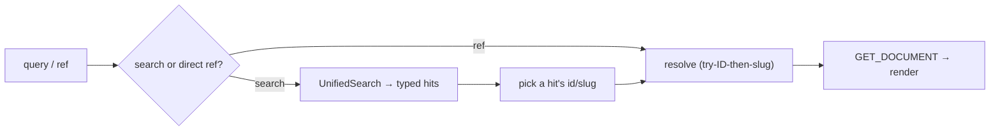
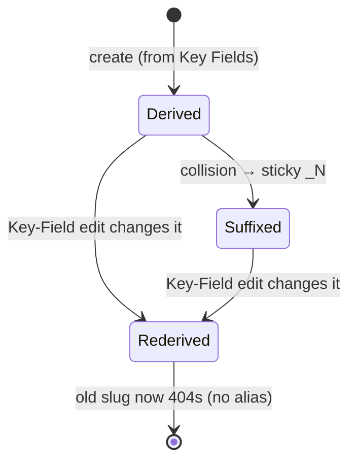

# Functional

What wiki12 does from a user's perspective — the capabilities it provides,
independent of implementation. See [`domain.md`](domain.md) for terms and
[`architecture.md`](architecture.md) for how these are built.

## Features

### Content (web + CLI)

| Feature | Who | Behavior |
|---|---|---|
| **Browse** | Reader | The landing surface (web): a recency-sorted card grid of **all** content (Pages + every Entity Type) — a pure list-all gallery (searching is the header's job). Clicking a card opens a **read-only** split-pane detail of all its fields — a transient in-page selection, so the URL stays `/`. **Full size** navigates to the bookmarkable deep link `/view/<slug>`. (CLI: unified search across all content; optional `kind` (page/entity) and `type` filters; returns typed hits.) |
| **Search** | Reader | The single, global search affordance (web): a header search box that searches **live as you type** (debounced) into the shareable `/search?q=<query>` route, with an optional `&type=<type>`, rendered as the same content cards as Browse. Server-side `UnifiedSearch` fan-out, deep-linkable. |
| **Read** | Reader | View a Page/Entity by Technical ID or slug; all fields rendered read-only (markdown body rendered), same render as the Browse detail pane. Every item also shows its **envelope** read-only: `CreatedOn`, the derived `Title`, and the `Changes` log (newest first). Deep-linkable at `/view/:ref` — the path segment is the **Slug verbatim** (`/view/page:albert_einstein`, colon-literal), with the Technical ID accepted as a fallback. The Slug appears once the server surfaces the envelope `Slug`; until then links fall back to the docRef. |
| **Create** | Editor | Create a Page or typed Entity from a model-driven form; server assigns the Technical ID and derives the slug. Started from the header **New** button, whose dropdown lists every content type (Page + each Entity type). |
| **Edit** | Editor | Update fields; a Key-Field change can re-derive the slug (surfaced as old → new). |
| **Delete** | Editor | Remove a Page/Entity by ref (idempotent server-side). |

### Models, forms, migrations (CLI + System area)

| Feature | Who | Behavior |
|---|---|---|
| **Data-model management** | Operator | List/read/create/update Data Models for any type (incl. `page`); no delete in baseline. Every content model must carry the standard envelope (`CreatedOn`, `Title`, `Changes`) — enforced offline by the validator and at upload by the model-lifecycle gate (409 otherwise). |
| **Form-model management** | Operator | List/read/create/update Form Models; a type with no explicit form gets a generated default. |
| **Migrations** | Operator | Run a stored TS Migration between content-schema versions; `--dry-run` previews (incl. slug manifest). A model-version bump must ship with its Migration (gated, 409 otherwise). |
| **User maintenance** | Operator | Out-of-band in **Keycloak** (the System area links to its admin console); wiki12 does not manage users. |

### CLI surface (`wiki12`)

Every command supports `-h`/`--help`.

```text
wiki12 search  <query>                                [--kind page|entity] [--type <type>]
wiki12 page    list|create|read|update|delete|search  <id-or-slug>
wiki12 entity  list|create|read|update|delete|search  --type <type> <id-or-slug>
wiki12 model   list|create|read|update                <type>
wiki12 form    list|create|read|update                <type>
wiki12 migrate <type> --from <v> --to <v> [--dry-run]
```

`page` is sugar for `entity --type page`. Fields are supplied as repeated
`--field Key=Value` (keys must match the Data Model field names exactly, e.g.
`Title`, `Body`, `FirstName`).

### Web client surface

- **Pages**: Login, Browse (landing `/`), Search (`/search?q=&type=`), View
  (`/view/:ref`, read-only render), Edit (create/update via the A12 Form Engine +
  Milkdown editor), System.
- **Browse** is the landing view: a **full-width, multi-column** responsive card
  grid of all content (newest-changed first) — a pure list-all gallery (searching
  is the header search box's job). Opening a card reflows the grid and shows a
  read-only detail panel (all fields) on the right, with **Close**, **Edit** and
  **Full size** controls. Opening the split-pane detail is a transient in-page
  selection — the URL stays `/`; **Full size** navigates to the deep-linkable
  standalone `/view/<slug>`. A hand-rolled responsive split (the A12 Managed
  Master-Detail widget couldn't show a full-width grid with no detail pane).
  Cards are the listing vocabulary across the client. Single items remain
  deep-linkable at `/view/:ref`, where the path segment is the **Slug verbatim**
  (colon-literal, e.g. `/view/page:albert_einstein`); a Technical ID is accepted as
  a fallback. The slug-vs-docRef URL rule lives in one pure helper
  (`client/src/lib/refUrl.ts`).
- **Search** (`/search?q=&type=`) is the single, global search affordance: a header
  search box that searches **live as you type** (debounced) into the shareable
  `/search` route — a server-side `UnifiedSearch` fan-out, deep-linkable. There is
  no separate Browse filter box.
- **System area**: a *Users* link out to the Keycloak console and a *Migrations*
  list — each `Migration` editable as its TS source in a simple text editor
  (upload is TS source only; the service owns transpile + sandboxed execution).
- **Theme**: a deliberately plain, compact flat A12 theme (styling is a later
  refinement).

## Key user journeys

### Create an Entity (web)

```mermaid
sequenceDiagram
    participant U as Editor
    participant W as Web client
    participant ML as model-lifecycle
    participant S as Data Service
    U->>W: open "new person" form
    W->>ML: GET form model (person) [generate default if absent]
    ML-->>W: form model
    U->>W: fill fields + markdown description
    W->>S: ADD_DOCUMENT { documentModelName, locale, document }
    S->>S: derive slug from Key Fields, ensure unique, assign Technical ID
    S-->>W: { docRef }
    W-->>U: show saved entity (id; slug on next read)
```

### Find then read (either client)



## Inputs & outputs

- **Inputs**: form field values + markdown (web); `--field Key=Value` pairs and
  id-or-slug refs (CLI); Data Model / Form Model JSON files; Migration TS source.
- **Outputs**: rendered content; typed search hits; created `docRef`; migration
  reports (counts, failures, dry-run slug manifest); slug-change notifications.

## States & transitions

### Slug lifecycle



### Content-schema version

A Data Model carries an integer `wiki12.version`. Instances created at vN are
brought to vN+1 only by running the matching Migration; deploying a higher
version without its Migration is rejected (409).

## Permissions & visibility

- **Authentication** is present: a login screen (seeded `admin`/`admin` via
  Keycloak) and 401 auto-logout.
- **Authorization is not enforced** in the baseline — any authenticated user can
  perform any content/model operation. Role-based gating is future work.
- **User management** is entirely in Keycloak (linked, not embedded).

## Edge cases & known limitations

- **Custom server ops are partially stubbed.** `ResolveBySlug` and
  `UnifiedSearch` are registered but their query-row extraction returns `null`
  (QA-LOG B8/B10); the web client compensates with client-side resolution + search
  fan-out. End-to-end behavior of these ops awaits the live-stack work.
- **No slug aliases/redirects.** When a slug changes, the old slug 404s.
- **No DB-unique backstop for slugs.** Uniqueness rests on a Postgres advisory
  lock taken in the write transaction (`spike-slug-concurrency`).
- **Slug-change-on-write isn't returned by the write.** `MODIFY_DOCUMENT` returns
  void; a re-derived slug surfaces on the next read.
- **Search is substring/`simple_search`** over a derived `searchText` blob;
  ranked/fuzzy search is out of scope.
- **No model delete** in the baseline (destructive model removal is out of scope).
- **A12-boundary `// VERIFY` markers** remain in `server/`, `cli/`, and `client/`
  for assumptions not yet confirmed against a running stack.
